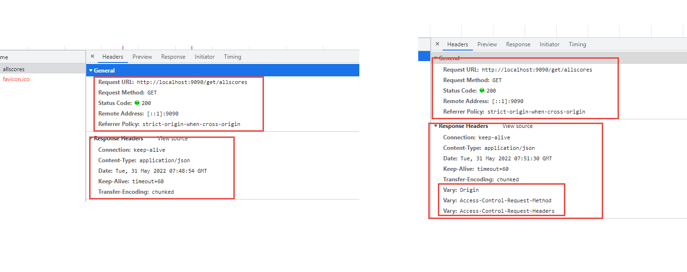

# 数据可视化技术

内容：

   echarts 的使用：   js、css、html。  vscode， 

   书写 后台程序 spring boot， 提供后台数据的 代码 。操作数据， 数据来源 数据库

   axios：  js， ajax请求的一个模块， 可以完成 前端 和后端通信


## vscode的插件安装


## 复习

1. 什么是数据可视化  ？
2. 移动端图表是否是 数据可视化需求  ？
3. echarts是什么东西  ？
4. 数据可视化的数据来源  ？ 
5. echarts 是 那就公司  ？ 
6. 其他
7.  SAAS,   hr, crm :
8. PAAS , IAAS  :  ECS,


## 其他

## 地图使用


```txt
 <div class="box"></div>
    <script>
        // 初始化echarts实例
        var myEcharts = echarts.init(document.querySelector("div"));
        var option = {
            title: { //标题样式
                text: '中国地图',
                x: "center",
                textStyle: {
                    fontSize: 18,
                    color: "black"
                },
            },
            tooltip: {
                trigger: 'item',
                formatter: function(params) {
                    console.log(params)
                    if (params.name) {
                        return params.name + ' : ' + (isNaN(params.value) ? 0 : parseInt(params.value));
                    }
                }
            },
            visualMap: { //视觉映射组件
                top: 'bottom',
                left: 'left',
                min: 10,
                max: 500000,
                //text: ['High', 'Low'],
                realtime: false, //拖拽时，是否实时更新
                calculable: true, //是否显示拖拽用的手柄
                inRange: {
                    color: ['lightskyblue', 'yellow', 'orangered']
                }
            },
            series: [{
                name: '模拟数据',
                type: 'map',
                mapType: 'china',
                roam: false, //是否开启鼠标缩放和平移漫游
                itemStyle: { //地图区域的多边形 图形样式
                    normal: { //是图形在默认状态下的样式
                        label: {
                            show: true, //是否显示标签
                            textStyle: {
                                color: "black"
                            }
                        }
                    },
                    zoom: 1.5, //地图缩放比例,默认为1
                    emphasis: { //是图形在高亮状态下的样式,比如在鼠标悬浮或者图例联动高亮时
                        label: {
                            show: true
                        }
                    }
                },
                top: "3%", //组件距离容器的距离
                center: [87.6, 43.79]
                    // data: [{
                    //     name: '北京',
                    //     value: 350000
                    // }, {
                    //     name: '天津',
                    //     value: 120000
                    // }, {
                    //     name: '上海',
                    //     value: 300000
                    // }, {
                    //     name: '重庆',
                    //     value: 92000
                    // }, {
                    //     name: '河北',
                    //     value: 25000
                    // }, {
                    //     name: '河南',
                    //     value: 20000
                    // }, {
                    //     name: '云南',
                    //     value: 500
                    // }, {
                    //     name: '辽宁',
                    //     value: 3050
                    // }, {
                    //     name: '黑龙江',
                    //     value: 80000
                    // }, {
                    //     name: '湖南',
                    //     value: 2000
                    // }, {
                    //     name: '安徽',
                    //     value: 24580
                    // }, {
                    //     name: '山东',
                    //     value: 40629
                    // }, {
                    //     name: '新疆',
                    //     value: 36981
                    // }, {
                    //     name: '江苏',
                    //     value: 13569
                    // }, {
                    //     name: '浙江',
                    //     value: 24956
                    // }, {
                    //     name: '江西',
                    //     value: 15194
                    // }, {
                    //     name: '湖北',
                    //     value: 41398
                    // }, {
                    //     name: '广西',
                    //     value: 41150
                    // }, {
                    //     name: '甘肃',
                    //     value: 17630
                    // }, {
                    //     name: '山西',
                    //     value: 27370
                    // }, {
                    //     name: '内蒙古',
                    //     value: 27370
                    // }, {
                    //     name: '陕西',
                    //     value: 97208
                    // }, {
                    //     name: '吉林',
                    //     value: 88290
                    // }, {
                    //     name: '福建',
                    //     value: 19978
                    // }, {
                    //     name: '贵州',
                    //     value: 94485
                    // }, {
                    //     name: '广东',
                    //     value: 89426
                    // }, {
                    //     name: '青海',
                    //     value: 35484
                    // }, {
                    //     name: '西藏',
                    //     value: 97413
                    // }, {
                    //     name: '四川',
                    //     value: 54161
                    // }, {
                    //     name: '宁夏',
                    //     value: 56515
                    // }, {
                    //     name: '海南',
                    //     value: 54871
                    // }, {
                    //     name: '台湾',
                    //     value: 48544
                    // }, {
                    //     name: '香港',
                    //     value: 49474
                    // }, {
                    //     name: '澳门',
                    //     value: 34594
                    // }]
            }]
        };
        // 使用刚指定的配置项和数据显示图表。
        myEcharts.setOption(option);
    </script>
</body>
```


## 复习

1. 如何创建一个 springboot 项目 ？
2. springboot项目是 maven项目 ？
3. lombok   ？
4. javaWeb项目的 三层结构 ？
5. mybatis 是什么  ？
6. 其他


springboot   框架（快速搭建项目）, ssm , ，约定 大于配置 ， 

Dev： js， nodejs， Python。

ssm： spring,  spring mvc,  mybatis , 


spring cloud 基于 springboot， 解决 高并发和分布式问题 。


axios ：   web页面同 后端程序 通讯的问题 。ajax的最新的解决框架 。




