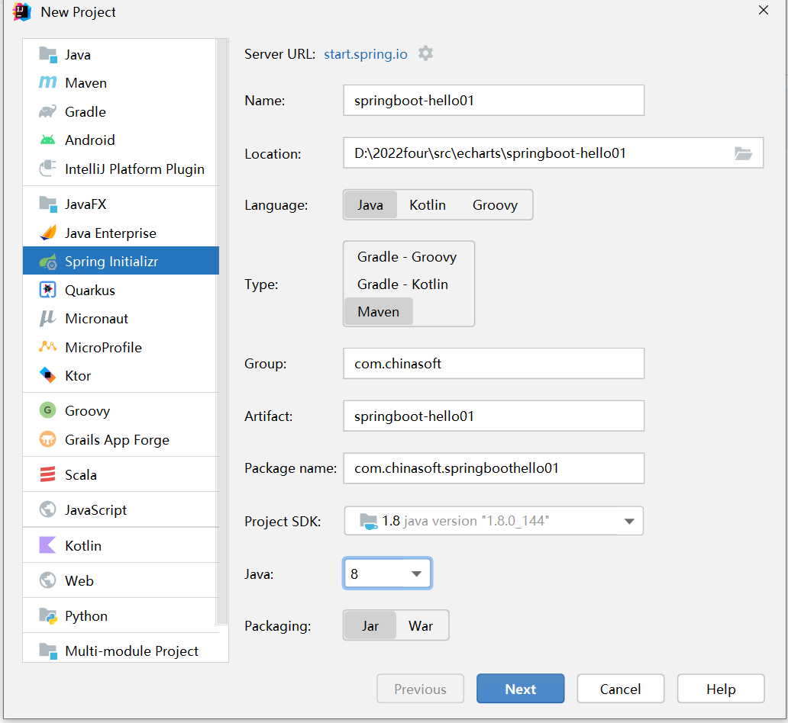

# java 后台


1. 创建一个springboot 程序、测试，快速入门

   ```txt
   
   
   javac -version
   
   mvn -version
   
   查看 idea maven配置， 使用 外部的安装maven
   ```

   

   

   ****

   

   

   

   

2. 创建以database和数据表、导入数据

   ```txt
   ps -ef 
   
   use echarts;
   
   select * from user;
   
   ```

   

3. 使用 springboot 程序操作数据库， mybatis

   ```txt
   1. 创建 spring boot 项目， mybatis， mysql dirver
   2、 创建 user javaBean， 使用 lombok
   3、 mapper.UserMapper 的接口
      @Mapper
   public interface UserMapper {
   
       @Select("select * from user")
       List<User>  selectAll();
   }
   
   4、 配置 application.yml 在 resources 目录下
   spring:
     datasource:
       username: root
       password: root1234
       driver-class-name: com.mysql.cj.jdbc.Driver  # mysql 8.0
       url: jdbc:mysql://192.168.8.61:3306/echarts?useSSL=false&useUnicode=true&characterEncoding=UTF-8
       
   5、 进行 测试， 使用已经有的测试文件
   
   @SpringBootTest
   class Springmybat03ApplicationTests {
   
       @Autowired
       // 将我们创建的 mapper的实例化对象 注入到 下面对象
       UserMapper userMapper;
   
       @Test
       void testMapper() {
           List<User> users = userMapper.selectAll();
           for (User user : users) {
               System.out.println(user);
           }
       }
   }
   
   ```

   

4. spring boot 添加日志

   ```txt
   1. application.yml 文件添加配置
   logging:
     level:
       root: info   # 项目日志 水平 info
       com:
         chinasoft: debug   # 我们的代码  debug
       org:
         apache:
           ibatis: debug   # mybatis的jar包 日志水平 是 debug
   
   2、 在类上面添加注释
      
      @Slf4j
   class UserMapperTest {
      
   3、 添加日志代码
      log.debug(user)
   ```

   

5. 使用 springboot程序进行数据的采集

   

6. 将采集的数据写入到数据库里面

7. 编写提供数据服务的后台

   编写 业务层

   ```txt
   1、 创建包 service
   2、 写接口然后写实现类
   3、必须使用 @Service 在实现类， @Auotwired
   ```

   ```txt
   @Service   // 标记 这个类是业务层， 会将该对象注入 spring 容器
   public class UserServiceImpl implements UserService {
       @Autowired
       UserMapper userMapper;
   
       @Override
       public List<User> getAllUser() {
           List<User> users = userMapper.selectAll();
           return users;
       }
   
       @Override
       public User getOneUser(Integer id) {
           User user = userMapper.selectById(id);
           return user;
       }
   ```

   

   

8. 其他


## 问题

1. springboot

2. spring 容器的原理

   

3. 其他


## 作业

### 一、创建一个Book的表，完成对表的 CRUD操作。

表字段（id，name, author, publisher, createDate）

操作步骤：

1. 创建 database
2. 创建 表， 同时手工插入数据
3. 创建 springboot项目
4. 编写 mapper，持久层代码并且测试
5. 编写业务层
6. 编写表现层, Get(), Post (update, insert), postman
7. 其他