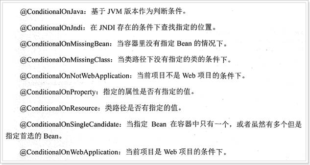
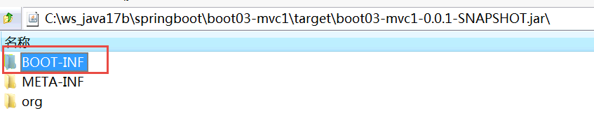
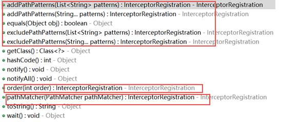

# springboot

## 复习

1. 谈谈你对 springboot的理解 ？
2. 如何理解 spring的自动配置 原理 ？

---

1. 如果你有自定义参数需要 输入到 springboot程序 ， 该如何 ？application.properties

   com.chinasoft.person.name

   com.name

   username

   @Value  ,  @ConfigurationProperties(prefix="com.chinasoft.person")

2. springboot 整合 mybatis 有 两种方式 ？

   @Mapper， 修饰 interface,   @MapperScan（basepackages= ）

3. springboot 是如何进行事务管理 ？

   @Transactional  修饰  类、 方法

4. 日期转换 。讲 2 种 方式 ？ 自定义类转换器， 使用注解 @DateTimeFormat， 修饰javaBean上面的日期字段 。主要针对 是 key=value形式 。

5. 其他

## 了解SpringBoot
在这一部分，我们主要了解以下3个问题：

- 什么是SpringBoot
- 为什么要学习SpringBoot
- SpringBoot的特点

### 什么是SpringBoot
SpringBoot是Spring项目中的一个子工程，与我们所熟知的Spring-framework 同属于spring的产品:


我们可以看到下面的一段介绍：

> Takes an opinionated view of building production-ready Spring applications. Spring Boot favors convention over configuration and is designed to get you up and running as quickly as possible.

翻译一下：

> 用一些固定的方式来构建生产级别的spring应用。Spring Boot 推崇约定大于配置的方式以便于你能够尽可能快速的启动并运行程序。

其实人们把Spring Boot 称为搭建程序的`脚手架`。其最主要作用就是帮我们快速的构建庞大的spring项目，并且尽可能的减少一切xml配置，做到开箱即用，迅速上手，让我们关注与业务而非配置。


### 为什么要学习SpringBoot
java一直被人诟病的一点就是臃肿、麻烦。当我们还在辛苦的搭建项目时，可能Python程序员已经把功能写好了，究其原因注意是两点：

- 复杂的配置，

  项目各种配置其实是开发时的损耗， 因为在思考 Spring 特性配置和解决业务问题之间需要进行思维切换，所以写配置挤占了写应用程序逻辑的时间。

- 一个是混乱的依赖管理。

  项目的依赖管理也是件吃力不讨好的事情。决定项目里要用哪些库就已经够让人头痛的了，你还要知道这些库的哪个版本和其他库不会有冲突，这难题实在太棘手。并且，依赖管理也是一种损耗，添加依赖不是写应用程序代码。一旦选错了依赖的版本，随之而来的不兼容问题毫无疑问会是生产力杀手。


而SpringBoot让这一切成为过去！

> Spring Boot 简化了基于Spring的应用开发，只需要“run”就能创建一个独立的、生产级别的Spring应用。Spring Boot为Spring平台及第三方库提供开箱即用的设置（提供默认设置，存放默认配置的包就是启动器），这样我们就可以简单的开始。多数Spring Boot应用只需要很少的Spring配置。

我们可以使用SpringBoot创建java应用，并使用java –jar 启动它，就能得到一个生产级别的web工程。

### SpringBoot的特点
Spring Boot 主要目标是：

- 为所有 Spring 的开发者提供一个非常快速的、广泛接受的入门体验
- 开箱即用（启动器starter-其实就是SpringBoot提供的一个jar包），但通过自己设置参数（.properties），即可快速摆脱这种方式。
-  提供了一些大型项目中常见的非功能性特性，如内嵌服务器、安全、指标，健康检测、外部化配置等
- 绝对没有代码生成，也无需 XML 配置。

更多细节，大家可以到[官网](http://projects.spring.io/spring-boot/)查看。


## 快速入门

### 快速入门案例


- https://start.springboot.io  

### 快速入门案例手写版
- 创建工程  


工程名为demo：


 

使用maven来构建：


然后填写项目坐标：

 

目录结构：


项目结构：


- 添加依赖  
	
	看到这里很多同学会有疑惑，前面说传统开发的问题之一就是依赖管理混乱，怎么这里我们还需要管理依赖呢？难道SpringBoot不帮我们管理吗？
	
	别着急，现在我们的项目与SpringBoot还没有什么关联。SpringBoot提供了一个名为spring-boot-starter-parent的工程，里面已经对各种常用依赖（并非全部）的版本进行了管理，我们的项目需要以这个项目为父工程，这样我们就不用操心依赖的版本问题了，需要什么依赖，直接引入坐标即可！
	
	- 添加父工程坐标  
	
	  ```txt
	   <parent>
	          <groupId>org.springframework.boot</groupId>
	          <artifactId>spring-boot-starter-parent</artifactId>
	          <version>2.3.7.RELEASE</version>
	      </parent>
	  ```
	  
	
	  
	- 添加web启动器  
	
	  为了让SpringBoot帮我们完成各种自动配置，我们必须引入SpringBoot提供的自动配置依赖，我们称为`启动器`。因为我们是web项目，这里我们引入web启动器：
	
	  ```txt
	    <dependency>
	              <groupId>org.springframework.boot</groupId>
	              <artifactId>spring-boot-starter-web</artifactId>
	          </dependency>
	  ```
	
	  需要注意的是，我们并没有在这里指定版本信息。因为SpringBoot的父工程已经对版本进行了管理了。
	
	  这个时候，我们会发现项目中多出了大量的依赖：
	
	   
	
	- 管理JDK版本  
	
	  默认情况下，maven工程的jdk版本是1.5，而我们开发使用的是1.8，因此这里我们需要修改jdk版本，只需要简单的添加以下属性即可：
	
	  ```txt
	   <properties>
	          <java.version>1.8</java.version>
	      </properties>
	  ```
	
	  
	
	- 添加 boot的构建插件(此不骤可以不做)
	
	  ```txt
	            <plugin>
	                  <groupId>org.springframework.boot</groupId>
	                  <artifactId>spring-boot-maven-plugin</artifactId>
	                  </plugin>
	  ```
	
	  
	
	- 完整的pom  
	
- 编写启动类  

  ```txt
  @SpringBootApplication
  public class TestbootApplication {
  
      public static void main(String[] args) {
          SpringApplication.run(TestbootApplication.class, args);
      }
  
  }
  ```

  

- 编写控制器  

  接下来，我们就可以像以前那样开发SpringMVC的项目了！

  我们编写一个controller：

  ```txt
  @RestController
  public class HelloController {
  
      @GetMapping("hello")
      public String hello(){
          return "hello, spring boot!";
      }
  }
  
  ```

  

- 启动测试  

  接下来，我们运行main函数，查看控制台：

   

  并且可以看到监听的端口信息：

  

  - 1）监听的端口是8080
  - 2）SpringMVC的映射路径是：/
  - 3）`/hello`路径已经映射到了`HelloController`中的`hello()`方法

  打开页面访问：http://localhost:8080/hello

   

  

  测试成功了！

### 快速入门案例的pom.xml 讲解

```txt
<?xml version="1.0" encoding="UTF-8"?>
<project xmlns="http://maven.apache.org/POM/4.0.0" xmlns:xsi="http://www.w3.org/2001/XMLSchema-instance"
         xsi:schemaLocation="http://maven.apache.org/POM/4.0.0 https://maven.apache.org/xsd/maven-4.0.0.xsd">
    <modelVersion>4.0.0</modelVersion>
    <parent>
        <!--所有boot资源的parent-->
        <groupId>org.springframework.boot</groupId>
        <artifactId>spring-boot-starter-parent</artifactId>
        <version>2.3.7.RELEASE</version>
        <relativePath/> <!-- lookup parent from repository -->
    </parent>
    <groupId>com.chinasoft</groupId>
    <artifactId>boot01-hello2</artifactId>
    <version>0.0.1-SNAPSHOT</version>
    <packaging>jar</packaging>
    <name>boot01-hello2</name>
    <description>Demo project for Spring Boot</description>

    <properties>
        <java.version>1.8</java.version>
    </properties>

    <dependencies>

        <!--spring mvc的启动器-->
        <dependency>
            <groupId>org.springframework.boot</groupId>
            <artifactId>spring-boot-starter-web</artifactId>
        </dependency>

        <!--开发工具-->
        <dependency>
            <groupId>org.springframework.boot</groupId>
            <artifactId>spring-boot-devtools</artifactId>
            <scope>runtime</scope>
            <optional>true</optional>
        </dependency>
        <dependency>
            <groupId>org.projectlombok</groupId>
            <artifactId>lombok</artifactId>
            <optional>true</optional>
        </dependency>

        <!--单元测试的 spring 启动器-->
        <dependency>
            <groupId>org.springframework.boot</groupId>
            <artifactId>spring-boot-starter-test</artifactId>
            <scope>test</scope>
            <exclusions>
                <exclusion>
                    <groupId>org.junit.vintage</groupId>
                    <artifactId>junit-vintage-engine</artifactId>
                </exclusion>
            </exclusions>
        </dependency>
    </dependencies>

    <build>
        <plugins>
            <plugin>
                <!--就是构建 boot项目-->
                <groupId>org.springframework.boot</groupId>
                <artifactId>spring-boot-maven-plugin</artifactId>
                <configuration>
                    <excludes>
                        <exclude>
                            <groupId>org.projectlombok</groupId>
                            <artifactId>lombok</artifactId>
                        </exclude>
                    </excludes>
                </configuration>
            </plugin>
        </plugins>
    </build>

</project>

```


### HelloApplication的讲解

```txt
@SpringBootApplication
public class TestbootApplication {

    public static void main(String[] args) {
        SpringApplication.run(TestbootApplication.class, args);
    }

}
```


### 启动项目的三种方式
- run main  运行main方法

- mvn spring-boot:run  

- java -jar ...  

  ```txt
  #通过 maven 命令
  terminal：
  mvn spring-boot:run
  
  # 通过 java 的命令
  mvn package
  cd $HOME
  cd target
  java -jar  boot01-*.jar
  
  ```

  

## java配置

在入门案例中，我们没有任何的配置，就可以实现一个SpringMVC的项目了，快速、高效！

但是有同学会有疑问，如果没有任何的xml，那么我们如果要配置一个Bean该怎么办？比如我们要配置一个数据库连接池，以前会这么玩：

```xml
<!-- 配置连接池 -->
<bean id="dataSource" class="com.alibaba.druid.pool.DruidDataSource"
      init-method="init" destroy-method="close">
    <property name="url" value="${jdbc.url}" />
    <property name="username" value="${jdbc.username}" />
    <property name="password" value="${jdbc.password}" />
</bean>
```

现在该怎么做呢？


### 回顾历史

事实上，在Spring3.0开始，Spring官方就已经开始推荐使用java配置来代替传统的xml配置了，我们不妨来回顾一下Spring的历史：

- spring 1.0 时代  

  在此时因为jdk1.5刚刚出来，注解开发并未盛行，因此一切Spring配置都是xml格式，想象一下所有的bean都用xml配置，细思极恐啊，心疼那个时候的程序员2秒

- spring 2.0 时代  

  Spring引入了注解开发，但是因为并不完善，因此并未完全替代xml，此时的程序员往往是把xml与注解进行结合，貌似我们之前都是这种方式。

- spring 3.0 及以后  

  3.0以后Spring的注解已经非常完善了，因此Spring推荐大家使用完全的java配置来代替以前的xml，不过似乎在国内并未推广盛行。然后当SpringBoot来临，人们才慢慢认识到java配置的优雅。

有句古话说的好：拥抱变化，拥抱未来。所以我们也应该顺应时代潮流，做时尚的弄潮儿，一起来学习下java配置的玩法。

### 尝试java配置

java配置主要靠java类和一些注解，比较常用的注解有：

- `@Configuration`：声明一个类作为配置类，代替xml文件
- `@Bean`：声明在方法上，将方法的返回值加入Bean容器，代替`<bean>`标签
- `@value`：属性注入
- `@PropertySource`：指定外部属性文件，

我们接下来用java配置来尝试实现连接池配置：

首先引入Druid连接池依赖：

```xml
<dependency>
    <groupId>com.alibaba</groupId>
    <artifactId>druid</artifactId>
    <version>1.1.6</version>
</dependency>
```

创建一个jdbc.properties文件，编写jdbc属性：

```properties
jdbc.driverClassName=com.mysql.jdbc.Driver
jdbc.url=jdbc:mysql://127.0.0.1:3306/leyou
jdbc.username=root
jdbc.password=123
```

然后编写代码：

```java
@Configuration
@PropertySource("classpath:jdbc.properties")
public class JdbcConfig {

    @Value("${jdbc.url}")
    String url;
    @Value("${jdbc.driverClassName}")
    String driverClassName;
    @Value("${jdbc.username}")
    String username;
    @Value("${jdbc.password}")
    String password;

    @Bean
    public DataSource dataSource() {
        DruidDataSource dataSource = new DruidDataSource();
        dataSource.setUrl(url);
        dataSource.setDriverClassName(driverClassName);
        dataSource.setUsername(username);
        dataSource.setPassword(password);
        return dataSource;
    }
}
```

解读：

- `@Configuration`：声明我们`JdbcConfig`是一个配置类
- `@PropertySource`：指定属性文件的路径是:`classpath:jdbc.properties`
- 通过`@Value`为属性注入值
- 通过@Bean将 `dataSource()`方法声明为一个注册Bean的方法，Spring会自动调用该方法，将方法的返回值加入Spring容器中。

然后我们就可以在任意位置通过`@Autowired`注入DataSource了！


我们在`HelloController`中测试：

```java
@RestController
public class HelloController {

    @Autowired
    private DataSource dataSource;

    @GetMapping("hello")
    public String hello() {
        return "hello, spring boot!" + dataSource;
    }
}
```

然后Debug运行并查看：


属性注入成功了！


## 自动配置原理

执行命令

```txt
mvn dependency:sources 
```

下载 jar包的源代码 。


使用SpringBoot之后，一个整合了SpringMVC的WEB工程开发，变的无比简单，那些繁杂的配置都消失不见了，这是如何做到的？

一切魔力的开始，都是从我们的main函数来的，所以我们再次来看下启动类：

 

我们发现特别的地方有两个：

- 注解：@SpringBootApplication
- run方法：SpringApplication.run()

我们分别来研究这两个部分。

### 了解@SpringBootApplication

点击进入，查看源码：


这里重点的注解有3个：

- @SpringBootConfiguration

- @EnableAutoConfiguration

- @ComponentScan

  

#### @SpringBootConfiguration

我们继续点击查看源码：


通过这段我们可以看出，在这个注解上面，又有一个`@Configuration`注解。通过上面的注释阅读我们知道：这个注解的作用就是声明当前类是一个配置类，然后Spring会自动扫描到添加了`@Configuration`的类，并且读取其中的配置信息。而`@SpringBootConfiguration`是来声明当前类是SpringBoot应用的配置类，项目中只能有一个。所以一般我们无需自己添加。


#### @EnableAutoConfiguration

关于这个注解，官网上有一段说明：

> The second class-level annotation is `@EnableAutoConfiguration`. This annotation
> tells Spring Boot to “guess” how you want to configure Spring, based on the jar
> dependencies that you have added. Since `spring-boot-starter-web` added Tomcat
> and Spring MVC, the auto-configuration assumes that you are developing a web
> application and sets up Spring accordingly.

简单翻译以下：

> 第二级的注解`@EnableAutoConfiguration`，告诉SpringBoot基于你所添加的依赖，去“猜测”你想要如何配置Spring。比如我们引入了`spring-boot-starter-web`，而这个启动器中帮我们添加了`tomcat`、`SpringMVC`的依赖。此时自动配置就知道你是要开发一个web应用，所以就帮你完成了web及SpringMVC的默认配置了！

总结，SpringBoot内部对大量的第三方库或Spring内部库进行了默认配置，这些配置是否生效，取决于我们是否引入了对应库所需的依赖，如果有那么默认配置就会生效。

所以，我们使用SpringBoot构建一个项目，只需要引入所需框架的依赖，配置就可以交给SpringBoot处理了。除非你不希望使用SpringBoot的默认配置，它也提供了自定义配置的入口。


#### @ComponentScan

我们跟进源码：

 

并没有看到什么特殊的地方。我们查看注释：

 

大概的意思：

> 配置组件扫描的指令。提供了类似与`<context:component-scan>`标签的作用
>
> 通过basePackageClasses或者basePackages属性来指定要扫描的包。如果没有指定这些属性，那么将从声明这个注解的类所在的包开始，扫描包及子包

而我们的@SpringBootApplication注解声明的类就是main函数所在的启动类，因此扫描的包是该类所在包及其子包。因此，**一般启动类会放在一个比较前的包目录中。**


### 默认配置原理
- 默认配置类  

  通过刚才的学习，我们知道@EnableAutoConfiguration会开启SpringBoot的自动配置，并且根据你引入的依赖来生效对应的默认配置。那么问题来了：

  - 这些默认配置是在哪里定义的呢？
  - 为何依赖引入就会触发配置呢？

  其实在我们的项目中，已经引入了一个依赖：spring-boot-autoconfigure，其中定义了大量自动配置类：

   

  还有：

   

  非常多，几乎涵盖了现在主流的开源框架，例如：

  - redis
  - jms
  - amqp
  - jdbc
  - jackson
  - mongodb
  - jpa
  - solr
  - elasticsearch

  ... 等等

  我们来看一个我们熟悉的，例如SpringMVC，查看mvc 的自动配置类：

   

  打开WebMvcAutoConfiguration：

  

  我们看到这个类上的4个注解：

  - `@Configuration`：声明这个类是一个配置类


  - `@ConditionalOnWebApplication(type = Type.SERVLET)`

    ConditionalOn，翻译就是在某个条件下，此处就是满足项目的类是是Type.SERVLET类型，也就是一个普通web工程，显然我们就是

  - `@ConditionalOnClass({ Servlet.class, DispatcherServlet.class, WebMvcConfigurer.class })`

    这里的条件是OnClass，也就是满足以下类存在：Servlet、DispatcherServlet、WebMvcConfigurer，其中Servlet只要引入了tomcat依赖自然会有，后两个需要引入SpringMVC才会有。这里就是判断你是否引入了相关依赖，引入依赖后该条件成立，当前类的配置才会生效！

  - `@ConditionalOnMissingBean(WebMvcConfigurationSupport.class)`

    这个条件与上面不同，OnMissingBean，是说环境中没有指定的Bean这个才生效。其实这就是自定义配置的入口，也就是说，如果我们自己配置了一个WebMVCConfigurationSupport的类，那么这个默认配置就会失效！

  接着，我们查看该类中定义了什么：

  视图解析器：

   

  处理器适配器（HandlerAdapter）：

   

  还有很多，这里就不一一截图了。

- 默认配置原理  

  另外，这些默认配置的属性来自哪里呢？

  

  我们看到，这里通过@EnableAutoConfiguration注解引入了两个属性：WebMvcProperties和ResourceProperties。这不正是SpringBoot的属性注入玩法嘛。

  我们查看这两个属性类：

   

  找到了内部资源视图解析器的prefix和suffix属性。

  ResourceProperties中主要定义了静态资源（.js,.html,.css等)的路径：

   

  如果我们要覆盖这些默认属性，只需要在application.properties中定义与其前缀prefix和字段名一致的属性即可。

### 阶段性总结

SpringBoot为我们提供了默认配置，而默认配置生效的条件一般有两个：

- 你引入了相关依赖
- 你自己没有配置

1）启动器

所以，我们如果不想配置，只需要引入依赖即可，而依赖版本我们也不用操心，因为只要引入了SpringBoot提供的stater（启动器），就会自动管理依赖及版本了。

因此，玩SpringBoot的第一件事情，就是找启动器，SpringBoot提供了大量的默认启动器，参考课前资料中提供的《SpringBoot启动器.txt》

2）全局配置

另外，SpringBoot的默认配置，都会读取默认属性，而这些属性可以通过自定义`application.properties`文件来进行覆盖。这样虽然使用的还是默认配置，但是配置中的值改成了我们自定义的。

因此，玩SpringBoot的第二件事情，就是通过`application.properties`来覆盖默认属性值，形成自定义配置。我们需要知道SpringBoot的默认属性key，非常多

### 全局配置文件
- application.properties  

  Spring Boot项目使用一个全局的配置文件application.properties或者是application.yml，在resources目录下或者类路径下的/config下，一般我们放到resources下。

  更多的配置： 见当前目录文件 ：

     applicationlist.properties 

- application.yml  

  Application.yml 文件的写法：

  YAML： Yet Another Marked Language

   

  

- properties和yaml的区别  

  ```txt
  两种配置方式比较
  1. Properties配置多环境，需要添加多个配置文件，YAML只需要一个配件文件
  2.书写格式的差异，yaml相对比较简洁，优雅
  3. YAML的缺点：不能通过@PropertySource注解加载。如果需要使用@PropertySource注解的方式加载值，那就要使用properties文件。
  ```

  

### starter pom


 


starter 文件详解

```txt
<project xsi:schemaLocation="http://maven.apache.org/POM/4.0.0 http://maven.apache.org/xsd/maven-4.0.0.xsd" xmlns="http://maven.apache.org/POM/4.0.0"
    xmlns:xsi="http://www.w3.org/2001/XMLSchema-instance">
  <!-- This module was also published with a richer model, Gradle metadata,  -->
  <!-- which should be used instead. Do not delete the following line which  -->
  <!-- is to indicate to Gradle or any Gradle module metadata file consumer  -->
  <!-- that they should prefer consuming it instead. -->
  <!-- do_not_remove: published-with-gradle-metadata -->
  <modelVersion>4.0.0</modelVersion>
  <groupId>org.springframework.boot</groupId>
  <artifactId>spring-boot-starter-web</artifactId>
  <version>2.3.7.RELEASE</version>
  <name>spring-boot-starter-web</name>
  <description>Starter for building web, including RESTful, applications using Spring MVC. Uses Tomcat as the default embedded container</description>
  <url>https://spring.io/projects/spring-boot</url>
  <organization>
    <name>Pivotal Software, Inc.</name>
    <url>https://spring.io</url>
  </organization>
  <licenses>
    <license>
      <name>Apache License, Version 2.0</name>
      <url>https://www.apache.org/licenses/LICENSE-2.0</url>
    </license>
  </licenses>
  <developers>
    <developer>
      <name>Pivotal</name>
      <email>info@pivotal.io</email>
      <organization>Pivotal Software, Inc.</organization>
      <organizationUrl>https://www.spring.io</organizationUrl>
    </developer>
  </developers>
  <scm>
    <connection>scm:git:git://github.com/spring-projects/spring-boot.git</connection>
    <developerConnection>scm:git:ssh://git@github.com/spring-projects/spring-boot.git</developerConnection>
    <url>https://github.com/spring-projects/spring-boot</url>
  </scm>
  <issueManagement>
    <system>GitHub</system>
    <url>https://github.com/spring-projects/spring-boot/issues</url>
  </issueManagement>
  <dependencies>
    <dependency>
      <groupId>org.springframework.boot</groupId>
      <artifactId>spring-boot-starter</artifactId>
      <version>2.3.7.RELEASE</version>
      <scope>compile</scope>
    </dependency>
    <dependency>
      <groupId>org.springframework.boot</groupId>
      <artifactId>spring-boot-starter-json</artifactId>
      <version>2.3.7.RELEASE</version>
      <scope>compile</scope>
    </dependency>
    <dependency>
      <groupId>org.springframework.boot</groupId>
      <artifactId>spring-boot-starter-tomcat</artifactId>
      <version>2.3.7.RELEASE</version>
      <scope>compile</scope>
    </dependency>
    <dependency>
      <groupId>org.springframework</groupId>
      <artifactId>spring-web</artifactId>
      <version>5.2.12.RELEASE</version>
      <scope>compile</scope>
    </dependency>
    <dependency>
      <groupId>org.springframework</groupId>
      <artifactId>spring-webmvc</artifactId>
      <version>5.2.12.RELEASE</version>
      <scope>compile</scope>
    </dependency>
  </dependencies>
</project>
```


## 

### 条件注解




## 基本技术运用

### 自定义banner

启动Spring Boot项目后会看到这样的图案：


 

这个图片其实是可以自定义的：

\1.     打开网站：http://patorjk.com/software/taag/


\2.     拷贝生成的字符到一个文本文件中，并且将该文件命名为banner.txt

\3.     将banner.txt拷贝到项目的resources目录中：
 

\4.     重新启动程序，查看效果：


 好像没有默认的好看啊！！！

 

如果不想看到任何的banner，也是可以将其关闭的：


### 引入xml文件

按照以下方式 可以 引入 xml 里面的bean 的配置：


在这里必须使用 @Configuration， 否则单元测试错误 。

### 日志的配置

Spring Boot对各种日志框架都做了支持，我们可以通过配置来修改默认的日志的配置：

logback 的日志：

 

Off,

 fatal,error,warn,info,debug,trace

 

logging.level.root=info

logging.level.com.chinasoft=debug

logging.level.org.apache.ibatis=debug

 

\#logging.level.root=debug

logging.level.root=info

logging.level.com.hc=debug

logging.pattern.console=%-20(%d{mm:ss.SSS} [%thread]) %-5level %logger**{10}**- %msg%n

 

\#设置日志级别

logging.level.org.springframework=DEBUG

 

格式：

```
logging.level.*= # Log levels severity mapping. For instance `logging.level.org.springframework=DEBUG`
```

 

### 单元测试如何进行

```txt
@SpringBootTest
class UserServiceTest {

    @Autowired
    UserService service;

    @Test
    void getOneUser() {
        final User oneUser = service.getOneUser(100);
        System.out.println(oneUser);
    }
}
```


### spring进行热调测

```txt
		<dependency>
			<groupId>org.springframework.boot</groupId>
			<artifactId>spring-boot-devtools</artifactId>
			<optional>true</optional>
		</dependency>

```

 idea 进行热调测 设置比较麻烦， 详情见  idea DEV.md 文档

### 自定义属性配置

application.properties

```txt
server.port=8080

com.chinasoft.user.name=pig
com.chinasoft.user.address=gz bb cc
com.chinasoft.user.age=18
```

使用@Value

```txt
@Component
@Data
public class VipUser {

    @Value("${com.chinasoft.user.name}")
    String name;
    @Value("${com.chinasoft.user.address}")
    String address;
    @Value("${com.chinasoft.user.age}")
    Integer age;
}
```

使用 @ConfigurationProperties

```txt
@Component
@Data
@ConfigurationProperties(prefix = "com.chinasoft.user")
public class Vip2User {

    String name;
    String address;
    Integer age;
}
```


### pom.xml 文件的补充

```txt
<resources>
			<resource>
				<directory>src/main/resources</directory>
				<includes>
					<include>**/*.properties</include>
					<include>**/*.xml</include>
					<include>**/*.tld</include>
<include>**/*.yml</include>
 <include>static/**</include>
 <include>templates/**</include>
				</includes>
				<filtering>false</filtering>
			</resource>
			<resource>
				<directory>src/main/java</directory>
				<includes>
					<include>**/*.properties</include>
					<include>**/*.xml</include>
					<include>**/*.tld</include>
<include>**/*.yml</include>

				</includes>
				<filtering>false</filtering>
			</resource>
		</resources>

```


## 整合mybatis

### 创建项目

需要的starter（模块） web, jdbc, mybatis, mysql, dev-tool. ， spring Starter Project


### 数据库连接池

```txt
#  database pool datasource

spring.datasource.driver-class-name=com.mysql.jdbc.Driver

spring.datasource.url=jdbc:mysql://localhost/mybatis?useSSL=false&useUnicode=true&characterEncoding=UTF-8

spring.datasource.username=root

spring.datasource.password=root123
```


- 缺省的数据库连接池  

  HikariCP是一款高效稳定的数据库连接池，性能方面与其他同类产品相比能高出近10倍，尤其连接取用的设计极大的提高可靠性，对于数据库连接中断的情况，通过测试getConnection()，各种CP的不相同处理方法如下：

  （所有CP都配置了跟connectionTimeout类似的参数为5秒钟）

  \- HikariCP：等待5秒钟后，如果连接还是没有恢复，则抛出一个SQLExceptions 异常；后续的getConnection()也是一样处理；

  \- C3P0：完全没有反应，没有提示，也不会在“CheckoutTimeout”配置的时长超时后有任何通知给调用者；然后等待2分钟后终于醒来了，返回一个error；

  \- Tomcat：返回一个connection，然后……调用者如果利用这个无效的connection执行SQL语句……结果可想而知；大约55秒之后终于醒来了，这时候的getConnection()终于可以返回一个error，但没有等待参数配置的5秒钟，而是立即返回error；

  \- BoneCP：跟Tomcat的处理方法一样；也是大约55秒之后才醒来，有了正常的反应，并且终于会等待5秒钟之后返回error了；

- c3p0  

  引入 c3p0 的 jar 包， 使用maven 进行配置

   

  \#spring.datasource.type=com.mchange.v2.c3p0.ComboPooledDataSource

### 使用包扫描
- 准备好mapper的代码和xml  

  Pojo 放到 com.hc.[projectname].domain 目录下，

  Mapper 相关的 代码 放到  com.hc.[projectname].mapper 目录下

  

   

  UserMapper.java:

  

   

  以上代码 可以 Mybatis Generator 生成  。

- 配置application.properties  

  

  红色框处 放 POJO 的路径， 方便生成 类型别名 用于 xml 的简化书写。

  **包扫描** **不能做** **。**

- 设置mapper的扫描  

  在 springboot 的主启动程序里面，可以 设置 mapper 进行扫描。

  

- 进行测试  

  

### 使用@mapper注解

使用 @Mapper 注解修饰mapper的代码 ， 可以不使用 @MapperScan进行包扫描 。如下：

 

UserMapper.java:


也可以完成 代码

### 事务管理和jdbc整合

在Spring Boot中推荐使用@Transactional注解来申明事务。

 

首先需要导入依赖：

<dependency>

​     <groupId>org.springframework.boot</groupId>

​     <artifactId>spring-boot-starter-jdbc</artifactId>

   </dependency>

 

当引入jdbc依赖之后，Spring Boot会自动默认分别注入DataSourceTransactionManager或JpaTransactionManager，所以我们不需要任何额外配置就可以用@Transactional注解进行事务的使用。

 

在Service中添加@Transactional注解：


 


 

spring中的jdbc连接和事务是配置中的重要一环，在SpringBoot中该如何处理呢？

答案是不需要处理，我们只要找到SpringBoot提供的启动器即可：

```xml
<dependency>
    <groupId>org.springframework.boot</groupId>
    <artifactId>spring-boot-starter-jdbc</artifactId>
</dependency>
```

当然，不要忘了数据库驱动，SpringBoot并不知道我们用的什么数据库，这里我们选择MySQL：

```xml
<dependency>
    <groupId>mysql</groupId>
    <artifactId>mysql-connector-java</artifactId>
</dependency>
```

至于事务，SpringBoot中通过注解来控制。就是我们熟知的`@Transactional`

```java
@Service
@AllArgsConstructor
@Transactional(readOnly = true, propagation = Propagation.SUPPORTS)
public class UserServiceImpl implements UserService {

    UserMapper userMapper;

    @Override
    public User findOneUser(Integer id) {
        return userMapper.selectById(id);
    }

    @Override
    @Transactional
    public Integer addUser(User user) {
        return userMapper.insert(user);
    }
}
```


### 项目部署到 服务器

```txt

windows, idea:

cd $HOME
mvn package

```


```txt
securefx 到linux 服务器 /home

cd /home
java -jar boot02*.jar
项目就启动
```


## web相关

### 整合springmvc
- 修改端口  

- 控制器相关注解  
	
	- PostMapping、GetMapping、PutMapping、DeleteMapping   Restful专用注解
	
- 日期转换的问题  (key=value)
	- 使用注解  
	
	  
	
	  ```txt
	  @Data
	  public class User  implements Serializable {
	      Integer id;
	      String username;
	      String address;
	      Integer sex;
	  
	      // 可以进行日期的转换
	      @DateTimeFormat(pattern = "yyyy-MM-dd HH:mm:ss")
	      Date birthday;
	  }
	  ```
	
	  
	
	- 使用全局日期转换器  
	
	  定义 一个 converter， 定义为 componet 就可以了 。
	
	  ```txt
	  @Component
	  public class MyDateConvertor implements Converter<String, Date> {
	      @Override
	      public Date convert(String source) {
	          // 日期转换对象
	          final SimpleDateFormat sdf = new SimpleDateFormat("yyyy-MM-dd HH:mm:ss");
	          final Date date;
	          try {
	              // 将字符串转换为 日期
	              date = sdf.parse(source);
	              return date;
	          } catch (ParseException e) {
	              e.printStackTrace();
	          }
	          return null;
	      }
	  }
	  ```
	
	  
	
	  
	
	- 返回json的数据格式  
		
		使用 注解
		
		@RestController, 就可以 得到 json的返回数据格式了 
		
		使用下面的注解修饰 属性可以指定 日期的输出格式
		
		- @jsonFormat  
		
		  ```txt
		  @Data
		  @AllArgsConstructor
		  @NoArgsConstructor
		  public class User implements Serializable {
		  
		      Integer id;
		      String username;
		      // @DateTimeFormat 就是 string 转 日期
		      @JsonFormat(pattern = "yyyy-MM-dd HH:mm:ss")
		      Date birthday;
		  }
		  ```
		
		  
	
- 访问静态资源  

  如果进入SpringMVC的规则为/时，Spring Boot的默认静态资源的路径为：

  spring.resources.static-locations=

  classpath:/META-INF/resources/,classpath:/resources/,classpath:/static/,classpath:/public/

   

  在 spring boot 里面 默认的静态资源的位置是 ： classpath:/static/ 目录

  我们一般将对应的静态资源放到 对应的目录就可以了 

  测试：

  ```txt
  放置静态文件 到对应目录，
  
  mvn clean
  
  再启动项目就可以 。
  ```

  ```txt
    <resources>
              <resource>
                  <directory>src/main/resources</directory>
                  <includes>
                      <include>**/*.properties</include>
                      <include>**/*.xml</include>
                      <include>**/*.tld</include>
                      <include>**/*.yml</include>
                      <include>static/**</include>
                      <include>public/**</include>
                      <include>templates/**</include>
                  </includes>
                  <filtering>false</filtering>
              </resource>
              <resource>
                  <directory>src/main/java</directory>
                  <includes>
                      <include>**/*.properties</include>
                      <include>**/*.xml</include>
                      <include>**/*.tld</include>
                      <include>**/*.yml</include>
  
                  </includes>
                  <filtering>false</filtering>
              </resource>
          </resources>
  ```

  

  jar, war 都是 普通的压缩文件 。

  

- 跨域支持  

  @CrossOrigin

- 文件上传  

  

  fastDFS，存图片 和小文件 。存到 文件 服务器 上面 。

  ```txt
   @ResponseBody
      public String showFileDir(HttpServletRequest request) {
          String path = request.getSession().getServletContext().getContextPath();
          String mydir = path  + "/img";
          final File file = new File(mydir);
          if (!file.exists()) {
              System.out.println("create dir");
              file.mkdirs();
          }
  
          System.out.println(request.getSession().getServletContext());
          System.out.println("path is " + path);
          
          final URL url = UploadController.class.getResource("/");
          System.out.println(url.getPath());
          
          return "aaaa";
      }
  ```

  

- 添加拦截器  
	- 实现一个拦截器  
	
	  ```txt
	  public class TestIntercept implements HandlerInterceptor {
	  
	      @Override
	      public boolean preHandle(HttpServletRequest request, HttpServletResponse response, Object handler) throws Exception {
	          System.out.println("in my preHandler");
	          // 放行
	          return true;
	      }
	  }
	  ```
	
	  
	
	  
	
	  注意， preHandle 重写方法必须手动引入 ， 而不是以前的实现方式
	
	   
	
	  Spring 开始在 interface里面 使用 缺省的 方法 。Spring boot的 思想， 思维方式 。
	
	  
	
	- 写一个拦截器的配置类  
	
	  ```txt
	 <!--定义 很多拦截器-->
	      <mvc:interceptors>
	        <!--定义一个拦截器-->
	          <mvc:interceptor>
	            <!--定义拦截的路径 拦截 什么 url-->
	              <mvc:mapping path="/**"/>
	            <!--我们拦截器 的 bean 定义-->
	              <bean class="com.chinasoft.ssm.interceptor.FirstIntercep" />
	        </mvc:interceptor>
	          <mvc:interceptor>
	              <mvc:mapping path="/**"/>
	              <bean class="com.chinasoft.ssm.interceptor.SecondIntercep" />
	          </mvc:interceptor>
	      </mvc:interceptors>
	  ```
	  
	  
	  
	  ```txt
	  @Configuration
	  // 相当于 springmvc.xml 里面进行 拦截器的配置
	  public class IntercepConfig implements WebMvcConfigurer {
	      @Override
	      // 添加拦截器
	      public void addInterceptors(InterceptorRegistry registry) {
	          // 拦截器的注册器
	          // 拦截的路径， 定义拦截器的 排序
	          registry.addInterceptor(new TestIntercept()).addPathPatterns("/**").order(1);
	      }
	  }
	  ```
	  
	  
	  
	  
	  
	  使用 @Configuration 让它成为一个配置类
	  
	  方法 addInterceptors() 必须手动引入
	  
	  拦截器的其他配置 在 registry.addInterceptor(new …). 后面定义：
	  
	  
	  
	   

### Thymeleaf


### webJar

```txt
WebJars是将客户端（浏览器）资源（JavaScript，Css等）打成jar包文件，以对资源进行统一依赖管理。WebJars的jar包部署在Maven中央仓库上。

<dependency>
   <groupId>org.webjars</groupId>
   <artifactId>jquery</artifactId>
   <version>2.1.4</version>
</dependency>


在应用的过程中只要在页面中引入即可
<script type="text/javascript" src="/webjars/jquery/2.1.4/jquery.min.js"></script>
```


```txt
<html xmlns:th="http://www.thymeleaf.org" >
<head>
<meta http-equiv="Content-Type" content="text/html; charset=UTF-8">
<title>Insert title here</title>
</head>
<body>
	<center>
		<h1 id="title" th:text="${title}"></h1>
	</center>

	<script type="text/javascript"
		src="/webjars/jquery/2.1.4/jquery.min.js"></script>

	<script>
      $(function(){
            $('#title').click(function(){
            alert('点击了');
            });
            })
</script>
</body>
</html>
```


controller 的代码

```txt
   @GetMapping("/index")
    public String getIndex() {
        return "index";
    }
```


## spring注解回顾

### @ComponentScan

### @ProperSource @Value

### @Configuration @Bean