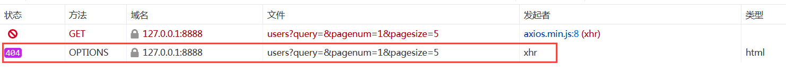
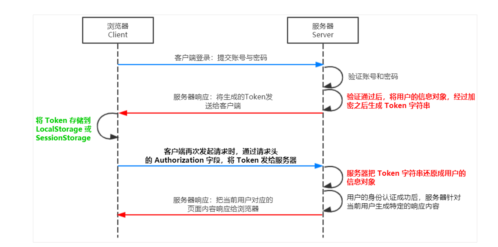

# VMall项目

## 


## 项目演示

### 项目演示

### 项目说明

#### 前端项目技术栈

```txt
是一个电商后台管理系统的前端项目，基于Vue+Element实现。主要包括商品管理、订单管理、、统计报表、权限管理、设置等功能。

前后端 分离的项目 。
```


#### 后台程序技术栈

 等你去创造 ！

```txt
springboot
JWT  json web token
mybatis
lombok
mybatis-generator
mysql
pageHelper
```


## 项目的考核标准

1. 分组，最多 4 人（含 4 人）周 2  上报

2.  11月12 日上午 上交课程设计报告， 7 页左右

3. 课程名称： 智慧管理综合实训

4. 11 月 12 日上午， 小组现场演示 项目结果， 现场打分

5. 项目功能要求

   

   ```txt
   用户管理：  全部完成
   权限管理：  权限列表功能：  完成
             角色列表：  加分项  + 5
    商品管理：  只要求显示 商品列表 
               其他功能 加分项目
    订单管理：  只要求 显示订单列表  10
               其他功能  加分项目  +5
    数据统计：  不要求：  加分项  +5
    
    JWT的 正确演示和使用  （包含 10 分）
    
    基准分：   85 分
   ```

   

6. 其他


## 前端项目准备

### nodepadplus安装


### nodejs的安装和配置


#### 2.Node和NPM

前面说过，NPM是Node提供的模块管理工具，可以非常方便的下载安装很多前端框架，包括Jquery、AngularJS、VueJs都有。为了后面学习方便，我们先安装node及NPM工具。

#### 2.1.下载Node.js

下载地址：[https://nodejs.org/en/download/](https://nodejs.org/en/download/)


推荐下载LTS版本。


完成以后，在控制台输入：

```powershell
node -v
```

看到版本信息：


#### 2.2.NPM

安装完成Node应该自带了NPM了，在控制台输入`npm -v`查看：

 


```txt
 npm config set registry https://registry.npm.taobao.org
 
// 配置后可通过下面方式来验证是否成功
npm config get registry
// 或
npm info express

```

npm install nrm -g
  ```
  


  ```


### 修改和运行项目

解压缩文件 vmallok.zip

讲该项目 复制到 工作空间

使用 nodepad plus 打开该目录


```txt

修改 axios.defaults.baseURL = 'http://git.gzpeter.com:8888/api/private/v1/'
```


进入到项目的目录：  d:/svntest/src/vmallok/      在 terminal 输入以下命令：

```txt
npm install

npm run dev

```


然后在 浏览器里面输入： localhost:3333


用户名称  admin/123456

## 后端项目准备


###  修改IP地址 虚拟机， 使用 数据库 mysql

1. 查看一下 当前的 ip 地址

   ```txt
   
   ip addr
   ```

   

   192.168.8.53    

2. 修改配置文件

   ```txt
    文件的位置和名称：  /etc/sysconfig/network-scripts/ifcfg-ens33 修改 ， 用 nodepad 打开
    
    
   
   ```

   ```
   TYPE="Ethernet"
   PROXY_METHOD="none"
   BROWSER_ONLY="no"
   DEFROUTE="yes"
   IPV4_FAILURE_FATAL="no"
   IPV6INIT="yes"
   IPV6_AUTOCONF="yes"
   IPV6_DEFROUTE="yes"
   IPV6_FAILURE_FATAL="no"
   IPV6_ADDR_GEN_MODE="stable-privacy"
   NAME="ens33"
   UUID="3d16da0d-a974-4742-8953-654d04d5a9f4"
   DEVICE="ens33"
   ONBOOT="yes"
   
   # 必须修改为你的 IP 地址
   IPADDR="192.168.8.53"
   PREFIX="24"
   # 你的 ip地址的 前三段 + .2
   GATEWAY="192.168.8.2"
   # Dns 必须同你的 Gateway 一样
   DNS1="192.168.8.2"
   IPV6_PRIVACY="no"

3. 重新启动网络

   ```txt
   [root@es50 ~]#
   [root@es50 ~]#
   [root@es50 ~]# /etc/init.d/network restart
   Restarting network (via systemctl):                        [  OK  ]
   [root@es50 ~]#
   [root@es50 ~]#
   [root@es50 ~]#
   
   ```

   

4. 测试是否可以

```txt

```
文件内容修改如下：
```txt

```

### 数据库创建

使用 navicat 工具：

创建数据库  mall 字符集选择 utf-8

使用 sql 导入数据 


### 项目创建 （springboot）

springboot  ：  


#### 项目结构


补充 pom.xml 文件， 添加以下内容

```txt
 <build>
        <resources>
            <resource>
                <directory>src/main/resources</directory>
                <includes>
                    <include>**/*.properties</include>
                    <include>**/*.xml</include>
                    <include>**/*.tld</include>
                    <include>**/*.yml</include>
                    <include>static/**</include>
                    <include>templates/**</include>
                </includes>
                <filtering>false</filtering>
            </resource>
            <resource>
                <directory>src/main/java</directory>
                <includes>
                    <include>**/*.properties</include>
                    <include>**/*.xml</include>
                    <include>**/*.tld</include>
                    <include>**/*.yml</include>

                </includes>
                <filtering>false</filtering>
            </resource>
        </resources>
        <plugins>
            <plugin>
                <groupId>org.springframework.boot</groupId>
                <artifactId>spring-boot-maven-plugin</artifactId>
                <configuration>
                    <excludes>
                        <exclude>
                            <groupId>org.projectlombok</groupId>
                            <artifactId>lombok</artifactId>
                        </exclude>
                    </excludes>
                </configuration>
            </plugin>
        </plugins>
    </build>

```
#### 使用springboot来显示helloworld


1. 修改application.properties文件

   ```txt
   server.port=9999
   
   spring.datasource.driver-class-name=com.mysql.cj.jdbc.Driver
   spring.datasource.url=jdbc:mysql://192.168.8.8/vmall?useSSL=false&useUnicode=true&characterEncoding=UTF-8
   spring.datasource.username=root
   spring.datasource.password=root1234
   ```

   

2. 添加一个包 package  ， controller 。 com.chinasoft.mallback.controller

3. 书写一个HelloController

   ```txt
   @RestController
   public class HelloController {
       
       @GetMapping("/hello")
       public String hello() {
           return "hello from teacher !";
       }
       
   }
   
   ```

   

4. 启动项目

   

   

5. 进行测试

   

6. 其他

### lombok

#### 什么是 lombok

·1.减少大量的模板代码,get和set方法,从代码封装维度看,将大量的模板代码进行封装,不需要其他人员来不断编写,哪怕是IDE可以生成的代码,这也是重复代码,减少重复的出现;
2.从代码可读性角度来看,可以专注于查看类的属性,尤其编写代码的风格不一致,比如为了防止代码冲突,新增加的代码都在最后下面编写,之前总会看到类似的问题,新增加的属性和set和get方法写道后面,让其他人无法专注查看类本身的关键内容;
3.第三减少代码冲突的可能,尤其增加新属性的时候,哪怕处理冲突也非常简单的,大量的bean,model,vo中减少非常多的代码维护;
4.lombok处理的toString方法,hash,equal方法等内容,当增加新属性的时候,以上方法都不需要重新编写,而是lombok直接帮助处理的,不会出现遗漏的问题和情况.就好比修改增加或修改某个属性,那么你就要处理该属性对其相关内容的变化,现在你修改后,其他内容不需要你去善后,而是直接有人给你善后一样,这一点尤其在新增加属性的时候非常容易忘记处理.

使用lombok的不足:
1.要求IDE增加对lombok的支持,比如IDEA中需要安装lombok的插件;如果你对外提供的服务使用lombok,那么可能引用jar的其他项目需要增加对lombok的支持,但是并不麻烦.

2.如果你想确认某个set或get方法是否在程序中被调用,你无法找到哪里使用的,但是我更认为这样的操作是违背了bean使用的初衷,bean尤其数据库和java类的映射bean,java对bean的定义和使用就是无参数的构造方法和set和get方法,而不应该在bean中处理任何和业务有任何关系的逻辑.

#### lombok的安装

1. 在 idea里面 安装lombok

   

2. 创建 spring starter 工程， 引入 lombok的jar包 。

     使用 昨天创建的项目

   

3. 进行一个测试

   创建一个 JavaBean， 然后测试，  在包  com.chinasoft.mallback.dto

   ```txt
   
       @Data
       // 就变成了一个 javaBean  pojo 对象
       // 必须安装 lombok的 plugins
   public class Meta {
       String msg;
       Integer status;
       int  age;
   }
   
   ```

   

   

   ```txt
   
   @SpringBootTest
   class MallbackApplicationTests {
   
       @Test
       // 测试 lombok 产生的 javaBean
       void testLombok() {
           Meta meta = new Meta();
           meta.setMsg("success");
           meta.setStatus(200);
           meta.setAge(18);
           System.out.println(meta);
           System.out.println(meta.getMsg());
       }
   
   }
   
   ```

   

   ```java
   @Data
   public class User implements Serializable {
   	private static final long serialVersionUID = -8466219559535957349L;
   	private String name;
   	private int age;
   }
   
   @RunWith(SpringRunner.class)
   @SpringBootTest
   public class LombokApplicationTests {
   
   	@Test
   	public void testUser() {
   		User user = new User();
   		user.setAge(88);
   		user.setName("tiger");
   		System.out.println(user);
   	}
   }
   
   ```

   

4. 其他

#### lombok的其他注解


@AllArgsConstructor  : 产生 全参数的 构造方法

@NoArgsConstructor：  产生 无参数构造方法


@CleanUp ，  调用这个局部变量的 close()  方法。


@NonNull :  检验传入参数是否为空 。


@Builder  : 建造 对象


@Log    @slf4j


### mybatis的逆向工程的测试


#### 开始 逆向工程开发

逆向工程， 必须单独开一个 项目 。这个会有 很多问题。

1. 创建一 个maven  Project

2. 引入 对应的 jar 包

   ```xml
   <dependencies>
           <dependency>
               <groupId>junit</groupId>
               <artifactId>junit</artifactId>
               <scope>test</scope>
               <version>4.12</version>
           </dependency>
           <dependency>
               <groupId>mysql</groupId>
               <artifactId>mysql-connector-java</artifactId>
               <version>5.1.8</version>
           </dependency>
           <dependency>
               <groupId>com.mchange</groupId>
               <artifactId>c3p0</artifactId>
               <version>0.9.5.2</version>
           </dependency>
           <dependency>
               <groupId>commons-beanutils</groupId>
               <artifactId>commons-beanutils</artifactId>
               <version>1.9.3</version>
           </dependency>
           <dependency>
               <groupId>org.mybatis</groupId>
               <artifactId>mybatis</artifactId>
               <version>3.5.2</version>
           </dependency>
           <dependency>
               <groupId>log4j</groupId>
               <artifactId>log4j</artifactId>
               <version>1.2.17</version>
           </dependency>
           <dependency>
               <groupId>org.mybatis.generator</groupId>
               <artifactId>mybatis-generator-core</artifactId>
               <version>1.3.5</version>
           </dependency>
           <dependency>
               <groupId>org.slf4j</groupId>
               <artifactId>slf4j-log4j12</artifactId>
               <version>1.5.8</version>
           </dependency>
       </dependencies>
   
       <build>
           <finalName>${project.artifactId}</finalName>
           <resources>
               <resource>
                   <directory>src/main/resources</directory>
                   <includes>
                       <include>**/*.properties</include>
                       <include>**/*.xml</include>
                       <include>**/*.tld</include>
                   </includes>
                   <filtering>false</filtering>
               </resource>
               <resource>
                   <directory>src/main/java</directory>
                   <includes>
                       <include>**/*.properties</include>
                       <include>**/*.xml</include>
                       <include>**/*.tld</include>
                   </includes>
                   <filtering>false</filtering>
               </resource>
           </resources>
           <plugins>
               <!-- 资源文件拷贝插件 -->
               <plugin>
                   <groupId>org.apache.maven.plugins</groupId>
                   <artifactId>maven-resources-plugin</artifactId>
                   <version>2.7</version>
                   <configuration>
                       <encoding>UTF-8</encoding>
                   </configuration>
               </plugin>
               <plugin>
                   <groupId>org.apache.maven.plugins</groupId>
                   <artifactId>maven-source-plugin</artifactId>
                   <version>2.2.1</version>
                   <executions>
                       <execution>
                           <goals>
                               <goal>jar-no-fork</goal>
                           </goals>
                           <phase>verify</phase>
                       </execution>
                   </executions>
               </plugin>
               <!-- java编译插件 -->
               <plugin>
                   <groupId>org.apache.maven.plugins</groupId>
                   <artifactId>maven-compiler-plugin</artifactId>
                   <version>3.2</version>
                   <configuration>
                       <source>1.8</source>
                       <target>1.8</target>
                       <encoding>UTF-8</encoding>
                   </configuration>
               </plugin>
           </plugins>
           <pluginManagement>
               <plugins>
                   <!-- 配置Tomcat插件 -->
                   <plugin>
                       <groupId>org.apache.tomcat.maven</groupId>
                       <artifactId>tomcat7-maven-plugin</artifactId>
                       <version>2.2</version>
                   </plugin>
               </plugins>
           </pluginManagement>
       </build>
   
   ```

   

3. 写 主程序（main）

   使用 Mybatis 上面的代码

   ```java
    public static void main(String[] args) throws Exception {
           List<String> warnings = new ArrayList<String>();
           boolean overwrite = true;
           File configFile = new File("src/main/resources/generatorConfig.xml");
           ConfigurationParser cp = new ConfigurationParser(warnings);
           Configuration config = cp.parseConfiguration(configFile);
           DefaultShellCallback callback = new DefaultShellCallback(overwrite);
           MyBatisGenerator myBatisGenerator = new MyBatisGenerator(config, callback, warnings);
           myBatisGenerator.generate(null);
       }
   ```

   

4. log4j.properties 文件 需要准备 (使用 复制粘贴)

   复制一下 。

   ```txt
   log4j.rootLogger=DEBUG, stdout
   # Console output...
   log4j.appender.stdout=org.apache.log4j.ConsoleAppender
   log4j.appender.stdout.layout=org.apache.log4j.PatternLayout
   log4j.appender.stdout.layout.ConversionPattern=%5p [%t] - %m%n
   ```

   

5. 修改 main方法里面 generatorConfig.xml 的打开路径 （使用复制粘贴）

   src/main/resources/generatorConfig.xml 

   ```txt
   <?xml version="1.0" encoding="UTF-8"?>
   <!DOCTYPE generatorConfiguration
           PUBLIC "-//mybatis.org//DTD MyBatis Generator Configuration 1.0//EN"
           "http://mybatis.org/dtd/mybatis-generator-config_1_0.dtd">
   
   <generatorConfiguration>
       <context id="testTables" targetRuntime="MyBatis3">
   
           <plugin type="org.mybatis.generator.plugins.SerializablePlugin" />
           <plugin type="org.mybatis.generator.plugins.ToStringPlugin" />
   
           <commentGenerator>
               <!-- 是否去除自动生成的注释 true：是 ： false:否 -->
               <property name="suppressAllComments" value="true" />
           </commentGenerator>
           <!--数据库连接的信息：驱动类、连接地址、用户名、密码 -->
           <jdbcConnection driverClass="com.mysql.jdbc.Driver"
                           connectionURL="jdbc:mysql://192.168.8.8:3306/vmall?useSSL=false" userId="root"
                           password="root1234">
           </jdbcConnection>
   
   
           <!-- 默认false，把JDBC DECIMAL 和 NUMERIC 类型解析为 Integer，为 true时把JDBC DECIMAL 和
               NUMERIC 类型解析为java.math.BigDecimal -->
           <javaTypeResolver>
               <property name="forceBigDecimals" value="false" />
           </javaTypeResolver>
   
           <!-- targetProject:生成PO类的位置 -->
           <javaModelGenerator targetPackage="com.chinasoft.shop.pojo"
                               targetProject=".\src\main\java">
               <!-- enableSubPackages:是否让schema作为包的后缀 -->
               <property name="enableSubPackages" value="false" />
               <!-- <property name="constructorBased" value="true" /> -->
               <!-- 从数据库返回的值被清理前后的空格 -->
               <property name="trimStrings" value="true" />
           </javaModelGenerator>
           <!-- targetProject:mapper映射文件生成的位置 -->
           <sqlMapGenerator targetPackage="com.chinasoft.shop.mapper"
                            targetProject=".\src\main\java">
               <!-- enableSubPackages:是否让schema作为包的后缀 -->
               <property name="enableSubPackages" value="false" />
           </sqlMapGenerator>
           <!-- targetPackage：mapper接口生成的位置 -->
           <javaClientGenerator type="XMLMAPPER"
                                targetPackage="com.chinasoft.shop.mapper"
                                targetProject=".\src\main\java">
               <!-- enableSubPackages:是否让schema作为包的后缀 -->
               <property name="enableSubPackages" value="false" />
           </javaClientGenerator>		<!-- 指定数据库表 -->
           <table tableName="sp_attribute"></table>
           <table tableName="sp_category"></table>
           <table tableName="sp_consignee"></table>
           <table tableName="sp_express"></table>
           <table tableName="sp_goods"></table>
           <table tableName="sp_goods_attr"></table>
           <table tableName="sp_goods_cats"></table>
           <table tableName="sp_goods_pics"></table>
           <table tableName="sp_manager"></table>
           <table tableName="sp_order"></table>
           <table tableName="sp_order_goods"></table>
           <table tableName="sp_permission"></table>
           <table tableName="sp_permission_api"></table>
           <table tableName="sp_reports_1"></table>
           <table tableName="sp_reports_2"></table>
           <table tableName="sp_reports_3"></table>
           <table tableName="sp_role"></table>
           <table tableName="sp_type"></table>
           <table tableName="sp_user"></table>
           <table tableName="sp_user_cart"></table>
   
       </context>
   </generatorConfiguration>
   
   ```

   

6. 修改 generatorConfig.xml

   - jdbc 4 个属性，

     

   - pojo 的 包名称、文件路径 是 maven项目使用

   - mapper.xml 文件， 包名称

   - mapper.java 文件  ， 包名称

     

   - 表的列表（那些表 生成 dao层）

7. 每次 必须先修改 包名称

8. 每次执行前，必须 删除 以前的 代码（xml，interface，pojo 对象）

9. 其他


条件查询的代码

```txt

```

#### mybatis-gen的使用


```txt
 <context id="testTables" targetRuntime="MyBatis3">
 
        <plugin type="org.mybatis.generator.plugins.SerializablePlugin" />
        <plugin type="org.mybatis.generator.plugins.ToStringPlugin" />
        
        
        <commentGenerator>
            <!-- 是否去除自动生成的注释 true：是 ： false:否 -->
            <property name="suppressAllComments" value="true" />
        </commentGenerator>
```


```txt
 <table tableName="sp_attribute"></table>
        <table tableName="sp_category"></table>
        <table tableName="sp_consignee"></table>
        <table tableName="sp_express"></table>
        <table tableName="sp_goods"></table>
        <table tableName="sp_goods_attr"></table>
        <table tableName="sp_goods_cats"></table>
        <table tableName="sp_goods_pics"></table>
        <table tableName="sp_manager"></table>
        <table tableName="sp_order"></table>
        <table tableName="sp_order_goods"></table>
        <table tableName="sp_permission"></table>
        <table tableName="sp_permission_api"></table>
        <table tableName="sp_reports_1"></table>
        <table tableName="sp_reports_2"></table>
        <table tableName="sp_reports_3"></table>
        <table tableName="sp_role"></table>
        <table tableName="sp_type"></table>
        <table tableName="sp_user"></table>
        <table tableName="sp_user_cart"></table>
```

#### 在springboot里面使用 mapper

首先要注意切换项目到 spring boot项目

1. 创建package： mapper,  pojo

   

2. 复杂目录下的文件， mapper 目录下、pojo目录下 到 spring boot的项目

3. 修改springboot的主程序添加主机进行扫描

   

4. 修改application.properties 文件添加mybatis的配置

   ```txt
   server.port=9999
   
   spring.datasource.driver-class-name=com.mysql.cj.jdbc.Driver
   spring.datasource.url=jdbc:mysql://192.168.8.8/vmall?useSSL=false&useUnicode=true&characterEncoding=UTF-8
   spring.datasource.username=root
   spring.datasource.password=root1234
   
   mybatis.type-aliases-package=com.chinasoft.shop.pojo
   mybatis.configuration.map-underscore-to-camel-case=true
   ```

   

5. 进行测试

   ```txt
   @SpringBootTest
   class ShopApplicationTests {
   
        @Autowired
       SpManagerMapper managerMapper;
   
       @Test
       public void testMapper() {
           // 进入数据库 查找 记录
           SpManager manager = managerMapper.selectByPrimaryKey(500);
           System.out.println(manager);
       }
       
    @Test
       public void testSelectAll() {
   
           // selectByExample 进行条件查询
           //  条件 没有定义， 就是一个全表查询
           List<SpManager> list = managerMapper.selectByExample(new SpManagerExample());
           for(SpManager sp : list) {
               System.out.println(sp);
           }
   
       }
   
   
   }
   ```

   

   ```txt
    @Test
       // 条件查询
       public void testSelectExample() {
           final SqlSession session = factory.openSession();
           final UserMapper mapper = session.getMapper(UserMapper.class);
           // 创建 example对象
           UserExample example = new UserExample();
           // 设置查询条件
           final Criteria criteria = example.createCriteria();
           // id 在 10， 30 之间
           criteria.andIdBetween(10, 30);
           // 模糊查询
           criteria.andUsernameLike("%小明%");
   
           final List<User> list = mapper.selectByExample(example);
           System.out.println(list);
           session.close();
       }
   ```

   

6. 其他

### API文档的开发说明


#### 基本说明

- 接口基准地址：`http://localhost:8888/api/private/v1/`
- 服务端已开启 CORS 跨域支持
- API V1 认证统一使用 Token 认证
- 需要授权的 API ，必须在请求头中使用 `Authorization` 字段提供 `token` 令牌
- 使用 HTTP Status Code 标识状态
- 数据返回格式统一使用 JSON

#### 支持的请求方法

- GET（SELECT）：从服务器取出资源（一项或多项）。

- POST（CREATE）：在服务器新建一个资源。

- PUT（UPDATE）：在服务器更新资源（客户端提供改变后的完整资源）。

- PATCH（UPDATE）：在服务器更新资源（客户端提供改变的属性）。

- DELETE（DELETE）：从服务器删除资源。

- HEAD：获取资源的元数据。

- OPTIONS：获取信息，关于资源的哪些属性是客户端可以改变的。

  详情见接口文档
  
  

## 后端项目开发

主要用户需求

### 登录功能

1. 查看API接口描述

2. 设计 DTO 和编写 DTO 代码

   UserIn

   ```txt
   @Data
   public class UserIn {
       Integer id;
       String username;
       String password;
       String email;
       String mobile;
       Short rid;
   }
   ```

   

   Meta

   ```txt
   @Data
   public class Meta {
       String msg;
       Integer status;
   
       public Meta() {
           this.status = 200;
           this.msg = "success";
       }
   }
   
   ```

   

   Rbody

   ```txt
   @Data
   public class Rbody implements Serializable {
       private Object data;
       private Meta meta;
   
       public Rbody() {
           meta = new Meta();
       }
   }
   ```

   

   SystemUser

   ```txt
   @Data
   public class SystemUser implements Serializable {
   
       private Integer id;
       private Integer rid;
       private String username;
       private String mobile;
       private String email;
       private String token;
       private Byte mg_state;
   }
   ```

   

3. 书写表现层 Controller

   ```txt
   @RestController
   @AllArgsConstructor
   @CrossOrigin
   public class UserController {
      UserService userService;
   
       @PostMapping("/login")
       public Rbody loginUser(@RequestBody  UserIn user) {
           System.out.println(user);
           SystemUser info = userService.getUserInfo(user);
           Rbody rbody = new Rbody();
           rbody.setData(info);
           rbody.getMeta().setMsg("登录成功");
           System.out.println(rbody);
           return rbody;
       }
   
   ```

   

4. 书写业务层

   UserServiceImpl.java

   ```txt
   @Service
   // 就是自动生成 一个 全参构造方法
   @AllArgsConstructor
   public class UserServiceImpl implements UserService {
   
   
       SpManagerMapper managerMapper;
   
       /**
        *
        * @param userIn, 用户信息
        * @return  null： 用户不存在， 或 校验密码不成功
        *          数据库 里面 用户的信息。用户可以登录
        */
       @Override
       public SystemUser getUserInfo(UserIn userIn) throws Exception {
           String username = userIn.getUsername();
   
           SpManagerExample example = new SpManagerExample();
           SpManagerExample.Criteria crit = example.createCriteria();
           crit.andMgNameEqualTo(username);
           List<SpManager> list = managerMapper.selectByExample(example);
           SystemUser retUser = new SystemUser();
           if (list.size() == 0) {
               // 用户不存在
               return null;
           } else {
               // 临时
               if("123456".equals(userIn.getPassword())) {
                   SpManager  manager = list.get(0);
                   retUser.setId(manager.getMgId());
                   retUser.setToken(manager.getMgId().toString());
                   retUser.setUsername(manager.getMgName());
               } else {
                   return null;
               }
           }
           System.out.println(list.get(0));
   
           return retUser;
       }
   ```
   
   
   
   
   
5. 使用Postman验证测试

   

6. 修改前端工程，指向我们的项目

   

   ```txt
   
   
   npm run dev
   ```

   

7. 通过前端工程测试

8. 其他

   


### 显示一级菜单

1. 查看 API 和显示效果

2. 编写 DTO （javaBean）

   ```txt
   @Data
   @AllArgsConstructor
   @NoArgsConstructor
   public class Menu {
   
       Short id;
       String authName;
       String path;
       List<Menu> children;
   }
   ```

   

3. 编写Controller 表现层

   ```txt
   @RestController
   @CrossOrigin
   @AllArgsConstructor
   public class RightController {
   
       RightService rightService;
   
       @GetMapping("/menus")
       public Rbody getMenus(HttpServletRequest request) {
           Rbody rbody = new Rbody();
           // 传送的是 userId， 现在看看 是否 可以 得到 UserID
           String token = request.getHeader("Authorization");
           List<Menu> menuList = rightService.getMenuByUserId(Integer.parseInt(token));
           System.out.println("token is " + token);
           rbody.setData(menuList);
           rbody.getMeta().setMsg("菜单获取成功 。");
           return rbody;
       }
   }
   
   ```

   

   ```txt
   @RestController
   @AllArgsConstructor
   @CrossOrigin
   public class RightController {
   
       RightService rightService;
   
       @GetMapping("/menus")
       public Rbody getMenus(HttpServletRequest request) {
           System.out.println("=================menus==================");
           Rbody rbody = new Rbody();
           Integer userId = Integer.parseInt(request.getAttribute("userId").toString());
           List<Menu> menuList = rightService.getMenusByUid(userId);
           System.out.println("userid is " +  request.getAttribute("userId"));
           rbody.setData(menuList);
           return rbody;
       }
   }
   ```

   

4. 进行表结构的分析

   

   sp_manager

   

   sp_role

   

   sp_permission

   

   sp_permission_api

   

5. 编写 业务层 service

   ```txt
   @Service
   @AllArgsConstructor
   public class RightServiceImpl implements RightService {
   
       SpManagerMapper managerMapper;
       SpRoleMapper roleMapper;
       SpPermissionMapper permissionMapper;
       SpPermissionApiMapper permissionApiMapper;
   
       @Override
       public List<Menu> getMenuByUserId(int userId) {
   //        1. 根据用户的 ID 获得 用户的角色的 ID
           SpManager manager = managerMapper.selectByPrimaryKey(userId);
           Short roleId = manager.getRoleId().shortValue();
           System.out.println("roleId is " + roleId);
   //                2. 通过 role id 获取 用户的 菜单ID 的列表
           SpRoleWithBLOBs role = roleMapper.selectByPrimaryKey(roleId);
           // 转换为 字符串的数组
           String[] strIds = role.getPsIds().split(",");
           // 将 字符串的数组 转换 为 Short的列表
           ArrayList<Short> ids = new ArrayList<>();
           for(String str : strIds) {
               ids.add(Short.parseShort(str));
           }
           System.out.println(ids);
   //                3. 根据 菜单 ID 列表 得到 用户的 一级菜单
           List<Menu> menuList = getMenusByParentId(ids, 0);
           for(Menu menu1: menuList) {
               // 根据 父菜单的 ID 去 找 子菜单
               List<Menu> menuList2 = getMenusByParentId(ids, menu1.getId().intValue());
               //  将子菜单的列表 赋值给 children
               menu1.setChildren(menuList2);
           }
           return menuList;
       }
   
       private List<Menu> getMenusByParentId(ArrayList<Short> ids, Integer parentId) {
   //                3. 根据 菜单 ID 列表 得到 用户的 一级菜单
           SpPermissionExample example = new SpPermissionExample();
           SpPermissionExample.Criteria crit = example.createCriteria();
           crit.andPsPidEqualTo(parentId.shortValue());
           crit.andPsIdIn(ids);
   
           List<SpPermission> permList = permissionMapper.selectByExample(example);
           ArrayList<Menu> menus = new ArrayList<>();
           for(SpPermission perm: permList) {
               System.out.println(perm);
               Menu menu = new Menu(perm.getPsId(), perm.getPsName(), "", null);
   
               menus.add(menu);
           }
           return menus;
       }
   }
   
   
   ```

   

   ```txt
   @Service
   @AllArgsConstructor
   public class RightServiceImpl implements RightService {
       SpManagerMapper managerMapper;
       SpRoleMapper roleMapper;
       SpPermissionMapper permissionMapper;
       SpPermissionApiMapper permissionApiMapper;
   
       @Override
       public List<Menu> getMenusByUid(Integer userId) {
           SpManager manager = managerMapper.selectByPrimaryKey(userId);
           Byte roleId = manager.getRoleId();
           SpRoleWithBLOBs role = roleMapper.selectByPrimaryKey(roleId.shortValue());
           String[] strIds = role.getPsIds().split(",");
           List<Short> ids = new ArrayList<>();
           for (int i = 0; i < strIds.length; i++) {
               ids.add(Short.parseShort(strIds[i]));
           }
           List<Menu> menuList = getMenusByParentId(ids, 0);
           for(Menu menu1: menuList) {
               List<Menu> menuList2 = getMenusByParentId(ids, menu1.getId().intValue());
               fillMenuPath(menuList2);
               menu1.setChildren(menuList2);
           }
           return menuList;
       }
       
       private List<Menu> getMenusByParentId(List<Short> ids, Integer parentId) {
           SpPermissionExample example = new SpPermissionExample();
           SpPermissionExample.Criteria crit = example.createCriteria();
           crit.andPsPidEqualTo(parentId.shortValue());
           crit.andPsIdIn(ids);
           List<SpPermission> permissionList = permissionMapper.selectByExample(example);
           List<Menu> menu1List = new ArrayList<>();
           for (SpPermission perm : permissionList) {
               Menu menu = new Menu();
               menu.setId(perm.getPsId());
               menu.setAuthName(perm.getPsName());
               menu1List.add(menu);
           }
           return menu1List;
       }
   
   ```

   

6. 联机测试

@AllArgsConstructor 的使用和讲解

### 显示二级菜单

1.  修改 application.properties 文件

   ```txt
   mybatis.type-aliases-package=com.chinasoft.mallback.pojo
   
   //  ps_id  ==>   psId (在 javaBean)
   mybatis.configuration.map-underscore-to-camel-case=true
   
   ```

   

2. 修改 SpPermissionApiMapper.java    SpPermissionApiMapper.xml 文件

   ```txt
   public interface SpPermissionApiMapper {
       SpPermissionApi selectByPsId(Integer id);
       
       long countByExample(SpPermissionApiExample example);
   
       int deleteByExample(SpPermissionApiExample example);
   
       int deleteByPrimaryKey(Integer id);
   
   ```

   ```txt
   <mapper namespace="com.chinasoft.mallback.mapper.SpPermissionApiMapper">
     <select id="selectByPsId" resultType="com.chinasoft.mallback.pojo.SpPermissionApi" parameterType="int" >
       select * from sp_permission_api where ps_id = #{psID}
     </select>
     <resultMap id="BaseResultMap" type="com.chinasoft.mallback.pojo.SpPermissionApi">
   ```

   

3. 进行单元测试

   ```txt
     @Autowired
       SpPermissionApiMapper spaMapper;
   
       @Test
       public void testMySql() {
           SpPermissionApi spPermissionApi = spaMapper.selectByPsId(101);
           System.out.println(spPermissionApi);
       }
   ```

   

4. 编写代码

   ```txt
     /**
        *  填充 menuList， Path 字段， 需要去 其他表查询。进行查询后填充 该 字段， Path
        * @param menuList2
        */
       private void fillMenuPath(List<Menu> menuList2) {
           for (Menu menu : menuList2) {
               final Short menuId = menu.getId();
               final SpPermissionApi api = permissionApiMapper.selectByPsId(menuId.intValue());
               menu.setPath(api.getPsApiPath());
           }
       }
   ```

   

5. 其他

1. 业务层的编码

   ```txt
   
   ```
   
   
   
2. 进行联机测试


### 用户管理列表功能



#### OPTIONS

GET,POST,PUT,DELETE,OPTIONS，

就是一个 服务查询的 方法 。看对应 url的服务 是否存在 。存在 就 ok。


#### 分页

分类：

​    逻辑分页、： 假分页。 一次查询 取得 所有数据， 已经到浏览器 。在显示地方进行分页。

   物理分页 ： 真分页， 就是每次 只查询需要显示的数据 。

mysql： 

   ```txt
select * from user limit 10;

select * from user limit 10, 5;
limit: 就是 mysql 对分页的支持 。
   ```


#### pageHelper

1. 说明

   ```txt
   如果你也在用Mybatis，建议尝试该分页插件，这个一定是最方便使用的分页插件。
   该插件目前支持Oracle,Mysql,MariaDB,SQLite,Hsqldb,PostgreSQL六种数据库分页。
   ```
   
   
   
2. 使用方法

   第一步：把PageHelper依赖的jar包添加到工程中。

   ```txt
     <dependency>
               <groupId>com.github.pagehelper</groupId>
               <artifactId>pagehelper-spring-boot-starter</artifactId>
               <version>1.2.3</version>
           </dependency>
   ```
   
   第二步：在application.properties 文件设置 分页的属性:

   ```txt
pagehelper.auto-dialect=true
   pagehelper.helper-dialect=mysql
   pagehelper.reasonable=true;
   pagehelper.support-methods-arguments=true
   
   ```
   
   第三步：在代码中使用

   1、设置分页信息：

     //获取第1页，10条内容，默认查询总数count

     PageHelper.startPage(1, 10);

    

     //紧跟着的第一个select方法会被分页

   List<Country> list = countryMapper.selectIf(1);

   2、取分页信息

   //获取第1页，10条内容，默认查询总数count

   PageHelper.startPage(1, 10);

   List<Country> list = countryMapper.selectAll();

   //用PageInfo对结果进行包装

   PageInfo page = new PageInfo(list);

   //测试PageInfo全部属性

   //PageInfo包含了非常全面的分页属性

3. 单元测试代码

```txt
 @Test
    // 测试分页
    public void testPageHelpler() {
        // 就可以完成分页
        PageHelper.startPage(2, 3);
        List<SpManager> list = managerMapper.selectByExample(new SpManagerExample());
        // 查询完成后
        PageInfo<SpManager> info = new PageInfo<>(list);
        System.out.println(info.getTotal());
        System.out.println(info.getPages());
        for(SpManager sp : list) {
            System.out.println(sp);
        }

    }


```


1. 查看 一下 API 接口文档

2. 分析 编写 DTO

   OnePage

    ```txt
    @Data
    public class OnePage {
        Integer total;
        Integer pagenum;
        List<UserOut> users;
    }
    ```

   

   UserOut

   ```txt
   @Data
   @AllArgsConstructor
   @NoArgsConstructor
   public class UserOut {
       Integer id;
       String role_name;
       String username;
       String create_time;
       String mobile;
       String email;
       boolean mg_state;
   }
   ```

   

3. 编写 UserController 里面的代码，接受请求

   ```txt
      @GetMapping("/users")
       // 得到用户的列表
       public Rbody getUserList(String query, Integer pagenum, Integer pagesize) {
           Rbody rbody = new Rbody();
           // 查询用户列表，
           OnePage op = userService.getUserList(query, pagenum, pagesize);
           rbody.setData(op);
           System.out.println(op);
           rbody.getMeta().setMsg("查询用户列表成功");
           return rbody;
       }
   ```

   

4. 编写 UserServiceImpl 里面的代码

   ```txt
     @Override
       public OnePage getUserList(String query, Integer pagenum, Integer pagesize) {
           OnePage op = new OnePage();
           // 就可以完成分页
           PageHelper.startPage(pagenum, pagesize);
           List<SpManager> list = managerMapper.selectByExample(new SpManagerExample());
   
           ArrayList<UserOut> users = new ArrayList<>();
           for(SpManager m : list) {
               UserOut user = new UserOut();
               user.setId(m.getMgId());
               user.setUsername(m.getMgName());
               user.setMobile(m.getMgMobile());
               user.setEmail(m.getMgEmail());
               user.setRole_name("super");
               users.add(user);
           }
           // 查询完成后
           PageInfo<SpManager> info = new PageInfo<>(list);
           op.setTotal((int)info.getTotal());
           op.setPagenum(info.getPageNum());
           op.setUsers(users);
   
           System.out.println(info.getTotal());
           System.out.println(info.getPages());
   //        for(SpManager sp : list) {
   //            System.out.println(sp);
   //        }
           return op;
       }
   ```

### 用户删除

1. 查看 api 文档

2. 不用写 DTO

3. 书写控制器 controller

   ```txt
    // 删除用户
       @DeleteMapping("/users/{id}")
       public Rbody deleteUser(@PathVariable("id") Integer id) {
           Rbody rbody = new Rbody();
           SystemUser user = userService.deleteUser(id);
           if (user != null) {
               rbody.setData(user);
               rbody.getMeta().setMsg("删除用户成功... ttt");
           } else {
               rbody.getMeta().setStatus(500);
               rbody.getMeta().setMsg("delete user failed");
           }
           return rbody;
       }
   ```

   

4. 编写 UserServiceImpl

   ```txt
     @Override
       public SystemUser deleteUser(Integer id) {
           SpManager manager = managerMapper.selectByPrimaryKey(id);
           if (manager == null) {
               // 查询不到
               return null;
           }
           int num = managerMapper.deleteByPrimaryKey(id);
           if (num != 1) {
               // 删除操作 不成功
               return null;
           }
           return new SystemUser();
       }
   ```

   

5. 测试完成

### 用户新增

1. 查看 API

2. 编写 DTO （不用写）

3. 编写控制器

    ```txt
      // 添加用户
        @PostMapping("/users")
        public Rbody addUser(@RequestBody UserIn user) {
            Rbody rbody = new Rbody();
            SystemUser systemUser = userService.addUser(user);
            if (systemUser == null) {
                rbody.getMeta().setMsg("添加用户失败");
                rbody.getMeta().setStatus(500);
            } else {
                rbody.getMeta().setMsg("添加用户成功");
                rbody.getMeta().setStatus(201);
                rbody.setData(systemUser);
            }
            return rbody;
        }
    ```

   

4. 编写 业务层 UserServiceImpl

   ```txt
    @Override
       public SystemUser addUser(UserIn user) {
           SpManager manager = new SpManager();
           manager.setMgEmail(user.getEmail());
           manager.setMgMobile(user.getMobile());
           manager.setMgName(user.getUsername());
           String password = DigestUtils.md5DigestAsHex(user.getPassword().getBytes());
           manager.setMgPwd(password);
           manager.setRoleId((byte)30);
           // manager.setMgTime((int)new Date().getTime());
           manager.setMgTime(0);
           manager.setMgState((byte)1);
           int insert = managerMapper.insert(manager);
           if (insert != 1) {
               System.out.println("insert user failed !");
               System.out.println(manager);
               return null;
           }
           return new SystemUser();
       }
   ```

   

5. 测试

### 完善密码登录功能

```txt
   } else {
            // 临时
            String password = DigestUtils.md5DigestAsHex(userIn.getPassword().getBytes());
            SpManager  manager = list.get(0);
            if(manager.getMgPwd().equals(password)) {
                retUser.setId(manager.getMgId());
                retUser.setToken(manager.getMgId().toString());
                retUser.setUsername(manager.getMgName());
            } else {
                return null;
            }
        }
```


### 用户删除

#### log4j

详细情况 见 ppt和对应目录

```txt
@RestController
@CrossOrigin
public class RightController {

    public static  final Logger log = LoggerFactory.getLogger(RightController.class);

    @Autowired
    private RightService rightService;
```

我们的项目如何使用log4j软件：

1. 引jar包

   ```txt
        <!--日志系统-->
           <dependency>
               <groupId>log4j</groupId>
               <artifactId>log4j</artifactId>
               <version>1.2.17</version>
           </dependency>
   
           <!--日志门面 -->
           <dependency>
               <groupId>org.slf4j</groupId>
               <artifactId>slf4j-log4j12</artifactId>
               <version>1.7.30</version>
           </dependency>
           
        
   ```
   
   
   
2. 准备配置文件 log4j.properties

   ```txt
   #代表 全局的日志级别
   log4j.rootLogger=info, stdout
   #log4j.rootLogger=debug, stdout
   # Console output...
   log4j.appender.stdout=org.apache.log4j.ConsoleAppender
   log4j.appender.stdout.layout=org.apache.log4j.PatternLayout
   log4j.appender.stdout.layout.ConversionPattern=%5p [%t] - %m%n
   # 可以显示 mapper的 调试信息
   #log4j.category.com.chinasoft.shop.mapper=info
   
   #就是 我们 自己写的代码 使用 debug的级别
   log4j.category.com.chinasoft.shop=debug
   ```

   

3. 添加注解

   

   ```txst
   @Slf4j
   ```

   

4. 添加调试代码

   ```txt
      @Override
       public SystemUser deleteUser(Integer userId) {
       
           log.debug("\n user id is {}", userId);
           // 查询 用户 是否 存在
           final SpManager manager = managerMapper.selectByPrimaryKey(userId);
           log.debug("\n manager is {}", manager);
           if (manager == null) {
               return null;
           }
           log.info("\dsjfksdfjk")
           
           
    //  {} 相当于 站位符， 代表 后面的 参数
           log.debug("\n user id is {} string {}", userId, "this is a test String");
           // 查询 用户 是否 存在
           final SpManager manager = managerMapper.selectByPrimaryKey(userId);
           log.debug("\n manager is {}", manager);
           
           log.warn("this is warn");
           log.info("thiss is a infoi {}l", manager);
   ```

   

5. 其他

   运行程序 。


### 用户修改

#### CrossOrigin


### 修改用户状态

### 用户角色分配

```txt
 @Override
    public List<Menu> getChildMenu(List<Short> ids, Short parentId) {

        int level;
        if (parentId != 0) {
            final SpPermission parent = permissionMapper.selectByPrimaryKey(parentId);
            level = Integer.parseInt(parent.getPsLevel());
            level++;
        } else {
            level = 0;
        }

        final SpPermissionExample example = new SpPermissionExample();
        final SpPermissionExample.Criteria crit = example.createCriteria();
        crit.andPsLevelEqualTo("" + level);
        crit.andPsIdIn(ids);
        crit.andPsPidEqualTo(parentId);
        final List<SpPermission> list = permissionMapper.selectByExample(example);

        final ArrayList<Menu> menus = new ArrayList<>();
        for (SpPermission sp : list) {
            final Menu menu = new Menu(sp.getPsId(), sp.getPsName(), "", null);
            menus.add(menu);
        }

        return menus;
    }
    
    
    
  private List<Menu> formAllRights(ArrayList<Short> ids) {
        final List<Menu> childMenu = getChildMenu(ids, (short) 0);
        System.out.println(childMenu);
        for (Menu menu : childMenu) {
            final List<Menu> cm2 = getChildMenu(ids, menu.getId());
            menu.setChildren(cm2);
            System.out.println(cm2);
            for (Menu menu2 : cm2) {
                final List<Menu> cm3 = getChildMenu(ids, menu2.getId());
                menu2.setChildren(cm3);
            }
        }
        return childMenu;
    }
    
    
  @Override
    public List<RoleOut> getAllRole() {
        final List<SpRoleWithBLOBs> roles = roleMapper.selectByExampleWithBLOBs(new SpRoleExample());

        final ArrayList<RoleOut> retList = new ArrayList<>();
        for (SpRoleWithBLOBs role : roles) {
            final String[] strIds = role.getPsIds().split(",");
            final ArrayList<Short> ids = new ArrayList<>();
            for (String strId : strIds) {
                ids.add(Short.valueOf(strId));
            }
            final RoleOut out = new RoleOut();
            out.setId(role.getRoleId());
            out.setRoleDesc(role.getRoleDesc());
            out.setRoleName(role.getRoleName());
            out.setChildren(formAllRights(ids));
            retList.add(out);
        }

        return retList;
    }

```

## JWT

### 什么是 JWT

我总结几个重点：

JWT，全称Json Web Token，是一种令牌认证的方式

长相：


头部：放有签名算法和令牌类型（这个就是JWT）
载荷：你在令牌上附带的信息：比如用户的id，用户的电话号码，这样以后验证了令牌之后就可以直接从这里获取信息而不用再查数据库了
签名：用来加令牌的

安全性：由于载荷里的内容都是用BASE64处理的，所以是没有保密性的(因为BASE64是对称的)，但是由于签名认证的原因，其他人很难伪造数据。不过这也意味着，你不能把敏感信息比如密码放入载荷中，毕竟这种可以被别人直接看到的，但是像用户id这种就无所谓了


### JWT解决什么问题

### 传统的session认证

我们知道，http协议本身是一种无状态的协议，而这就意味着如果用户向我们的应用提供了用户名和密码来进行用户认证，那么下一次请求时，用户还要再一次进行用户认证才行，因为根据http协议，我们并不能知道是哪个用户发出的请求，所以为了让我们的应用能识别是哪个用户发出的请求，我们只能在服务器存储一份用户登录的信息，这份登录信息会在响应时传递给浏览器，告诉其保存为cookie,以便下次请求时发送给我们的应用，这样我们的应用就能识别请求来自哪个用户了,这就是传统的基于session认证。

但是这种基于session的认证使应用本身很难得到扩展，随着不同客户端用户的增加，独立的服务器已无法承载更多的用户，而这时候基于session认证应用的问题就会暴露出来.


### JWT的工作原理



总结：用户的信息通过 Token 字符串的形式，保存在客户端浏览器中。服务器通过还原 Token 字符串的形式来认证用户的身份

### jwt的开发实施步骤

1. 导包 修改pom.xml 文件

   ```txt
       <dependency>
               <groupId>com.auth0</groupId>
               <artifactId>java-jwt</artifactId>
               <version>3.8.3</version>
           </dependency>
   ```

   

2. 编写 工具类

   ```txt
   public class JwtUtils {
   
       /**
        签发对象：这个用户的id
        签发时间：现在
        有效时间：30分钟
        载荷内容：暂时设计为：这个人的名字，这个人的昵称
        加密密钥：这个人的id加上一串字符串
        */
       public static String createToken(String userId, String userName) {
   
           Calendar nowTime = Calendar.getInstance();
           nowTime.add(Calendar.MINUTE,30);
           Date expiresDate = nowTime.getTime();
   
           return JWT.create().withAudience(userId)   //签发对象
                   .withIssuedAt(new Date())    //发行时间
                   .withExpiresAt(expiresDate)  //有效时间
                   .withClaim("userName", userName)    //载荷，随便写几个都可以
                   .sign(Algorithm.HMAC256(userId+"hello888"));   //加密
       }
   
       /**
        * 检验合法性，其中secret参数就应该传入的是用户的id
        * @param token
        */
       public static boolean verifyToken(String token)  {
           String  secret = getAudience(token);
           DecodedJWT jwt = null;
           try {
               JWTVerifier verifier = JWT.require(Algorithm.HMAC256(secret+"hello888")).build();
               jwt = verifier.verify(token);
               return true;
           } catch (Exception e) {
               //效验失败
               //这里抛出的异常是我自定义的一个异常，你也可以写成别的
               return false;
           }
       }
   
       /**
       * 获取签发对象
       */
       public static String getAudience(String token) {
           String audience = null;
           try {
               audience = JWT.decode(token).getAudience().get(0);
           } catch (JWTDecodeException j) {
               //这里是token解析失败
               return null;
           }
           return audience;
       }
   
   
       /**
       * 通过载荷名字获取载荷的值
       */
       public static Claim getClaimByName(String token, String name){
           return JWT.decode(token).getClaim(name);
       }
   }
   
   ```

   复制 项目里面 utils里面的java源文件 到 utils包里面

   

3. 测试生成的token

   编写一个 TokenController 来测试一下令牌

   ```txt
   @RestController
   @CrossOrigin
   public class TokenController {
   
       @GetMapping("/token")
       public Rbody testToken() {
           Rbody rbody = new Rbody();
           // 创建token， 返回给 用户
           String token = JwtUtils.createToken("500", "admin");
           rbody.setData(token);
   
           rbody.getMeta().setMsg("令牌获取成功 ！");
           return rbody;
       }
   }
   
   ```

   

4. 测试通过 token获取用户信息

   ```txt
    @GetMapping("/whoami")
       public Rbody whoami(HttpServletRequest request) {
           Rbody rbody = new Rbody();
           String token = request.getHeader("Authorization");
           System.out.println(token);
           if (JwtUtils.verifyToken(token)) {
               Claim userName = JwtUtils.getClaimByName(token, "userName");
               rbody.setData(" 你是 " + userName.asString());
               rbody.getMeta().setMsg("用户的校验成功");
           } else {
               rbody.setData("你的令牌 是 无效的  ");
               rbody.getMeta().setMsg("用户的校验failed");
           }
           return rbody;
       }
   ```

   

5. 添加 token 生成代码

   ```txt
          if(manager.getMgPwd().equals(password)) {
                   retUser.setId(manager.getMgId());
   //                retUser.setToken(manager.getMgId().toString());
                   String token = JwtUtils.createToken(manager.getMgId().toString(), manager.getMgName());
                   retUser.setToken(token);
                   retUser.setUsername(manager.getMgName());
               } else {
                   return null;
               }
   ```

   

6. 编写拦截器

   ```txt
   public class AuthInterceptor implements HandlerInterceptor {
   
       @Override
       public boolean preHandle(HttpServletRequest request, HttpServletResponse response, Object handler) throws Exception {
           System.out.println(request.getRequestURL());
           String method = request.getMethod();
           if ("options".equalsIgnoreCase(method)) {
               return true;
           }
           String token = request.getHeader("Authorization");
           if (token != null && token.length() > 0 && JwtUtils.verifyToken(token) == true) {
               String strId = JwtUtils.getAudience(token);
               request.setAttribute("userId", strId);
               return true;
           }
           // 令牌是空的
           final Rbody ret = new Rbody();
           ret.getMeta().setStatus(500);
           ret.getMeta().setMsg("令牌无效  ！");
           response.setContentType("application/json");
           response.setCharacterEncoding("utf-8");
           final PrintWriter writer = response.getWriter();
           writer.write(JsonUtils.objectToJson(ret));
           writer.flush();
   
           return false;
       }
   }
   ```

   

7. 配置拦截器

   ```txt
   @Configuration
   public class JwtInterceptorConfig implements WebMvcConfigurer {
   
       @Override
       public void addInterceptors(InterceptorRegistry registry) {
           registry.addInterceptor(getJwtInterceptor()).addPathPatterns("/**").excludePathPatterns("/login");
       }
   
       @Bean
       public AuthInterceptor getJwtInterceptor() {
           return new AuthInterceptor();
       }
   }
   ```

   

8. 使用token来完成系统的登录校验

   ```txt
     @GetMapping("/menus")
       public Rbody getMenus(HttpServletRequest request) {
           Rbody rbody = new Rbody();
           // 传送的是 userId， 现在看看 是否 可以 得到 UserID
           // String token = request.getHeader("Authorization");
           String strId = (String) request.getAttribute("userId");
           List<Menu> menuList = rightService.getMenuByUserId(Integer.parseInt(strId));
           System.out.println("token is " + strId);
           rbody.setData(menuList);
           rbody.getMeta().setMsg("菜单获取成功 。");
           return rbody;
       }
   ```

   

9. 其他


## Redis

### 简单使用

```txt

```


### 使用AOP

```txt

```

```txt
 #在文件 applicationContext-service.xml 里面添加
 
 <aop:aspectj-autoproxy />
```


### 解决令牌问题

```txt
  @Override
    public SystemUser getUserInfo(UserIn userIn) {
        // 查询用户信息， 根据用户名称
        final SpManager manager = managerMapper.selectByName(userIn.getUsername());
        // 判断用户 找不到
        if (manager == null) {
            return null;
        }
        // 校验密码 放一放
        String password = DigestUtils.md5DigestAsHex(userIn.getPassword().getBytes());
        SystemUser ret;
        if (password.equals(manager.getMgPwd())) {
            // 就是将 数据库里面的 manager 转换 成 页面需要的信息
            ret = new SystemUser();
            ret.setUsername(manager.getMgName());
            ret.setMobile(manager.getMgMobile());
            ret.setEmail(manager.getMgEmail());
            ret.setId(manager.getMgId());
            ret.setRid(manager.getRoleId());

            // 令牌 用一个随机串  redis 实现一个令牌 系统。
            // jwt,  java web token  lib.
            // ret.setToken(manager.getMgId() + "," + UUID.randomUUID().toString());
            ret.setToken(UUID.randomUUID().toString());
            // 放的是 用户的 ID， 其实 可以 放用户 对象 。
            jedisClient.set(ret.getToken(), ret.getId().toString());
            // 设置令牌的 有效时间  2 个小时
            jedisClient.expire(ret.getToken(), 2*60*60);
            // jedisClient.expire(ret.getToken(), 3);
        } else {
            // 密码不对
            return null;
        }
        return ret;
    }

```


SSO,  单点登录系统 。 使用令牌

```txt
 @RequestMapping("/menus")
    public Rbody getMenus(@RequestHeader("Authorization") String token ) {
        System.out.println(token);
        /*
        final String[] arr = token.split(",");
        String strId = arr[0];
        System.out.println(strId);
        */
        final Rbody r = new Rbody();
        final String strId = jedisClient.get(token);
        if (strId != null) {
            List<Menu> menuList = rightService.getUserMenu(Integer.valueOf(strId));
            r.setData(menuList);
            r.getMeta().setMsg("获取菜单列表成功");
        } else {
            r.getMeta().setStatus(500);
            r.getMeta().setMsg("令牌已经过期 ");
        }
        return r;
    }
```


### 解决请求认证问题

```txt
@Slf4j
public class AuthIntercp implements HandlerInterceptor {

    @Setter
    JedisClient jedisClient;

    @Override
    public boolean preHandle(HttpServletRequest request, HttpServletResponse response, Object handler) throws Exception {
        // login 请求 不能拦截
        final String uri = request.getRequestURI();
        if (uri.contains("login")) {
            // 登录 请求， 不拦截
            return true;
        }

        if ("options".equalsIgnoreCase(request.getMethod())) {
            return true;
        }

        final String token = request.getHeader("Authorization");
        log.debug("token is in interceptor {} ", token);
        // 令牌是否 存在
        if (!StringUtils.isEmpty(token)) {
            // 令牌 是否有效
            final String strId = jedisClient.get(token);
            log.debug("user is is {}", strId);
            if (!StringUtils.isEmpty(strId)) {
                // 合法用户 ，放行
                log.debug(" now request is ok ");
                return true;
            }
        }
        // 令牌是空的
        final Rbody ret = new Rbody();
        ret.getMeta().setStatus(500);
        ret.getMeta().setMsg("令牌无效  ！");
        response.setHeader("content-type",
                "application/json;charset=utf-8");
        final PrintWriter writer = response.getWriter();
        writer.write(JsonUtils.objectToJson(ret));
        writer.flush();
        return false;

    }
}
```


```txt
<mvc:interceptors>
        <mvc:interceptor>
            <mvc:mapping path="/**"/>
            <bean class="com.chinasoft.shop.interceptor.AuthIntercep">
                <constructor-arg name="jedisClient" ref="jedisClientPool" />
            </bean>
        </mvc:interceptor>
    </mvc:interceptors>
```


### DTO准备

#### Menu

```txt
@Data
@AllArgsConstructor
@NoArgsConstructor
public class Menu {

    Short id;
    String authName;
    String path;
    List<Menu> children;
}
```


#### OnePage

```txt
@Data
@AllArgsConstructor
@NoArgsConstructor
public class OnePage {

    Integer total;
    Integer pagenum;
    List<User> users;
}
```


#### RoleOut

```txt
@Data
public class RoleOut {
    Short id;
    String roleName;
    String roleDesc;
    List<Menu> children;
}
```


#### SystemUser

```txt
@Data
public class SystemUser implements Serializable {

    private Integer id;
    private Integer rid;
    private String username;
    private String mobile;
    private String email;
    private String token;
    private Byte mg_state;
}
```


#### User

```txt
@Data
@NoArgsConstructor
@AllArgsConstructor
public class User {
    Integer id;
    String role_name;
    String username;
    String create_time;
    String mobile;
    String email;
    boolean mg_state;
}
```


#### UserIn

```txt
@Data
public class UserIn {
    Integer id;
    String username;
    String password;
    String email;
    String mobile;
    Short rid;
}
```


