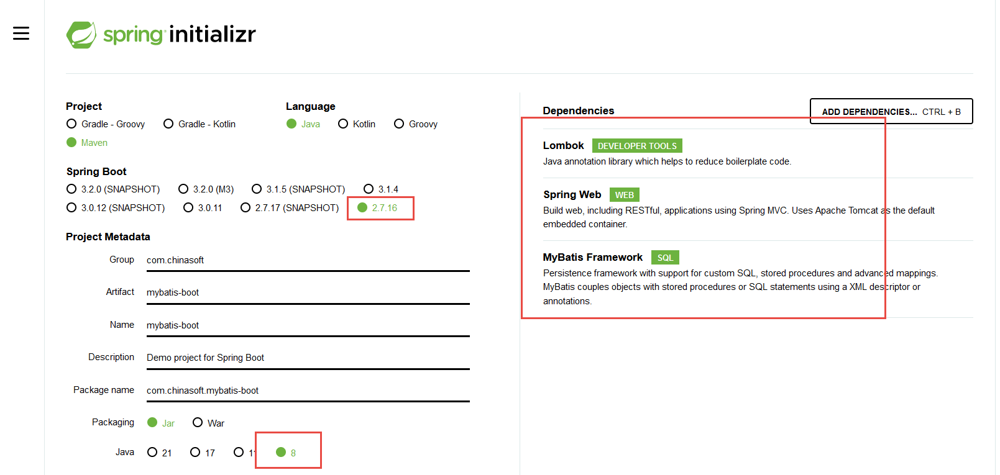
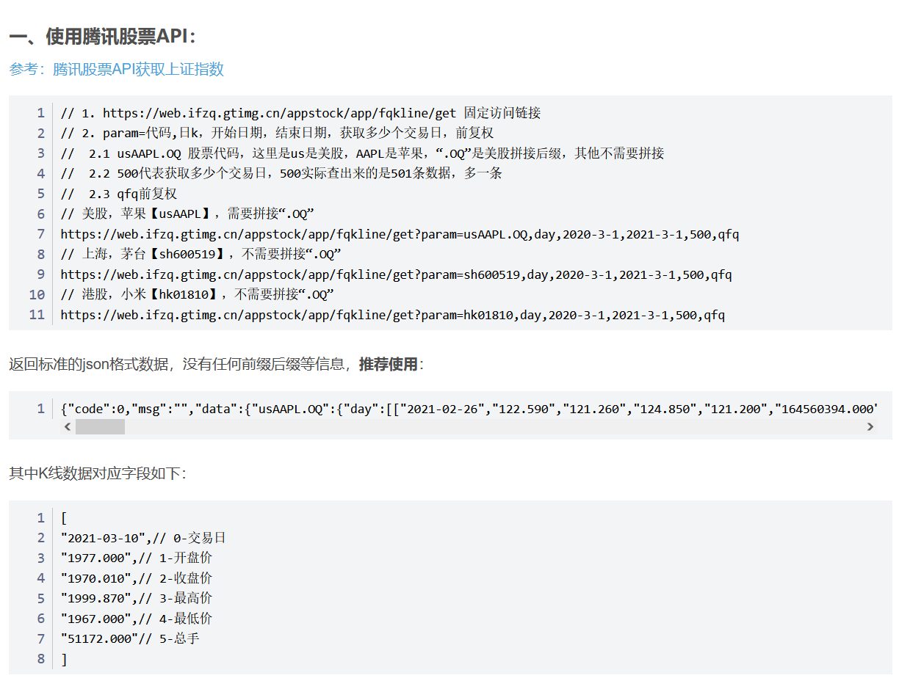
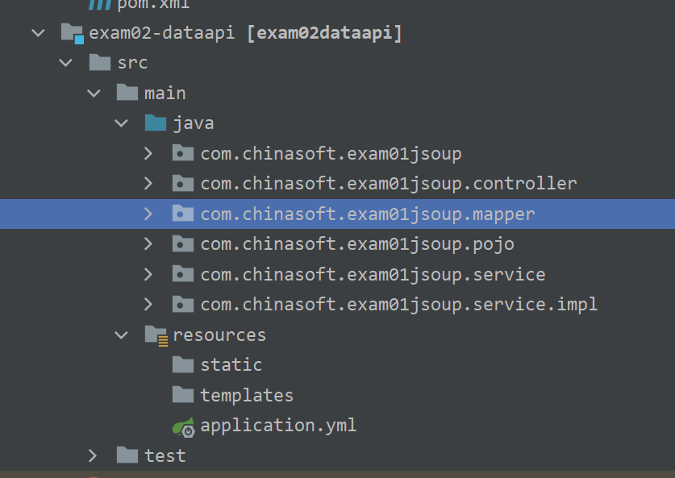

# Stock API


## 创建数据表


高斯数据库的数据类型

https://docs.opengauss.org/zh/docs/3.0.0/docs/BriefTutorial/%E6%95%B0%E6%8D%AE%E7%B1%BB%E5%9E%8B.html


```txt
# 创建一个序列， 1
create sequence sq_stock_id  start 1 increment 1 cache 20;

# 创建一个股票的表
create table stock(
	id int primary key not null default nextval('sq_stock_id'),
	code char(10),
	date date,
	name varchar(64),
	open float,
	close float,
	high float,
	low float,
	vol bigint,
	money float
);

# 创建一个 关于股票代码和日期的 唯一性索引
CREATE UNIQUE INDEX index_code_date ON stock(code, date);
```


##  lombok

```txt
@Data
@NoArgsConstructor
@AllArgsConstructor
public class Stock {
    Integer id;
    String code;
    String date;
    String name;
    Float open;
    Float close;
    Float high;
    Float low;
    Long vol;
    Float money;
}
```


## springboot

### 创建一个 springboot的 mybatis 项目



### javabean

```txt
@Data
@NoArgsConstructor
@AllArgsConstructor
public class Stock {
    Integer id;
    String code;
    String date;
    String name;
    Float open;
    Float close;
    Float high;
    Float low;
    Long vol;
    Float money;
}
```


## mybatis

application.yml

```txt
server:
  port: 8090

spring:
  datasource:
    driver-class-name: org.opengauss.Driver
    url: jdbc:opengauss://192.168.66.128:15400/tiger_db
    username: tiger
    password: Tiger@123
```


```txt
@Mapper
public interface StockMapper {

    @Insert("insert into stock(date, open, close, high, low, vol, code) values( " +
            "  #{date},  " +
            " #{open}, #{close}, #{high}, #{low}, " +
            " #{vol}, #{code} )")
    Integer insert(Stock st);

    @Delete("delete from stock")
    Integer clear();
    
  @Select("select * from stock where code = #{code} " +
            " and date > #{start} and date < #{end} order by date ")
    List<Stock> selectByCond(Query query);
    
}


```


## 导入数据进入表

### 网易的接口是：

网易的数据格式为csv文件

日线

<http://quotes.money.163.com/service/chddata.html?code=>代码&start=开始时间&end=结束时间&fields=TCLOSE;HIGH;LOW;TOPEN;LCLOSE;CHG;PCHG;TURNOVER;VOTURNOVER;VATURNOVER;TCAP;MCAP

参数说明：代码为股票代码，上海股票前加0，如600756变成0600756，深圳股票前加1。时间都是6位标识法，年月日，fields标识想要请求的数据。可以不变。

例如大盘指数数据查询（上证指数000001前加0，沪深300指数000300股票前加0，深证成指399001前加1，中小板指399005前加1，创业板指399006前加1）： 
<http://quotes.money.163.com/service/chddata.html?code=0000300&start=20151219&end=20171108&fields=TCLOSE;HIGH;LOW;TOPEN;LCLOSE;CHG;PCHG;VOTURNOVER>

上海股票数据查询（浪潮）：<http://quotes.money.163.com/service/chddata.html?code=0600756&start=20160902&end=20171108&fields=TCLOSE;HIGH;LOW;TOPEN;LCLOSE;CHG;PCHG;VOTURNOVER>;




一、使用腾讯股票API：

参考：腾讯股票API获取上证指数

// 1. https://web.ifzq.gtimg.cn/appstock/app/fqkline/get 固定访问链接
// 2. param=代码,日k，开始日期，结束日期，获取多少个交易日，前复权
// 	2.1 usAAPL.OQ 股票代码，这里是us是美股，AAPL是苹果，“.OQ”是美股拼接后缀，其他不需要拼接
// 	2.2 500代表获取多少个交易日，500实际查出来的是501条数据，多一条
// 	2.3 qfq前复权
// 美股，苹果【usAAPL】，需要拼接“.OQ”
https://web.ifzq.gtimg.cn/appstock/app/fqkline/get?param=usAAPL.OQ,day,2020-3-1,2021-3-1,500,qfq
// 上海，茅台【sh600519】，不需要拼接“.OQ”
https://web.ifzq.gtimg.cn/appstock/app/fqkline/get?param=sh600519,day,2020-3-1,2021-3-1,500,qfq
// 港股，小米【hk01810】，不需要拼接“.OQ”
https://web.ifzq.gtimg.cn/appstock/app/fqkline/get?param=hk01810,day,2020-3-1,2021-3-1,500,qfq

​    

返回标准的json格式数据，没有任何前缀后缀等信息，推荐使用：

{"code":0,"msg":"","data":{"usAAPL.OQ":{"day":[["2021-02-26","122.590","121.260","124.850","121.200","164560394.000"],["2021-03-01","123.750","127.790","127.930","122.790","116307892.000"]],"qt":{"usAAPL.OQ":["delay","\u82f9\u679c","AAPL.OQ","121.09","116.36","119.03","129525780","14220762302068.5","14219341089103.5","121.02","12","0","0","0","0","0","0","0","0","121.09","13","0","0","0","0","0","0","0","0","","2021-03-09 16:00:02","4.73","4.06","122.06","118.79","USD","129525780","15640486261","0.77","32.64","","36.92","","2.81","","20327.86604","Apple Inc","3.71","144.89","52.33","-1","30.70","0.68","20327.86604","-8.60","","SHARE","82.09","18.41",""],"market":["2021-03-10 16:56:01|HK_close_\u5df2\u6536\u76d8|SH_close_\u5df2\u6536\u76d8|SZ_close_\u5df2\u6536\u76d8|US_close_\u672a\u5f00\u76d8|SQ_close_\u5df2\u4f11\u5e02|DS_close_\u5df2\u4f11\u5e02|ZS_close_\u5df2\u4f11\u5e02|NEWSH_close_\u5df2\u6536\u76d8|NEWSZ_close_\u5df2\u6536\u76d8|NEWHK_close_\u5df2\u6536\u76d8|NEWUS_close_\u672a\u5f00\u76d8|REPO_close_\u5df2\u6536\u76d8|UK_open_\u4ea4\u6613\u4e2d|KCB_close_\u5df2\u6536\u76d8|IT_open_\u4ea4\u6613\u4e2d|MY_open_\u6536\u5e02\u7ade\u4ef7\u4e2d|EU_open_\u4ea4\u6613\u4e2d|AH_close_\u5df2\u6536\u76d8|DE_open_\u4ea4\u6613\u4e2d|JW_close_\u5df2\u6536\u76d8|CYB_close_\u5df2\u6536\u76d8|USA_close_\u672a\u5f00\u76d8|USB_close_\u672a\u5f00\u76d8"]},"pandata":{"last":-1,"volume":"","pct":"","netchange":"","time":"","tag":"","season":"EST"},"prec":"120.990","version":"12"}}}

    1

其中K线数据对应字段如下：

[
"2021-03-10",// 0-交易日
"1977.000",// 1-开盘价
"1970.010",// 2-收盘价
"1999.870",// 3-最高价
"1967.000",// 4-最低价
"51172.000"// 5-总手
]

​    


### jsoup接口代码

```txt
 @Override
    public String getQqStockData(String stockCode, String start, String end) {
        String url = "https://web.ifzq.gtimg.cn/appstock/app/fqkline/get";
        try {
            // 得到和设置 connection 对象
            Connection conn = Jsoup.connect(url)
                    .method(Connection.Method.GET)
                    .ignoreContentType(true);
            // 给url请求参数
            String str = stockCode + "," +
                    "day," +
                start + "," +
                end + ",500,qfq";
            conn.data("param", str);

            // 执行请求
            Connection.Response response = conn.execute();

            // 判断请求是否成功
            if (response.statusCode() == 200) {
                // 显示 contentType
                // 响应对象的输入流， 流就是 图片的字节
                String html = new String(response.bodyAsBytes(), "GBK");
                // 读 bis的内容 到 buff里面， 然后将buff内容写入 fos
//                System.out.println(html);
                return html;
            }
        } catch (Exception e) {
            e.printStackTrace();
        }
        return null;
    }
```


```txt
 @Override
    public List<List<String>> html2List(String html) {
        int startIndex = html.indexOf("[[");
        int endIndex = html.indexOf(",\"qt");
        String qfqday = html.substring(startIndex, endIndex);

        List<List<String>> list = null;
        try {
            list = mapper.readValue(qfqday, new TypeReference<List<List<String>>>() {
            });
        } catch (JsonProcessingException e) {
            e.printStackTrace();
        }
        for (List<String> ls : list) {
            System.out.println(ls);
        }
        return list;
    }
```


```txt
 @Override
    public List<Stock> string2List(List<List<String>> list, String code) {
        ArrayList<Stock> stocks = new ArrayList<>();
        for(int i = 0; i < list.size(); i++) {
            List<String> ls = list.get(i);
            System.out.println(ls);
            //日期,股票代码,名称,收盘价,最高价,最低价,开盘价,前收盘,涨跌额,涨跌幅,换手率,成交量,成交金额,总市值,流通市值,成交笔数
            Stock st = new Stock();
            st.setDate(ls.get(0));
            st.setClose(Float.parseFloat(ls.get(2)));
            st.setHigh(Float.parseFloat(ls.get(3)));
            st.setLow(Float.parseFloat(ls.get(4)));
            st.setOpen(Float.parseFloat(ls.get(1)));
            st.setVol((long)Float.parseFloat(ls.get(5)));
            st.setCode(code);
            stocks.add(st);
        }
        return stocks;
    }
```


## 编写后端代码

application.yml 文件

```txt
spring:
  datasource:
    username: peter
    password: peter@123
    driver-class-name: org.opengauss.Driver
    url: jdbc:opengauss://192.168.8.67:15400/mybatis
#logging:
#  level:
logging:
  level:
    root: info   # 项目日志 水平 info
    com:
      chinasoft: debug   # 我们的代码  debug
    org:
      apache:
        ibatis: debug   # mybatis的jar包 日志水平 是 debug
server:
  port: 8888
```





## 编写前端代码


```txt
<!DOCTYPE html>
<html lang="en">

<head>
    <meta charset="UTF-8">
    <meta http-equiv="X-UA-Compatible" content="IE=edge">
    <meta name="viewport" content="width=device-width, initial-scale=1.0">
    <title>Document</title>
    <style>
        #box {
            width: 1600px;
            height: 800px;
            border: 1px solid red;
            margin: 50px auto;
        }
    </style>
    <script src="./node_modules/echarts/dist/echarts.js"></script>
    <script src="js/axios.js"></script>
</head>

<body>
    <div id="box">
    </div>
    <script>
        var box = document.querySelector("#box");

        const myChart = echarts.init(box);

        const url = "http://localhost:8888/stock"

        const params = {
            code: '600029',
            start: '20220501',
            end: '20231001',
        }

        axios.get(url, {
            params
        }).then(function(res) {
            let stockArr = res.data
            console.log(stockArr);
            let xDataArr = []
            let yDataArr = []
            let stockName = stockArr[0].name

            for (let i = 0; i < stockArr.length; i++) {
                let stock = stockArr[i]
                xDataArr.push(stock.date)
                yDataArr.push(stock.close)
            }
            console.log(xDataArr);
            console.log(yDataArr);
            console.log(yDataArr.max);
            console.log(yDataArr.min);
            var option = {
                dataZoom: [ // 控制区域缩放效果的实现
                    {
                        type: 'slider', // 缩放的类型 slide代表滑块 inside代表依靠鼠标滚轮
                        // type: 'inside'
                        xAxisIndex: 0
                    }, {
                        type: 'slider',
                        yAxisIndex: 0,
                        start: 0, // 渲染完成后, 数据筛选的初始值, 百分比
                        end: 99 // 渲染完成后, 数据筛选的结束值, 百分比
                    }
                ],

                title: {
                    text: stockName,
                    textStyle: {
                        color: 'red',
                    },
                    borderWidth: 5,
                    borderColor: 'blue',
                    borderRadius: 5,
                    // left: 'center',
                    left: 50,
                    top: 10,
                    padding: 8,

                },
                legend: {
                    // null 已经可以工作了
                },
                // 工具箱
                toolbox: {
                    feature: {
                        saveAsImage: {},
                        dataView: {},
                        restore: {},
                        dataZoom: {},
                        magicType: {
                            type: ['bar', 'line'],
                        },
                    },
                },
                tooltip: {
                    // trigger: 'axis',
                    // // triggerOn: 'click',
                    // triggerOn: 'mousemove',
                    // formatter: ' 科目: {a} <br> 姓名 {b} 成绩 {c}',

                },
                xAxis: {
                    type: 'category',
                    data: xDataArr,
                },
                yAxis: {
                    type: 'value',
                    // boundaryGap: false,
                    max: Math.max(...yDataArr) * 1.05,
                    min: Math.min(...yDataArr) * .95,

                },
                series: [{
                    name: stockName,
                    type: 'line', // 折线图
                    data: yDataArr,
                    smooth: true,
                    label: {
                        // 在柱子上面显示文字
                        show: true,
                        position: 'top',
                        // rotate: 20,
                    },
                    markPoint: {
                        data: [{
                            type: 'max',
                        }, {
                            type: 'min'
                        }]
                    },
                }, ],

            }

            myChart.setOption(option);


        })
    </script>

</body>

</html>
```


```txt
<!DOCTYPE html>
<html lang="en">

<head>
    <meta charset="UTF-8">
    <meta http-equiv="X-UA-Compatible" content="IE=edge">
    <meta name="viewport" content="width=device-width, initial-scale=1.0">
    <title>Document</title>
    <style>
        #box {
            width: 1600px;
            height: 800px;
            border: 1px solid red;
            margin: 50px auto;
        }
    </style>
    <script src="./node_modules/echarts/dist/echarts.js"></script>
    <script src="js/axios.js"></script>
</head>

<body>
    <div id="box">
    </div>
    <script>
        var box = document.querySelector("#box");

        const myChart = echarts.init(box);

        const url = "http://localhost:8888/stock"

        const params = {
            code: '600029',
            start: '20220501',
            end: '20231001',
        }

        axios.get(url, {
            params
        }).then(function(res) {
            let stockArr = res.data
            console.log(stockArr);
            let xDataArr = []
            let yDataArr = []
            let maxPrice = stockArr[0].high
            let minPrice = stockArr[0].low
            let stockName = stockArr[0].name

            for (let i = 0; i < stockArr.length; i++) {
                let stock = stockArr[i]
                xDataArr.push(stock.date)
                yDataArr.push([stock.open, stock.close, stock.low, stock.high])
                if (stock.high > maxPrice) {
                    maxPrice = stock.high
                }

                if (stock.low < minPrice) {
                    minPrice = stock.low
                }
            }
            console.log(xDataArr);
            console.log(yDataArr);
            console.log(yDataArr.max);
            console.log(yDataArr.min);
            var option = {
                dataZoom: [ // 控制区域缩放效果的实现
                    {
                        type: 'slider', // 缩放的类型 slide代表滑块 inside代表依靠鼠标滚轮
                        // type: 'inside'
                        xAxisIndex: 0
                    }, {
                        type: 'slider',
                        yAxisIndex: 0,
                        start: 0, // 渲染完成后, 数据筛选的初始值, 百分比
                        end: 99 // 渲染完成后, 数据筛选的结束值, 百分比
                    }
                ],

                title: {
                    text: stockName,
                    textStyle: {
                        color: 'red',
                    },
                    borderWidth: 5,
                    borderColor: 'blue',
                    borderRadius: 5,
                    // left: 'center',
                    left: 50,
                    top: 10,
                    padding: 8,

                },
                legend: {
                    // null 已经可以工作了
                },
                // 工具箱
                toolbox: {
                    feature: {
                        saveAsImage: {},
                        dataView: {},
                        restore: {},
                        dataZoom: {},
                        magicType: {
                            type: ['bar', 'line'],
                        },
                    },
                },
                tooltip: {
                    // trigger: 'axis',
                    // // triggerOn: 'click',
                    // triggerOn: 'mousemove',
                    // formatter: ' 科目: {a} <br> 姓名 {b} 成绩 {c}',

                },
                xAxis: {
                    type: 'category',
                    data: xDataArr,
                },
                yAxis: {
                    type: 'value',
                    // boundaryGap: false,
                    // max: Math.max(...Math.max(yDataArr)) * 1.05,
                    // min: Math.min(...Math.min(yDataArr)) * .95,
                    max: maxPrice * 1.05,
                    min: minPrice * .95,

                },
                series: [{
                    name: stockName,
                    type: 'candlestick', // 折线图
                    data: yDataArr,
                    // smooth: true,
                    // label: {
                    //     // 在柱子上面显示文字
                    //     show: true,
                    //     position: 'top',
                    //     // rotate: 20,
                    // },
                    // markPoint: {
                    //     data: [{
                    //         type: 'max',
                    //     }, {
                    //         type: 'min'
                    //     }]
                    // },
                }, ],

            }

            myChart.setOption(option);


        })
    </script>

</body>

</html>
```


