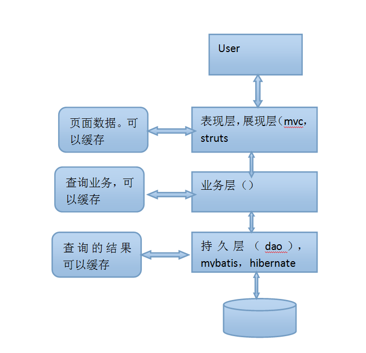
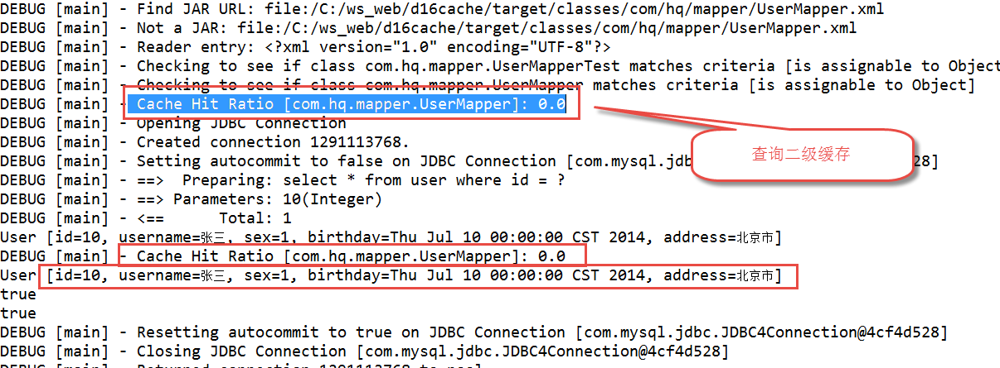
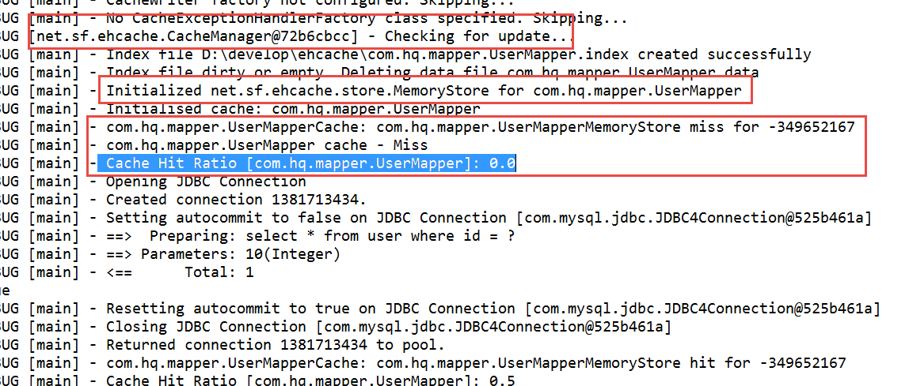
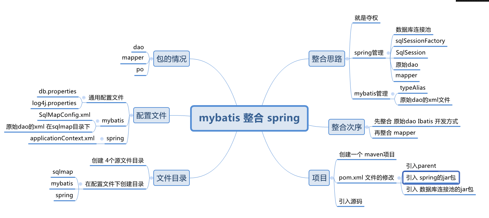
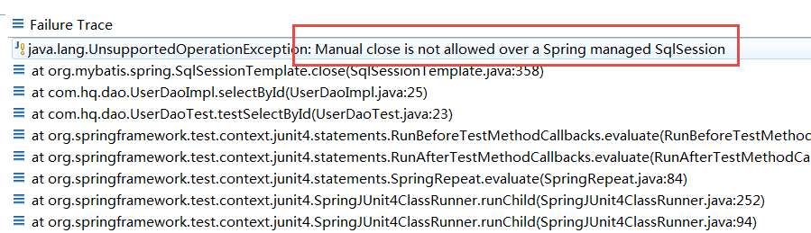
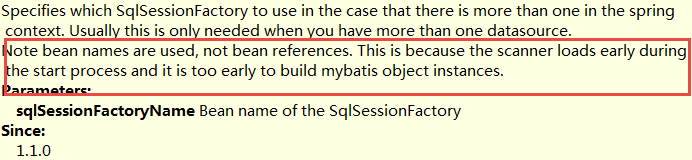

# Mybatis Day03

[TOC]

## 复习

1.  nginx ， 谈谈 对 nginx 理解  ？web Server  
2. mybatis-generator  ?
3. 其他  ？
4. 

### 数据模型分析

1. 如何对数据模型分析 （分成几步）  查看表的主键和外键（表名称、字段）、根据表的 外键确定 表与表的直接关系、（一对一， 一对 多）再来分析 （没有直接关系的表之间的关系) ?

2. 多对多的 关系 是 直接关系吗 ？ 不是 。

   

### 一对一

1. 使用 resultType 处理一对一
2. 使用 resultMap 来处理一对一
3. assication 的关键字： property： user    javaType ： User javaBean  作用 ？ 
4. resultMap：  映射什么内容 ？   <id       <result:
5. 使用  resultType 和 resultMap 进行一对一处理的 区别 ？ 清单列表、对象模型

### 一对多

1. 可以使用 resultType 来接受查询结果 ？ （ 可以的）
2. 使用一个关键词  collection， 用来干什么 ？   property， ofType 意义是 什么  ？
3. collection： 来作  一对多的映射 。
4. collection 里面： property, ofType 含义是什么 ？
5. 复杂 一对多的查询。 4 个表的联合查询 ？

### 延迟加载

1. 什么是延迟加载 ？
2. 如何实现延迟，  
3. 是否使用  resultMap  ？（必须）
4. 在resultMap 里面如何定义 ？  assication ， collection   select  column：
5.   select ： 写的 sql语句， namespace + id ： statement
6. column： select statement 的输入参数 。
7. 延迟加载技术，只能在 （Service 和 dao层 应用） web层不能使用 。


## 1、查询缓存

### 1.1 缓存的简介

1. 什么是缓存 ？

   将用户经常查询的数据放在缓存（内存）中，用户去查询数据就不用从磁盘上(关系型数据库数据文件)查询，从缓存中查询，从而提高查询效率，解决了高并发系统的性能问题。（如果我们的系统是一个高并发系统）

2. 缓存的意义 ？

   

3. 其他


### 1.2 一级缓存

1. 原理

   第一次发出一个查询sql，sql查询结果写入sqlsession的一级缓存中，缓存使用的数据结构是一个map<key,value>
   key：hashcode+sql+sql输入参数+输出参数（sql的唯一标识）
   value：用户信息

2. 第一次查询、第二次查询、如果 有 CUD 语句的时候的情况 。

3. 其他


一级缓存 使用 以 SqlSession 为使用单位。 

**mybatis和spring整合后进行mapper代理开发，不支持一级缓存**， spring 会管理  sqlSession 这个对象。 每一个 sql 语句 一个 sqlSession。 spring 里面， 是不支持 一级缓存 。


### 1.3 二级缓存

1. 二级缓存的 范围 是 以 namespace （命名空间） 为 单位

2. 一级缓存 和 二级缓存的执行次序

   

   - 执行sql查询（如果 二级缓存打开）
   - 首先查询 是否 二级缓存存在（如果不存在）
   - 再查询 一级缓存
   - 如果 一级缓存不存在， 再查询 数据库 

3. Cache Hit Ratio 缓存命中率 ： 

4. 缓存对象 需要 进行序列化 ！

5. 其他

### 1.4 二级缓存 使用 分布式缓存

1. 什么 是 分布式缓存 ？

   就是将缓存数据 存到 一台（多台）独立 缓存服务器上面。 这样缓存方式 就是 分布式缓存。 是 二级缓存 。

2. 实现的思路

   通过mybatis和ehcache框架进行整合，就可以把缓存数据的管理托管给ehcache。(redis)

   在mybatis中提供一个cache接口，只要实现cache接口就可以把缓存数据灵活的管理起来。

   ```java
   public interface Cache {
   
     /**
      * @return The identifier of this cache
      */
     String getId();
   
     /**
      * @param key Can be any object but usually it is a {@link CacheKey}
      * @param value The result of a select.
      */
     void putObject(Object key, Object value);
   
     /**
      * @param key The key
   ```

   

3. 如何实现 ehcache缓存 ？

   - 配置 pom.xml , 引入jar包

   - 配置 一下 ehcache.xml 文件

     ```xml
     <ehcache xmlns:xsi="http://www.w3.org/2001/XMLSchema-instance"
     	xsi:noNamespaceSchemaLocation="../config/ehcache.xsd">
     	<!--diskStore：缓存数据持久化的目录 地址  -->
     	<diskStore path="D:\develop\ehcache" />
     	<defaultCache 
     		maxElementsInMemory="1000" 
     		maxElementsOnDisk="10000000"
     		eternal="false" 
     		overflowToDisk="false" 
     		diskPersistent="true"
     		timeToIdleSeconds="120"
     		timeToLiveSeconds="120" 
     		diskExpiryThreadIntervalSeconds="120"
     		memoryStoreEvictionPolicy="LRU">
     	</defaultCache>
     </ehcache>
     
     ```

     

   - 在 d: 盘 创建 目录  develop\ehcache

   - 引入jar包， slf4j 日志门面系统 同 log4j 日志系统的 关联关系

     ```xml
     <dependency>
     			<groupId>org.slf4j</groupId>
     			<artifactId>slf4j-log4j12</artifactId>
     		</dependency>
     ```

     

   - 进行单元测试的日志

     

   - 二级缓存的局限性

     对查询频率高，变化频率低的数据建议使用二级缓存。
     	对于访问多的查询请求且用户对查询结果实时性要求不高，此时可采用mybatis二级缓存技术降低数据库访问量，提高访问速度，业务场景比如：耗时较高的统计分析sql、电话账单查询sql等。
     	实现方法如下：通过设置刷新间隔时间，由mybatis每隔一段时间自动清空缓存，根据数据变化频率设置缓存刷新间隔flushInterval，比如设置为30分钟、60分钟、24小时等，根据需求而定。

   - 其他

4. 其他

## 2、 mybatis 同spring的整合

### 2.1 整合的思路



### 2.2 创建整合工程（Maven)

1.  jar是可以， 使用 Jar 包

2. 引入jar包

   ```xml
   <dependencies>
   		<dependency>
   			<groupId>junit</groupId>
   			<artifactId>junit</artifactId>
   			<scope>test</scope>
   		</dependency>
   		<dependency>
   			<groupId>mysql</groupId>
   			<artifactId>mysql-connector-java</artifactId>
   		</dependency>
   		<dependency>
   			<groupId>com.mchange</groupId>
   			<artifactId>c3p0</artifactId>
   		</dependency>
   		<dependency>
   			<groupId>commons-beanutils</groupId>
   			<artifactId>commons-beanutils</artifactId>
   			<version>1.9.3</version>
   		</dependency>
   		<dependency>
   			<groupId>org.mybatis</groupId>
   			<artifactId>mybatis</artifactId>
   		</dependency>
   		<dependency>
   			<groupId>log4j</groupId>
   			<artifactId>log4j</artifactId>
   		</dependency>
   		<dependency>
   			<groupId>org.mybatis</groupId>
   			<artifactId>mybatis-spring</artifactId>
   		</dependency>
   		<dependency>
   			<groupId>org.springframework</groupId>
   			<artifactId>spring-beans</artifactId>
   		</dependency>
   		<dependency>
   			<groupId>org.springframework</groupId>
   			<artifactId>spring-context</artifactId>
   		</dependency>
   		<dependency>
   			<groupId>org.springframework</groupId>
   			<artifactId>spring-web</artifactId>
   		</dependency>
   		<!-- spring 对单元测试的支持， junit -->
   		<dependency>
   			<groupId>org.springframework</groupId>
   			<artifactId>spring-test</artifactId>
   		</dependency>
   		<dependency>
   			<groupId>org.springframework</groupId>
   			<artifactId>spring-aop</artifactId>
   		</dependency>
   		<dependency>
   			<groupId>org.springframework</groupId>
   			<artifactId>spring-aspects</artifactId>
   		</dependency>
   		<dependency>
   			<groupId>org.springframework</groupId>
   			<artifactId>spring-jdbc</artifactId>
   		</dependency>
   		<!-- 事务管理 -->
   		<dependency>
   			<groupId>org.springframework</groupId>
   			<artifactId>spring-tx</artifactId>
   		</dependency>
   		<dependency>
   			<groupId>org.springframework</groupId>
   			<artifactId>spring-orm</artifactId>
   		</dependency>
   
   	</dependencies>
   ```

   

3. 配置文件， db.properties,  sqlMapConfig.xml, log4j.properties

   sqlMapConfig.xml

   ```xml
   <?xml version="1.0" encoding="UTF-8"?>
   <!DOCTYPE configuration
   PUBLIC "-//mybatis.org//DTD Config 3.0//EN"
   "http://mybatis.org/dtd/mybatis-3-config.dtd">
   <configuration>
   	<typeAliases>
   		<!-- 进行包扫描 -->
   		<package name="com.hq.pojo" />
   	</typeAliases>
   
   	<mappers>
   		<!--  原始 Ibatis 开发方式 使用的 xml 文件 -->
   		<mapper resource="sqlmap/User.xml"/>
   	</mappers>
   
   </configuration>
   
   ```

   

4. applicationContext.xml 文件

   applicationContext-dao.xml 文件的配置：  配了一个 数据库 连接池 c3p0

   ```xml
   <?xml version="1.0" encoding="UTF-8"?>
   <beans xmlns="http://www.springframework.org/schema/beans"
   	xmlns:xsi="http://www.w3.org/2001/XMLSchema-instance" 
   	xmlns:context="http://www.springframework.org/schema/context"
   	xmlns:aop="http://www.springframework.org/schema/aop"
   	xmlns:tx="http://www.springframework.org/schema/tx"
   	xsi:schemaLocation="
   		http://www.springframework.org/schema/aop 
   		http://www.springframework.org/schema/aop/spring-aop.xsd
   		http://www.springframework.org/schema/context 
   		http://www.springframework.org/schema/context/spring-context.xsd
   		http://www.springframework.org/schema/tx 
   		http://www.springframework.org/schema/tx/spring-tx.xsd
   		http://www.springframework.org/schema/beans 
   		http://www.springframework.org/schema/beans/spring-beans.xsd">
   
   	<context:annotation-config />
   
   	<context:property-placeholder location="classpath:db.properties" />
   	<bean id="dataSource" class="com.mchange.v2.c3p0.ComboPooledDataSource">
   		<property name="driverClass" value="${jdbc.driver}" />
   		<property name="jdbcUrl" value="${jdbc.url}" />
   		<property name="user" value="${jdbc.username}" />
   		<property name="password" value="${jdbc.password}" />
   	</bean>
   	
   	<bean id="sqlSessionFactory" class="org.mybatis.spring.SqlSessionFactoryBean">
   		<property name="dataSource" ref="dataSource" />
   		<property name="configLocation" value="classpath:mybatis/sqlMapConfig.xml"/>
   	</bean>
   	
   	<bean id="userDao" class="com.hq.dao.UserDaoImpl" >
   		<property name="sqlSessionFactory" ref="sqlSessionFactory"/>
   	</bean>
   
   
   
   </beans>
   ```

   

5. 错误

   

   手工关闭  sqlSession 是不允许的  ！

6. mapper 方式， 首先复制 xml， interface 文件

7. javadoc

   

8. applicationContext-dao.xml 部分配置， 进行包扫描

   ```xml
   <bean class="org.mybatis.spring.mapper.MapperScannerConfigurer">
          <property name="basePackage" value="com.hq.mapper" />
          <!-- optional unless there are multiple session factories defined -->
          <property name="sqlSessionFactoryBeanName" value="sqlSessionFactory" />
      </bean>
    
   ```

   

9. 其他

## 3、mybatis的逆向工程

### 3.1 什么 是 mybatis 的逆向工程 

我们正常开发， 就是 根据 数据库的设计 来进行 dao 层的开发 。 就是根据 数据库的 表设计（表） 来自动生成 持久层的代码（mapper）， mapper 的 interface 和 mapper的 xml ， 还有 pojo 类（ 数据库表的pojo类）。搞定后， 持久层的代码 完成 。 但是， 它只能满足 一些简单需求 。如果是 复杂需求还是需要我们自己进行mapper的 sql语句的开发和编写。

### 3.2  开始 逆向工程开发

逆向工程， 必须单独开一个 项目 。这个会有 很多问题。

1. 创建一 个maven  Project

2. 引入 对应的 jar 包

   ```xml
   <parent>
   		<groupId>com.hq</groupId>
   		<artifactId>web-parent</artifactId>
   		<version>0.0.1-SNAPSHOT</version>
   	</parent>
   	<artifactId>mygen</artifactId>
   	<dependencies>
   		<dependency>
   			<groupId>org.mybatis</groupId>
   			<artifactId>mybatis</artifactId>
   		</dependency>
   		<dependency>
   			<groupId>junit</groupId>
   			<artifactId>junit</artifactId>
   			<scope>test</scope>
   		</dependency>
   		<dependency>
   			<groupId>log4j</groupId>
   			<artifactId>log4j</artifactId>
   		</dependency>
   		<dependency>
   			<groupId>mysql</groupId>
   			<artifactId>mysql-connector-java</artifactId>
   		</dependency>
   		<dependency>
   			<groupId>org.slf4j</groupId>
   			<artifactId>slf4j-log4j12</artifactId>
   		</dependency>
   		<dependency>
   			<groupId>org.mybatis.generator</groupId>
   			<artifactId>mybatis-generator-core</artifactId>
   			<version>1.3.5</version>
   		</dependency>
   	</dependencies>
   ```

   

3. 写 主程序（main）

   使用 Mybatis 上面的代码

   ```java
   public static void main(String[] args) throws Exception {
   		 List<String> warnings = new ArrayList<String>();
   		   boolean overwrite = true;
   		   File configFile = new File("generatorConfig.xml");
   		   ConfigurationParser cp = new ConfigurationParser(warnings);
   		   Configuration config = cp.parseConfiguration(configFile);
   		   DefaultShellCallback callback = new DefaultShellCallback(overwrite);
   		   MyBatisGenerator myBatisGenerator = new MyBatisGenerator(config, callback, warnings);
   		   myBatisGenerator.generate(null);
   	}
   ```

   

4. log4j.properties 文件 需要准备

   复制一下 。

5. 修改 main方法里面 generatorConfig.xml 的打开路径

   src/main/resources/generatorConfig.xml 

   ```txt
   <?xml version="1.0" encoding="UTF-8"?>
   <!DOCTYPE generatorConfiguration
     PUBLIC "-//mybatis.org//DTD MyBatis Generator Configuration 1.0//EN"
     "http://mybatis.org/dtd/mybatis-generator-config_1_0.dtd">
   
   <generatorConfiguration>
   	<context id="testTables" targetRuntime="MyBatis3">
   		<commentGenerator>
   			<!-- 是否去除自动生成的注释 true：是 ： false:否 -->
   			<property name="suppressAllComments" value="true" />
   		</commentGenerator>
   		<!--数据库连接的信息：驱动类、连接地址、用户名、密码 -->
   		<jdbcConnection driverClass="com.mysql.jdbc.Driver"
   			connectionURL="jdbc:mysql://localhost:3306/mybatis?useSSL=false" userId="peter"
   			password="peter">
   		</jdbcConnection>
   	
   
   		<!-- 默认false，把JDBC DECIMAL 和 NUMERIC 类型解析为 Integer，为 true时把JDBC DECIMAL 和 
   			NUMERIC 类型解析为java.math.BigDecimal -->
   		<javaTypeResolver>
   			<property name="forceBigDecimals" value="false" />
   		</javaTypeResolver>
   
   		<!-- targetProject:生成PO类的位置 -->
   		<javaModelGenerator targetPackage="com.hc.ssm.po"
   			targetProject=".\src\main\java">
   			<!-- enableSubPackages:是否让schema作为包的后缀 -->
   			<property name="enableSubPackages" value="false" />
   			<!-- <property name="constructorBased" value="true" /> -->
   			<!-- 从数据库返回的值被清理前后的空格 -->
   			<property name="trimStrings" value="true" />
   		</javaModelGenerator>
           <!-- targetProject:mapper映射文件生成的位置 -->
   		<sqlMapGenerator targetPackage="com.hc.ssm.mapper" 
   			targetProject=".\src\main\java">
   			<!-- enableSubPackages:是否让schema作为包的后缀 -->
   			<property name="enableSubPackages" value="false" />
   		</sqlMapGenerator>
   		<!-- targetPackage：mapper接口生成的位置 -->
   		<javaClientGenerator type="XMLMAPPER"
   			targetPackage="com.hc.ssm.mapper" 
   			targetProject=".\src\main\java">
   			<!-- enableSubPackages:是否让schema作为包的后缀 -->
   			<property name="enableSubPackages" value="false" />
   		</javaClientGenerator>		<!-- 指定数据库表 -->
   		<table tableName="items"></table>
   		<table tableName="orders"></table>
   		<table tableName="orderdetail"></table>
   		<table tableName="user"></table>
   		
   		<!-- 有些表的字段需要指定java类型
   		 <table schema="" tableName="">
   			<columnOverride column="" javaType="" />
   		</table> -->
   	</context>
   </generatorConfiguration>
   
   ```

   

6. 修改 generatorConfig.xml

   - jdbc 4 个属性，
   - pojo 的 包名称、文件路径 是 maven项目使用
   - mapper.xml 文件， 包名称
   - mapper.java 文件  ， 包名称
   - 表的列表（那些表 生成 dao层）

7. 每次 必须先修改 包名称

8.  每次执行前，必须 删除 以前的 代码（xml，interface，pojo 对象）

9. 其他


## 4、输入输出映射补充(了解) JavaBean, 都可以使用 map对象，

spring：  可以使用 JavaBean的地方，都可以 使用 map替代

UserMapper.java

```txt
public interface UserMapper {

    List<User> selectBetweenId(Map<String, Object> map);
    Map<String, Object> selectById(Integer id);
    List<Map<String, Object>> selectAll();
}
```

UserMapper.xml

```txt
   <select id="selectBetweenId" resultType="User" parameterType="map">
        select *
        from user
        where id between #{beginId} and #{endId}
    </select>

    <select id="selectAll" resultType="map" >
        select * from user
    </select>

    <select id="selectById" parameterType="int" resultType="map">
        select *
        from user where id = #{id}
    </select>
```

单元测试代码

```txt
   @Test
    public void testSelectBetweenId() {
        Map<String, Object> map = new HashMap<String, Object>();
        map.put("beginId", 10);
        map.put("endId", 30);
        final List<User> list = mapper.selectBetweenId(map);
        System.out.println(list);
    }

    @Test
    public void testSelectMap() {
        final Map<String, Object> mapUser = mapper.selectById(1);
        System.out.println(mapUser);
    }

    @Test
    public void testSelectListMap() {
        final List<Map<String, Object>> mapList = mapper.selectAll();
        System.out.println(mapList);
    }

```


## 5、注解开发 （重点）

### 普通的CRUD

```txt
public interface UserMapper {

    @Select("select * from user where id = #{id}")
    @Results(id="newUserMap", value= {
            @Result(id=true, column = "id", property = "userId"),
            @Result(column = "username", property = "userName"),
            @Result(column = "sex", property = "userSex")
    } )
    NewUser selectById(Integer id);

    @Select("select * from user where username like '%${value}%' ")
    List<User> selectLikeName(String name);

    @Insert("insert into user values(null, #{username},  #{birthday}, #{sex}, #{address})")
    @SelectKey(statement = {"select last_insert_id()"}, before = false, keyProperty = "id", resultType = Integer.class)
    int insert(User user);
}
```


### 一对一

```txt
public interface OrdersMapper {

    @Select("select * from orders")
    @Results(id="orderUserMap", value = {
            @Result(id=true, column = "id", property = "id"),
            @Result( column = "user_id", property = "userId"),
            @Result( column = "note", property = "note"),
            @Result( column = "number", property = "number"),
            @Result( column = "user_id", property = "user",
                    one=@One(select="com.chinasoft.mapper.UserMapper.selectById", fetchType = FetchType.LAZY) )
    })
    List<Orders> selectAll();

}
```

UserMapper.java

```txt
 @Select("select * from user where id = #{id}")
    User selectById(Integer id);
```


### 一对多

UserMapper

```txt
 @Select("select * from user")
    @Results(id="userOrdersMap", value = {
            @Result(id=true, column = "id", property = "id"),
            @Result( column = "username", property = "username"),
            @Result( column = "sex", property = "sex"),
            @Result( column = "birthday", property = "birthday"),
            @Result( column = "address", property = "address"),
            @Result(column = "id", property = "ordersList",
                many = @Many(select="com.chinasoft.mapper.OrdersMapper.selectByUserId",
                    fetchType = FetchType.LAZY))
    })
    List<User> selectAll();
```

OrdersMapper.java

```txt
 @Select("select * from orders where user_id = #{userId}")
    List<Orders> selectByUserId(Integer userId);
```

