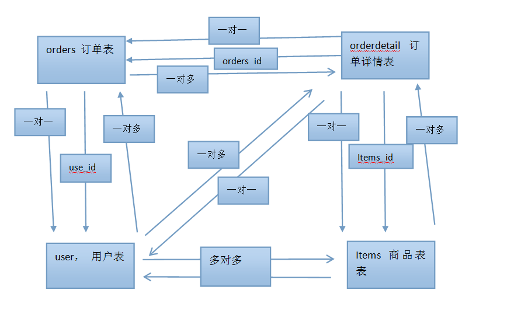
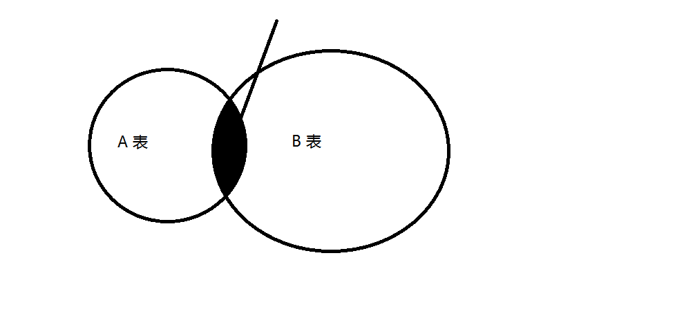
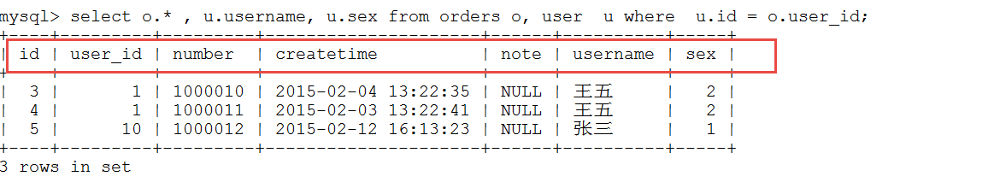
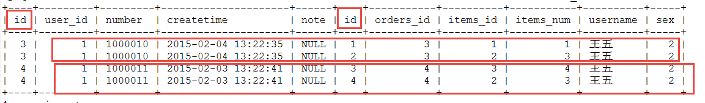
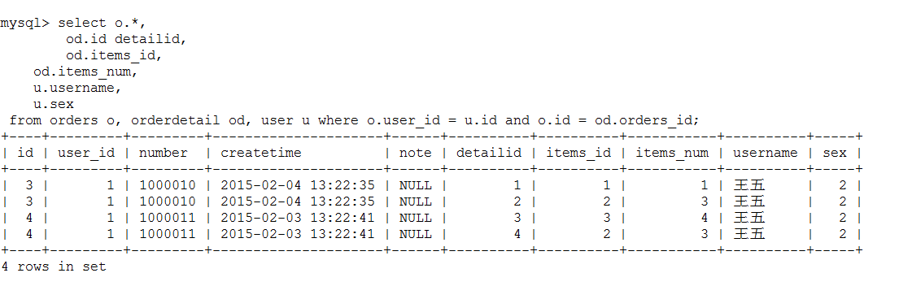

# Mybatis day02

[TOC]

## 1、复习

1. 类型别名是 什么 ？
2. mappers的使用方法， 最终使用方式 ？
3. 输入映射 是什么含义 ？
4. 动态sql是什么 ?
5. 动态sql的 4个标签 ？if where sql foreach when choose trim 
6. 一对一 使用的 对应标签是 什么 ？ as
7. collection

### 1.1 ibatis开发方式

1. ibatis（原始的开发方式的步骤）JavaBean、 interface、user.xml（写sql语句）、写 Dao层的实现类
2. 如何解决 select 模糊查询问题，  #{} 和   ${}  的区别 ？
3. insert 主键如何得到 
4. mybatis 和 hibernate 的区别  和适应场景 ？
5. mybatis 的对象： sqlSessionFactory,   SqlSession  ？
6. 其他

### 1.2  mapper的开发方式

1. 什么是mapper开发方式，步骤： jb、interface、同名的xml文件
2. mapper开发的规范（4 点） ？ 接口全路径（mapper.xml, namespace)、输入参数一致、输出参数一致、方法名称 同 mapper.xml 里面的 statement的id一致
3. statement对象 有一些什么属性 ？sql、输入参数、输入参数 。
4. 如何得到 mapper 实例化对象 ？ 
5. 其他

### 1.3  sqlMapConfig.xml 文件详解

1. typeAliases ？  类型别名 ， 如何配置 ？
2. mapper 如何 设置 ?  resource ->   class  -> package .


### 1.5 输入输出映射

输入的映射： 输入参数 可以 使用 javaBean， javaBean可以包含 javaBean

输出映射： resultMap , 映射 。

### 1.6 动态sql

什么是动态sql ？

你使用过那些动态sql ？标签 ？ foreach  if  where  include   sql  choose  when otherwise

foreach 标签的 作用 ？

if  sql 标签的作用 ？

## 2、商品数据订单数据模型分析

1. 了解表的字段，（主键、外键、非空字段）
2. 通过 外键进行 表与表的分析
3. 分析没有外键的表之间的 关系
4. 先决条件， 是你要了解 业务 和 字段的关系 。



分析的结果：

用户表 订单详情表的对应关系：
  用户表 对  orderdetail  ： 一对多
orderdetail 对 user：   一对一

用户表 对 items： 一对多
items表 对 user：一对多 
  用户表 和 items 是 多对多 关系 。

orders 对 items： 一对多
items 对 orders： 一对 多 。
   orders  对  items 也是 多对 多

## 3、一对一查询

### 3.1 需求

查询订单信息关联查询用户信息

### 3.2 分析

  主查询表： orders，  关联表 user

orders 同 user 是 什么 关系  1 对 1 关系。

select o.* , u.username, u.sex from orders o, user  u where  u.id = o.user_id  and ...

```sql
select o.* , u.username, u.sex from orders o, user  u where  u.id = o.user_id

```





### 3.3 进行开发

#### 3.3.1 使用 result type 实现

1.  javaBean

   ```java
   public class OrdersCustom extends Orders {
   
   	private static final long serialVersionUID = 3181465582625240545L;
   	private String usrname;
   	private Integer sex;
   	public String getUsrname() {
   		return usrname;
   	}
   ```

   

2. OrdersMapper.java

3. OrdersMapper.xml

4. 写一个测试用例

5. 其他

#### 3.3.2  使用 reusltMap 实现 
1. javaBean

   ```java
   public class Orders implements Serializable {
   	private Integer id;
   	private Integer user_id; // userId
   	private String number;
   	private Date createtime;
   	private String note;
   	private User user;
   	
   ```

   

2. OrdersMapper.java

   ```java
   public interface OrdersMapper {
   	// 一对一 查询
   	List<Orders> selectOne2One();
   }
   
   ```

   

3. OrdersMapper.xml

   非标准形式：

   ```xml
   <mapper namespace="com.hq.mapper.OrdersMapper">
   	<resultMap  id="rm_orders_user" type="orders">
   		<id column="id" property="id"/>
   		<result column="user_id" property="user_id"/>
   		<result column="number" property="number"/>
   		<result column="createtime" property="createtime"/>
   		<result column="note" property="note"/>
   		<result column="username" property="user.username"/>
   		<result column="sex" property="user.sex"/>
   		<result column="user_id" property="user.id"/>
   	</resultMap>
   	
   	<select id="selectOne2One" resultMap="rm_orders_user">
   	select o.* , u.username, u.sex from orders o, user  u where  u.id = o.user_id
   	</select>
   </mapper>	
   ```

   标准形式：

   ```xml
   <resultMap id="rm_orders_user2" type="orders">
   		<id column="id" property="id" />
   		<result column="user_id" property="user_id" />
   		<result column="number" property="number" />
   		<result column="createtime" property="createtime" />
   		<result column="note" property="note" />
   		<!-- assocation : 用于 1 对 1 的关联映射 -->
   		<!-- property: user 是 orders javaBean的属性 -->
   		<!-- <association property="user" javaType="com.hq.pojo.User"> -->
   		<association property="user" javaType="User">
   			<!-- id: 一般就是主键 -->
   			<id column="user_id" property="id" />
   			<result column="username" property="username" />
   			<result column="sex" property="sex" />
   		</association>
   	</resultMap>
   ```

   

4. 写一个测试用例

5. 其他

### 3.4 小结

resultType：要自定义pojo 保证sql查询列和pojo的属性对应，这种方法相对较简单，所以应用广泛。

resultMap：使用association完成一对一映射需要配置一个resultMap，过程有点复杂，
如果要实现延迟加载就只能用resultMap实现 ，如果为了方便对关联信息进行解析，也可以用association将关联信息映射到pojo中方便解析。

## 4、 一对多查询（简单）

### 4.1需求

查询所有订单信息及订单下的订单明细信息及用户信息

### 4.2分析

主查询表： orders，  关联查询表 ： ordersdetail 和 user 表

orders -> orderdetail  ： 一对 多的关系

sql语句：

```sql
select o.*,
	od.id detailid, 
	od.items_id,
    od.items_num,
    u.username, 
    u.sex 
 from orders o, orderdetail od, user u where o.user_id = u.id and o.id = od.orders_id;
```




第一个， 数据是重复的。  列名  id  有 2 个 。




### 4.3 进行开发

1. javaBean如何写 ？

   ```java
   public class Orders implements Serializable {
   	private static final long serialVersionUID = -3602983821299881324L;
   	private Integer id;
   	private Integer user_id; // userId
   	private String number;
   	private Date createtime;
   	private String note;
   	private User user;
   	private List<Orderdetail> details;
   	
   	public List<Orderdetail> getDetails() {
   		return details;
   ```

   使用 List 对象 完成  1 对 多的映射关系

2. OrdersMapper.java

   ```java
   public interface OrdersMapper {
   	// 一对一 查询
   	List<Orders> selectOne2One();
   	// 一对 多 查询
   	List<Orders> selectOne2Many();
   }
   
   ```

   

3. xml 文件

   ```xml
   <resultMap  id="rm_orders_detail_user" type="orders"  extends="rm_orders_user2">
   		<!-- 集合， 理解为接受 集合里面的值 -->
   		<!--  ofType:  the type of details, 集合里面对应的属性的javaBean -->
   		<collection property="details" ofType="Orderdetail">
   			<!-- id: 代表主键，  result：代表普通的属性 -->
               <!-- column: 列名或别名, property: Orderdetail javaBean 的属性-->
   			<id column="detailid" property="id" />
   			<result column="items_id" property="items_id" />
   			<result column="items_num" property="items_num" />
   			<result column="id" property="orders_id" />
   		</collection>
   	</resultMap>
   
   
   	<select id="selectOne2Many" resultMap="rm_orders_detail_user">
   		select o.*,
   		od.id detailid,
   		od.items_id,
   		od.items_num,
   		u.username,
   		u.sex
   		from orders o, orderdetail od, user u where o.user_id = u.id and o.id =
   		od.orders_id;
   	</select>
   ```

   首先使用了 继承（ extends）

   这里 注意 使用了 extends 关键字， 同 java 对象 扩展的意义基本一样 。
   注意 collection 的定义：  property为 Orders 对象 里面的属性
   ofType 为 List<T>  的类型， 就是 在 Orders 里面 进行了定义

4. 测试

   ```java
   	@Test
   	public void testSelectOne2Many() {
   		SqlSession session = factory.openSession();
   		OrdersMapper mapper = session.getMapper(OrdersMapper.class);
   		List<Orders> list = mapper.selectOne2Many();
   		for (Orders o : list) {
   			System.out.println("" + o + o.getUser() + " " );
   			List<Orderdetail> details = o.getDetails();
   			for(Orderdetail od : details) {
   				System.out.println("          ==== ordertail is " + od);
   			}
   		}
   	}
   
   ```

   

5. 其他

## 5、 一对多复杂（查询）

作业

## 5.1 多对多 

也是一种关系 。mybatis 主要解决 一对 多 关系。

多对多关系，实际上包含  2 个 一对 多关系。 1 对多的关系  mybtatis 都可以 解决 。

## 6、延迟加载

### 6.1 延迟加载的简介

1. 什么是延迟加载

   如果我们的对象里面包含其他表的对象， 单我们需要这个对象的值的时候， 才发出 sql语句进行查询。 这种查询方式就是延迟加载 。延迟加载 必须 使用 resultMap。

2. 如何进行延迟加载的配置

   ```xml
   	<!-- 全局配置参数 -->
   	<settings>		
   		<!-- 延迟加载总开关 -->
   		<setting name="lazyLoadingEnabled" value="true" />	
   		<!-- 设置按需加载 -->
   		<setting name="aggressiveLazyLoading" value="false" />
   	</settings>
   
   ```

   

   ### 6.2延迟加载的实现例子

   1. 需求

      需求：
      查询订单及用户的信息，一对一查询。

      刚开始只查询订单信息

      当需要用户时调用 Orders类中的getUser()方法执行延迟加载 ，向数据库发出sql

   2. javaBean

      ```java
      public class Orders implements Serializable {
      	private static final long serialVersionUID = -3602983821299881324L;
      	private Integer id;
      	private Integer user_id; // userId
      	private String number;
      	private Date createtime;
      	private String note;
      	private User user;
      	private List<Orderdetail> details;
      ```

      不用修改

   3. Mapper.java

      ```java
      // 延迟加载
      	List<Orders> selectLazyLoad();
      ```

      

   4. Mapper.xml

      OrdersMapper.xml

      ```xml
      <!-- 延迟加载的 resultMap的定义 -->
      	<resultMap  id="rm_orders_lazy" type="orders">
      		<id column="id" property="id" />
      		<result column="user_id" property="user_id" />
      		<result column="number" property="number" />
      		<result column="createtime" property="createtime" />
      		<result column="note" property="note" />
      		<!--  一对 一，  select： 对应的是 namespace + statement_ID -->
      		<!-- column: select statement 的输入参数  -->
      		<association property="user" select="com.hq.mapper.UserMapper.selectById" column="user_id">
      		</association>
      	</resultMap>
      	<!-- 延迟加载的例子 -->
      	<select id="selectLazyLoad" resultMap="rm_orders_lazy">
      		select * from orders
      	</select>
      ```

      UserMapper.xml

      ```xml
      <mapper namespace="com.hq.mapper.UserMapper">
      	<select id="selectById" parameterType="int" resultType="user">
      		select * from user where id = #{id}
      	</select>
      
      </mapper>	
      
      ```

      

   5. 测试

   ```java
   @Test
   	// 延迟加载的例子
   	public void testSelectLazyLoad() {
   		SqlSession session = factory.openSession();
   		OrdersMapper mapper = session.getMapper(OrdersMapper.class);
   		List<Orders> list = mapper.selectLazyLoad();
   		int i = 3;
   		Orders orders = list.get(0);
   		System.out.println(orders.getNumber());
   		System.out.println(list.get(1).getNumber());
   		// System.out.println(list.get(1).toString());
   		System.out.println("-------------before get user--------------------");
   		System.out.println(orders.getUser());
   	}
   
   ```

   

   ### 6.2 一对多的延迟加载 （作业）

   一对多延迟加载的方法同一对一延迟加载，在collection标签中配置select内容。
   本部分内容自学， 实训时间 进行 练习 。 
   首先加载 orders 表里面的数据。 然后延迟加载  orderdetail 里面的数据 

   ### 6.3 总结

   延迟加载：
   延迟加载实现的方法多种多样，在只查询单表就可以满足需求，为了提高数据库查询性能使用延迟加载，再查询关联信息。

   mybatis提供延迟加载的功能用于service层。

   resultType：
   作用：
   	将查询结果按照sql列名pojo属性名一致性映射到pojo中。
   场合：
   	常见一些明细记录的展示，将关联查询信息全部展示在页面时，此时可直接使用resultType将每一条记录映射到pojo中，在前端页面遍历list（list中是pojo）即可。

   resultMap：
   	使用association和collection完成一对一和一对多高级映射。

   association：
   作用：
   	将关联查询信息映射到一个pojo类中。
   场合：
   	为了方便获取关联信息可以使用association将关联订单映射为pojo，比如：查询订单及关联用户信息。
   	
   collection：
   作用：
   	将关联查询信息映射到一个list集合中。
   场合：
   	为了方便获取关联信息可以使用collection将关联信息映射到list集合中，比如：查询用户权限范围模块和功能，可使用collection将模块和功能列表映射到list中。基于对象的数据展现

   

