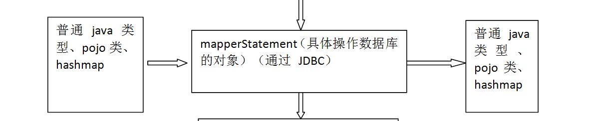
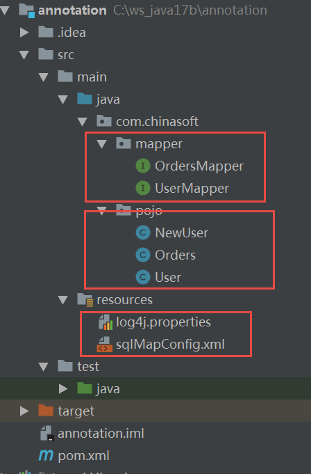
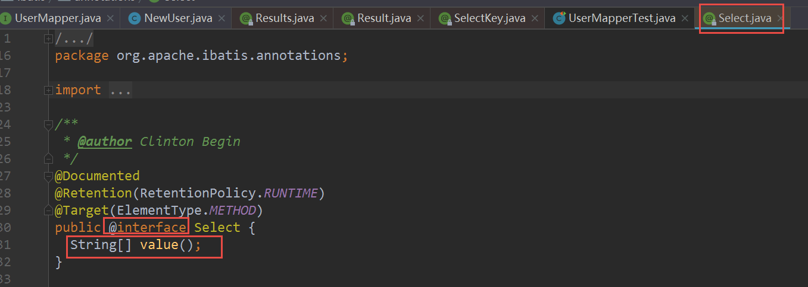
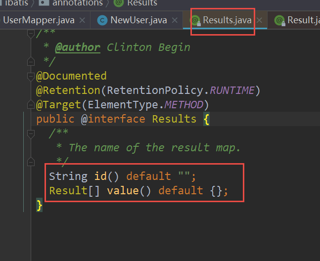
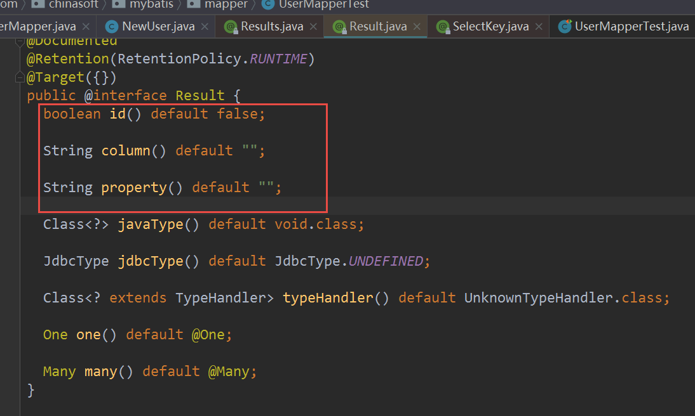
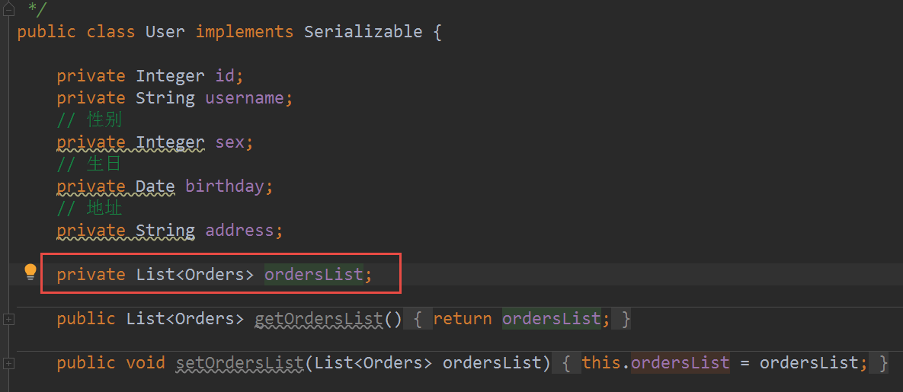

# Mybatis Day04

[TOC]

## 复习

1. 什么是延迟加载 ？
2. resultType, resultMap  适合什么时候使用 ?
3. mybatis 一级缓存、二级缓存  是 什么 ？
4. 我们 进行查询， 开始查询。 ？
5. 分布式缓存 ?
6. 什么是逆向工程 ？


## 1、mybatis的逆向工程的测试


### 开始 逆向工程开发

逆向工程， 必须单独开一个 项目 。这个会有 很多问题。

1. 创建一 个maven  Project

2. 引入 对应的 jar 包

   ```xml
     <dependencies>
           <dependency>
               <groupId>junit</groupId>
               <artifactId>junit</artifactId>
               <scope>test</scope>
               <version>4.12</version>
           </dependency>
           <dependency>
               <groupId>mysql</groupId>
               <artifactId>mysql-connector-java</artifactId>
               <version>5.1.8</version>
           </dependency>
           <dependency>
               <groupId>com.mchange</groupId>
               <artifactId>c3p0</artifactId>
               <version>0.9.5.2</version>
           </dependency>
           <dependency>
               <groupId>commons-beanutils</groupId>
               <artifactId>commons-beanutils</artifactId>
               <version>1.9.3</version>
           </dependency>
           <dependency>
               <groupId>org.mybatis</groupId>
               <artifactId>mybatis</artifactId>
               <version>3.5.2</version>
           </dependency>
           <dependency>
               <groupId>log4j</groupId>
               <artifactId>log4j</artifactId>
               <version>1.2.17</version>
           </dependency>
           <dependency>
               <groupId>org.mybatis.generator</groupId>
               <artifactId>mybatis-generator-core</artifactId>
               <version>1.3.5</version>
           </dependency>
           <dependency>
               <groupId>org.slf4j</groupId>
               <artifactId>slf4j-log4j12</artifactId>
               <version>1.5.8</version>
           </dependency>
       </dependencies>
   
       <build>
           <finalName>${project.artifactId}</finalName>
           <resources>
               <resource>
                   <directory>src/main/resources</directory>
                   <includes>
                       <include>**/*.properties</include>
                       <include>**/*.xml</include>
                       <include>**/*.tld</include>
                   </includes>
                   <filtering>false</filtering>
               </resource>
               <resource>
                   <directory>src/main/java</directory>
                   <includes>
                       <include>**/*.properties</include>
                       <include>**/*.xml</include>
                       <include>**/*.tld</include>
                   </includes>
                   <filtering>false</filtering>
               </resource>
           </resources>
           <plugins>
               <!-- 资源文件拷贝插件 -->
               <plugin>
                   <groupId>org.apache.maven.plugins</groupId>
                   <artifactId>maven-resources-plugin</artifactId>
                   <version>2.7</version>
                   <configuration>
                       <encoding>UTF-8</encoding>
                   </configuration>
               </plugin>
               <plugin>
                   <groupId>org.apache.maven.plugins</groupId>
                   <artifactId>maven-source-plugin</artifactId>
                   <version>2.2.1</version>
                   <executions>
                       <execution>
                           <goals>
                               <goal>jar-no-fork</goal>
                           </goals>
                           <phase>verify</phase>
                       </execution>
                   </executions>
               </plugin>
               <!-- java编译插件 -->
               <plugin>
                   <groupId>org.apache.maven.plugins</groupId>
                   <artifactId>maven-compiler-plugin</artifactId>
                   <version>3.2</version>
                   <configuration>
                       <source>1.8</source>
                       <target>1.8</target>
                       <encoding>UTF-8</encoding>
                   </configuration>
               </plugin>
           </plugins>
           <pluginManagement>
               <plugins>
                   <!-- 配置Tomcat插件 -->
                   <plugin>
                       <groupId>org.apache.tomcat.maven</groupId>
                       <artifactId>tomcat7-maven-plugin</artifactId>
                       <version>2.2</version>
                   </plugin>
               </plugins>
           </pluginManagement>
       </build>
   ```

   

3. 写 主程序（main）

   使用 Mybatis 上面的代码

   ```java
   public static void main(String[] args) throws Exception {
   		 List<String> warnings = new ArrayList<String>();
   		   boolean overwrite = true;
   		   File configFile = new File("generatorConfig.xml");
   		   ConfigurationParser cp = new ConfigurationParser(warnings);
   		   Configuration config = cp.parseConfiguration(configFile);
   		   DefaultShellCallback callback = new DefaultShellCallback(overwrite);
   		   MyBatisGenerator myBatisGenerator = new MyBatisGenerator(config, callback, warnings);
   		   myBatisGenerator.generate(null);
   	}
   ```

   

4. log4j.properties 文件 需要准备

   复制一下 。

5. 修改 main方法里面 generatorConfig.xml 的打开路径

   src/main/resources/generatorConfig.xml 

6. 修改 generatorConfig.xml

   - jdbc 4 个属性，
   - pojo 的 包名称、文件路径 是 maven项目使用
   - mapper.xml 文件， 包名称
   - mapper.java 文件  ， 包名称
   - 表的列表（那些表 生成 dao层）

7. 每次 必须先修改 包名称

8.  每次执行前，必须 删除 以前的 代码（xml，interface，pojo 对象）

9. 其他


条件查询的代码

```txt
 @Test
    // 条件查询
    public void testSelectExample() {
        final SqlSession session = factory.openSession();
        final UserMapper mapper = session.getMapper(UserMapper.class);
        // 创建 example对象
        UserExample example = new UserExample();
        // 设置查询条件
        final Criteria criteria = example.createCriteria();
        // id 在 10， 30 之间
        criteria.andIdBetween(10, 30);
        // 模糊查询
        criteria.andUsernameLike("%小明%");

        final List<User> list = mapper.selectByExample(example);
        System.out.println(list);
        session.close();
    }
```


## 2、输入输出映射补充(了解)



### 普通java类型

```txt
Interface：
// 输出的类型 是 普通的 java 类
    int selectCount();
 
 
mapper.xml:

<select id="selectCount" resultType="int" >
        select count(*) from user
    </select>
```


### 使用HashMap

断言： 可以使用 pojo的地方，基本都可以使用Map


UserMapper.java

```txt
public interface UserMapper {

    List<User> selectBetweenId(Map<String, Object> map);
    Map<String, Object> selectById(Integer id);
    List<Map<String, Object>> selectAll();
}
```

UserMapper.xml

```txt
   <select id="selectBetweenId" resultType="User" parameterType="map">
        select *
        from user
        where id between #{beginId} and #{endId}
    </select>

    <select id="selectAll" resultType="map" >
        select * from user
    </select>

    <select id="selectById" parameterType="int" resultType="map">
        select *
        from user where id = #{id}
    </select>
```

单元测试代码

```txt
   @Test
    public void testSelectBetweenId() {
        Map<String, Object> map = new HashMap<String, Object>();
        map.put("beginId", 10);
        map.put("endId", 30);
        final List<User> list = mapper.selectBetweenId(map);
        System.out.println(list);
    }

    @Test
    public void testSelectMap() {
        final Map<String, Object> mapUser = mapper.selectById(1);
        System.out.println(mapUser);
    }

    @Test
    public void testSelectListMap() {
        final List<Map<String, Object>> mapList = mapper.selectAll();
        System.out.println(mapList);
    }

```


## 3、注解开发 （重点）

知识前导： 对注解了解吗 ？ 什么是注解  ?  注解里面的含义 ？

### 常用注解列表

```txt
@Insert:实现新增
@Update:实现更新
@Delete:实现删除
@Select:实现查询
@Result:实现结果集封装
@Results:可以与@Result 一起使用，封装多个结果集
@ResultMap:实现引用@Results 定义的封装
@One:实现一对一结果集封装
@Many:实现一对多结果集封装
@SelectProvider: 实现动态 SQL 映射
@CacheNamespace:实现注解二级缓存的使用
```


### 项目构建（maven）

复制和粘贴

项目生成后的样子




### 普通的CRUD



```txt
public interface UserMapper {

    @Select("select * from user where id = #{id}")
    @Results(id="newUserMap", value= {
            @Result(id=true, column = "id", property = "userId"),
            @Result(column = "username", property = "userName"),
            @Result(column = "sex", property = "userSex")
    } )
    NewUser selectById(Integer id);

    @Select("select * from user where username like '%${value}%' ")
    List<User> selectLikeName(String name);

    @Insert("insert into user values(null, #{username},  #{birthday}, #{sex}, #{address})")
    @SelectKey(statement = {"select last_insert_id()"}, before = false, keyProperty = "id", resultType = Integer.class)
    int insert(User user);
    
    
}
```

### CRUD完善和加强





```txt
public interface UserMapper {

    @Select("select * from user where id = #{id}")
    @Results(id="newUserMap", value= {
            @Result(id=true, column = "id", property = "userId"),
            @Result(column = "username", property = "userName"),
            @Result(column = "sex", property = "userSex")
    } )
    NewUser selectById(Integer id);

    @Select("select * from user where username like '%${value}%' ")
    List<User> selectLikeName(String name);

    @Insert("insert into user values(null, #{username},  #{birthday}, #{sex}, #{address})")
    @SelectKey(statement = {"select last_insert_id()"}, before = false, keyProperty = "id", resultType = Integer.class)
    int insert(User user);
}
```


### 一对一

1. 修改 Orders pojo 对象， 增加 user 属性
2. 修改 OrderMapper.interface

```txt
public interface OrdersMapper {

    @Select("select * from orders")
    @Results(id="orderUserMap", value = {
            @Result(id=true, column = "id", property = "id"),
            @Result( column = "user_id", property = "userId"),
            @Result( column = "note", property = "note"),
            @Result( column = "number", property = "number"),
            @Result( column = "user_id", property = "user",
                    one=@One(select="com.chinasoft.mapper.UserMapper.selectById", fetchType = FetchType.LAZY) )
    })
    List<Orders> selectAll();

}
```

3. 编写修改 UserMapper.java 添加一对一使用的方法

UserMapper.java

```txt
 @Select("select * from user where id = #{id}")
    User selectById(Integer id);
```

4. 测试

   ```tt
       @Test
       public void testSelectOne2One() {
           final List<Orders> list = mapper.selectAll();
           for(Orders o : list) {
               System.out.println(o);
               System.out.println(o.getUser());
           }
       }
   ```

   

### 一对多

需求： 查询user表，得到 对应的 orders表的信息

1.  修改 User.java Pojo对象

   ```txt
   
   ```

   

2. 编写 UserMapper interface

   ```txt
   /**
        * 一对多的案例
        */
       @Select("select * from user")
       @Results(id="userOrdersMap", value = {
               @Result(id=true, column = "id", property = "id"),
               @Result(column = "username", property = "username"),
               @Result(column = "address", property = "address"),
               @Result(column = "sex", property = "sex"),
               @Result(column = "birthday", property = "birthday"),
               /**
                *  column:  是 many里面 sql语句的输入
                *  property: User对象里面的属性， 订单列表 List<Orders> ordersList
                *  many:  一对多标签
                *     select：需要调用的sql语句 对应的 interface OrdersMapper的全路径名 + 对应的方法名称， 输入是 上面的 column
                *     fetchType：使用时 懒加载
                *  
                */
               @Result(column = "id", property = "ordersList", many =
                   @Many(select = "com.chinasoft.mybatis.mapper.OrdersMapper.selectByUserId", fetchType = FetchType.LAZY))
   
       })
       List<User> selectAll();
   ```

   

3. 编写 OrdersMapper interface

   ```txt
    /**
        * 
        * @param id:  user 的 ID
        * @return
        *     Orders 对象的列表
        */
       @Select("select * from orders where user_id=#{id}")
       List<Orders> selectByUserId(Integer id);
   
   ```

   

4. 测试

   ```txt
    @Test
       // 一对 多
       public void testSelectAll() {
           final List<User> list = mapper.selectAll();
           for (User user : list) {
               System.out.println(user);
               System.out.println(user.getOrdersList());
           }
       }
   ```

   

UserMapper

```txt
 @Select("select * from user")
    @Results(id="userOrdersMap", value = {
            @Result(id=true, column = "id", property = "id"),
            @Result( column = "username", property = "username"),
            @Result( column = "sex", property = "sex"),
            @Result( column = "birthday", property = "birthday"),
            @Result( column = "address", property = "address"),
            @Result(column = "id", property = "ordersList",
                many = @Many(select="com.chinasoft.mapper.OrdersMapper.selectByUserId",
                    fetchType = FetchType.LAZY))
    })
    List<User> selectAll();
```

OrdersMapper.java

```txt
 @Select("select * from orders where user_id = #{userId}")
    List<Orders> selectByUserId(Integer userId);
```


### 动态sql

1. 表现层

   ```txt
   @Controller
   public class ManagerController {
   
       @Autowired
       ManagerService managerService;
   
       @GetMapping("/selectUser")
       public ModelAndView getUserList() {
           ModelAndView mv = new ModelAndView();
   
           mv.addObject("user", new TbUser());
           mv.setViewName("list");
           return mv;
       }
   
       @PostMapping("/selectUser")
       public ModelAndView QueryUserList(TbUser user) {
           System.out.println("user is " + user);
           ModelAndView mv = new ModelAndView();
   //        List<TbUser> userList = managerService.getAllUser();
   
           user.setCardId(user.getCardId().trim());
           user.setWorkId(user.getWorkId().trim());
           List<TbUser> userList = managerService.queryUserList(user);
   
           mv.addObject("user", new TbUser());
           mv.addObject("list", userList);
           mv.setViewName("list");
           return mv;
       }
   }
   ```

   

2. 持久层

   ```txt
   public interface TbUserMapper {
   
       @Select("select * from  tb_user")
       List<TbUser> selectAll();
   
       @SelectProvider(method = "selectUser", type = UserSql.class)
       List<TbUser> selectSomeUser(TbUser user);
   }
   ```

   ```txt
   @RunWith(SpringJUnit4ClassRunner.class)
   @ContextConfiguration(locations = "classpath:spring/applicationContext-*.xml")
   public class TbUserMapperTest {
   
       @Autowired
       TbUserMapper userMapper;
   
       @Test
       public void selectSomeUser() {
           TbUser query = new TbUser();
           query.setName("tea");
           List<TbUser> userList = userMapper.selectSomeUser(query);
           for(TbUser u: userList) {
               System.out.println(u);
           }
       }
   }
   ```

   

3. 使用注解实现动态sql

   ```txt
   public interface TbUserMapper {
   
       @Select("select * from  tb_user")
       List<TbUser> selectAll();
   
       @SelectProvider(method = "selectUser", type = UserSql.class)
       List<TbUser> selectSomeUser(TbUser user);
   }
   ```

   该文件可用放到 包com.chinasofti.bank.pojo 包下面

   ```txt
   public class UserSql {
   
       public String selectUser(final TbUser user) {
           return new SQL() {
               {
                   SELECT("*");
                   FROM("tb_user");
                   if (user.getCardId() != null && user.getCardId().trim().length() != 0) {
                       WHERE(" card_id = #{cardId}");
                   }
                   if (user.getWorkId() != null && user.getWorkId().trim().length() != 0) {
                       WHERE(" work_id = #{workId}");
                   }
                   if (user.getName() != null && user.getName().trim().length() != 0) {
                       WHERE(" name like '%${name}%'");
                   }
               }
           }.toString();
       }
   }
   ```

   

4. 业务层

   ```txt
   public interface ManagerService {
       List<TbUser> getAllUser();
       List<TbUser> queryUserList(TbUser user);
   }
   
   ```

   ```txt
   @Service
   public class ManagerServiceImpl implements ManagerService {
       @Autowired
       TbUserMapper userMapper;
   
       @Override
       public List<TbUser> getAllUser() {
           return userMapper.selectAll();
       }
   
       @Override
       public List<TbUser> queryUserList(TbUser user) {
           return userMapper.selectSomeUser(user);
       }
   }
   
   ```

   

5. 其他


