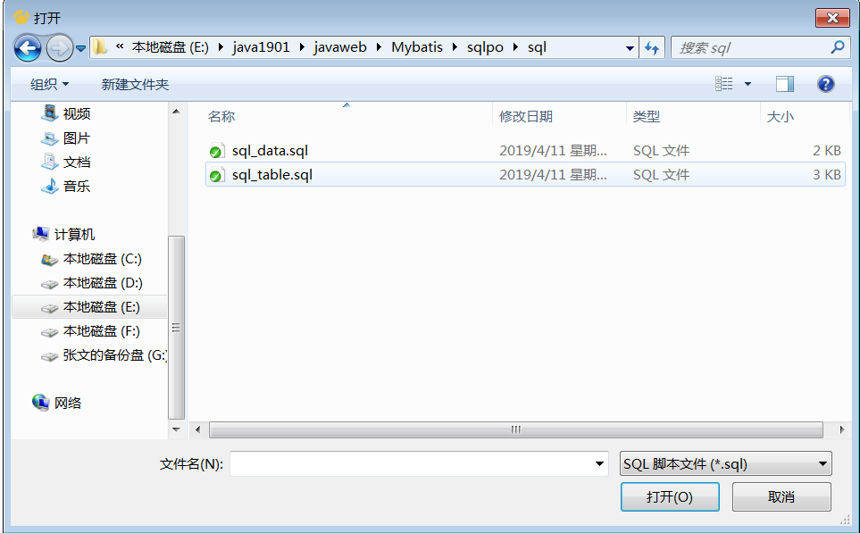
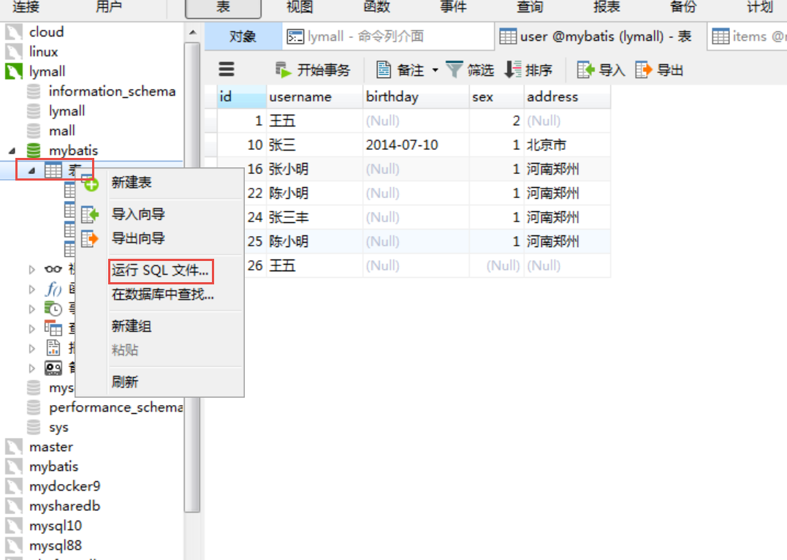
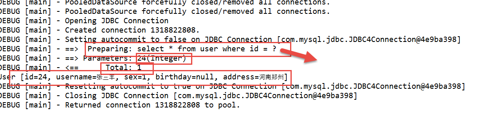
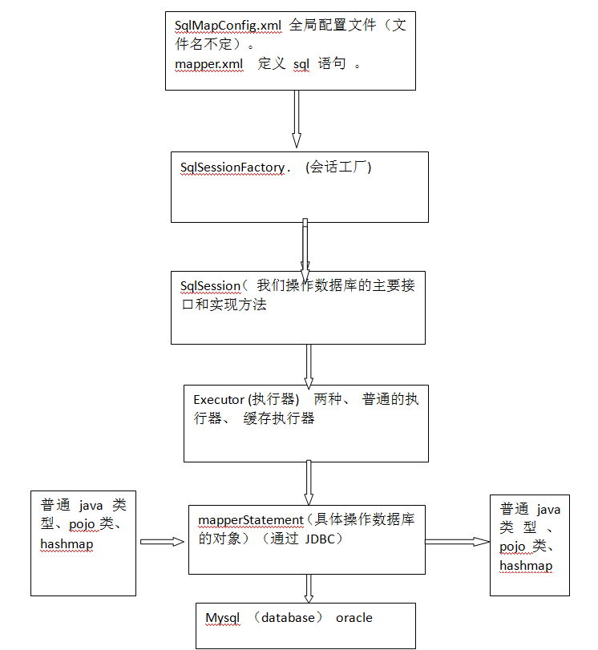
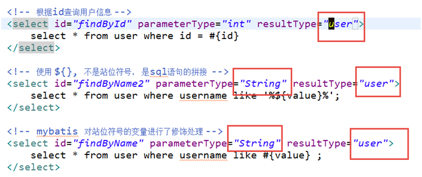
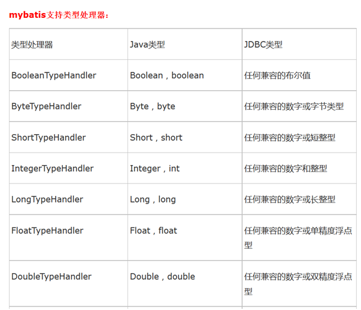

# Mybatis day01

[TOC]


## 1、课程总体介绍

### 第一天内容

1. Mybatis简介
2. Mybatis快速入门及架构
3. 原始Dao开发方式CRUD（Ibatis）
4. Mapper开发方式（代理开发）
5. SqlMapConfig.xml 文件详解
6. 输入和输出映射
7. 动态SQL

### 第二天内容

1. 商品订单的数据模型分析
2. 一对一查询
3. 一对多查询
4. 多对多查询
5. 延迟加载

### 第三天内容

1. 查询缓存
2. Mybatis和Spring的整合
3. Mybatis逆向工程
4. Mybatis的注解开发

## 2、Mybatis的简介

### 2.1 什么 是mybatis ？

是一个优秀的持久层框架  ！

MyBatis 是一款优秀的持久层框架，特点：它支持定制化 SQL、存储过程以及高级映射。MyBatis 避免了几乎所有的 JDBC 代码和手动设置参数以及获取结果集。MyBatis 可以使用简单的 XML 或注解来配置和映射原生信息，将接口和 Java 的 POJOs(Plain Ordinary Java Object,普通的 Java对象)映射成数据库中的记录。 mybatis 是一个 不完全的 ORM 框架 。

特点：

### 2.2  mybatis的历史

MyBatis 本是apache的一个开源项目iBatis, 2010年这个项目由apache software foundation 迁移到了google code，并且改名为MyBatis 。2013年11月迁移到Github。

iBATIS一词来源于“internet”和“abatis”的组合，是一个基于Java的持久层框架。iBATIS提供的持久层框架包括SQL Maps和Data Access Objects（DAOs）
当前，最新版本是MyBatis 3.5.0 ，其发布时间是2019年1月20日。

（SSI) 框架 

### 2.3 什么是 ORM ？

对象关系映射（英语：(Object Relational Mapping，简称ORM，或O/RM，或O/R mapping），是一种程序技术。 实际上 就是 java对象 和 关系型数据库的 表的映射关系 。就是修改 java Object 等同于 修改 数据库里面的对应表数据 。 Hibernate 是一个 完全的 ORM实现。 mybatis 是一个 不完全的 ORM实现。

## 3、Mybatis的快速入门

### 3.1 回顾一下 JDBC程序

```java
public class JdbcHello {

	public static void main(String[] args) throws Exception {
		// 1.注册驱动
		Class.forName("com.mysql.jdbc.Driver");
		// 2. 连接数据库
		Connection conn = DriverManager.getConnection(
				"jdbc:mysql://10.0.13.200/jdbc?useSSL=false", "root", "root123");
		// 3.创建Statement对象
		Statement stmt = conn.createStatement();
		// 4.执行SQL语句并且遍历查询结果
		String sql = "select * from user";
		ResultSet rs = stmt.executeQuery(sql);
		while (rs.next()) {
			System.out.println(rs.getInt("id") + " " + rs.getString("username"));
		}
		// 5.关闭资源
		rs.close();
		stmt.close();
		conn.close();
	}

}
```

有什么 问题：

- stmt 只能使用一次

- 不够灵活（如果sql语句修改， 代码修改量比较大，）

- 必须关闭资源 （太麻烦）

- 连接很繁琐 

- 耦合度特别高。 修改什么东西都需要 重新编译（重写）

- 需要从 rs 解析结果 。

  

### 3.2 数据库表环境的设置

- 创建  database mybatis (utf-8)
- 导入表 和 导入数据  
- 



### 3.3 快速入门

1. 创建项目

   使用 web-parent， 使用 jar 方式
   
   
   
   ```txt
   <build>
   		<finalName>${project.artifactId}</finalName>
   		<resources>
   			<resource>
   				<directory>src/main/resources</directory>
   				<includes>
   					<include>**/*.properties</include>
   					<include>**/*.xml</include>
   					<include>**/*.tld</include>
   				</includes>
   				<filtering>false</filtering>
   			</resource>
   			<resource>
   				<directory>src/main/java</directory>
   				<includes>
   					<include>**/*.properties</include>
   					<include>**/*.xml</include>
   					<include>**/*.tld</include>
   				</includes>
   				<filtering>false</filtering>
   			</resource>
   		</resources>
   		<plugins>
   			<!-- 资源文件拷贝插件 -->
   			<plugin>
   				<groupId>org.apache.maven.plugins</groupId>
   				<artifactId>maven-resources-plugin</artifactId>
   				<version>2.7</version>
   				<configuration>
   					<encoding>UTF-8</encoding>
   				</configuration>
   			</plugin>
   			<plugin>
   				<groupId>org.apache.maven.plugins</groupId>
   				<artifactId>maven-source-plugin</artifactId>
   				<version>2.2.1</version>
   				<executions>
   					<execution>
						<goals>
   							<goal>jar-no-fork</goal>
						</goals>
   						<phase>verify</phase>
   					</execution>
   				</executions>
   			</plugin>
   			<!-- java编译插件 -->
   			<plugin>
   				<groupId>org.apache.maven.plugins</groupId>
   				<artifactId>maven-compiler-plugin</artifactId>
   				<version>3.2</version>
   				<configuration>
   					<source>1.7</source>
   					<target>1.7</target>
   					<encoding>UTF-8</encoding>
   				</configuration>
   			</plugin>
   		</plugins>
   		<pluginManagement>
   			<plugins>
   				<!-- 配置Tomcat插件 -->
   				<plugin>
   					<groupId>org.apache.tomcat.maven</groupId>
   					<artifactId>tomcat7-maven-plugin</artifactId>
   					<version>2.2</version>
   				</plugin>
   			</plugins>
   		</pluginManagement>
   	</build>
   ```
   
   
   
2. 引入jar包

    

   ```txt
   
   ```

   

   ```xml
     <dependencies>
           <dependency>
               <groupId>junit</groupId>
               <artifactId>junit</artifactId>
               <scope>test</scope>
               <version>4.12</version>
           </dependency>
           <dependency>
               <groupId>mysql</groupId>
               <artifactId>mysql-connector-java</artifactId>
               <version>5.1.8</version>
           </dependency>
           <dependency>
               <groupId>com.mchange</groupId>
               <artifactId>c3p0</artifactId>
               <version>0.9.5.2</version>
           </dependency>
           <dependency>
               <groupId>commons-beanutils</groupId>
               <artifactId>commons-beanutils</artifactId>
               <version>1.9.3</version>
           </dependency>
           <dependency>
               <groupId>org.mybatis</groupId>
               <artifactId>mybatis</artifactId>
               <version>3.5.2</version>
           </dependency>
           <dependency>
               <groupId>log4j</groupId>
               <artifactId>log4j</artifactId>
               <version>1.2.17</version>
           </dependency>
       </dependencies>
   ```

   

3. 工程结构

   建立 package： com.zy.dao

   ​                  com.zy.pojo  (javaBean)

   ​                  

4. log4j.properties

   ```pr
   log4j.rootLogger=DEBUG, stdout
   # Console output...
   log4j.appender.stdout=org.apache.log4j.ConsoleAppender
   log4j.appender.stdout.layout=org.apache.log4j.PatternLayout
   log4j.appender.stdout.layout.ConversionPattern=%5p [%t] - %m%n
   
   ```

   必须 使用 Debug 模式

5. sqlMapConfig.xml  文件>

   ```xml
   <?xml version="1.0" encoding="UTF-8"?>
   <!DOCTYPE configuration
   PUBLIC "-//mybatis.org//DTD Config 3.0//EN"
   "http://mybatis.org/dtd/mybatis-3-config.dtd">
   <configuration>
       <!-- 和spring整合后 environments配置将废除 -->
       <environments default="development">
           <environment id="development">
               <!-- 使用jdbc事务管理 -->
               <transactionManager type="JDBC" />
               <!-- 数据库连接池 -->
               <dataSource type="POOLED">
                   <property name="driver" value="com.mysql.jdbc.Driver" />
                   <property name="url"
                             value="jdbc:mysql://192.168.8.11:3306/mybatis?useSSL=false&amp;useUnicode=true&amp;characterEncoding=UTF-8" />
                   <property name="username" value="root" />
                   <property name="password" value="Root@1234" />
               </dataSource>
           </environment>
       </environments>
   
   	<mappers>
   		<!-- 引入刚才 写的 sql 语句 -->
   		<mapper resource="sqlmap/User.xml"/>
   	</mappers>
   
   </configuration>
   
   ```

   

   

6. 需求 根据用户 ID 查询用户

   select * from user where id = ?

7. User 的javaBean

   ```java
   public class User implements Serializable {
   
       private static final long serialVersionUID = 7595165263605415550L;
       private Integer id;
       private String username;
       // 性别
       private Integer sex;
       // 生日
       private Date birthday;
       // 地址
       private String address;
       ...
   ```

   

8. User.xml 文件

   ```xml
   <?xml version="1.0" encoding="UTF-8"?>
   <!DOCTYPE mapper
   PUBLIC "-//mybatis.org//DTD Mapper 3.0//EN"
   "http://mybatis.org/dtd/mybatis-3-mapper.dtd">
   <!-- namespace命名空间，为了对sql语句进行隔离，方便管理 ，mapper开发dao方式，使用namespace有特殊作用
   mapper代理开发时将namespace指定为mapper接口的全限定名
    -->
   <mapper namespace="test">
   <!-- 在mapper.xml文件中配置很多的sql语句，执行每个sql语句时，封装为MappedStatement对象
   mapper.xml以statement为单位管理sql语句
    -->
    	<!--  paramterType: 输入参数的类型，  resultType: 输出参数类型， 写全路径名 -->
    	<select id="selectById" parameterType="Integer" resultType="com.hq.pojo.User">
    		select * from user where id = #{id}
    	</select>
   
   
   </mapper>	
   
   ```

   #{id}  #{},   相等于 占位符 ?， preparedStatement  ?

9. 编码

   ```java
   public class HelloMybatis {
   
       public static void main(String[] args) throws IOException {
           // 根据 sqlMapConfig.xml 得到输入流
           final InputStream is = Resources.getResourceAsStream("sqlMapConfig.xml");
           // 获取 sqlSessionFactory 工厂对象
           final SqlSessionFactory factory = new SqlSessionFactoryBuilder().build(is);
           //  获取 sqlSession 对象
           final SqlSession sqlSession = factory.openSession();
           // 执行 User.xml 里面的 select 语句
           User u = sqlSession.selectOne("test.selectById", 10);
           System.out.println(u);
           // 关闭对象
           sqlSession.close();
       }
   }
   ```

   

10. 输出内容分析

   

11. 其他

### 3.4 快速入门的总结

1、编写SqlMapConfig.xml  （总文件， 文件名称无限制）
2、编写User.xml
	定义了statement  (namespace.statement_id)  selectById   sql 语句
3、编程通过配置文件创建SqlSessionFactory
4、通过SqlSessionFactory获取SqlSession
5、通过SqlSession操作数据库
selectOne()
selectList()
	如果执行添加、更新、删除需要调用SqlSession.commit()
   sqlSession.commit();
6、SqlSesion使用完成要关闭

## 4、mybatis的架构




## 5、使用 Ibatis方式进行开发（原始）

### 5.1 需求

查询（ 普通的查询、模糊查询）
增加、删除、修改 

### 5.2 selectById 进入 Dao模式

### 5.3 select 模糊查询办法

使用${}接收参数 #{}
不是 占位符， 是 sql 语句的 拼接 ?
${} 符号 不进行 如何串（类型）的处理工作， 不会对串加引号 。
\#{username}  ？ 站位符号。  ${value}  就是原始值 。 

```xml
	<!--  paramterType: 输入参数的类型，  resultType: 输出参数类型， 写全路径名 -->
 	<select id="selectById" parameterType="Integer" resultType="com.hq.pojo.User">
 		select * from user where id = #{shit}
 	</select>
 	
 	<select id="selectLikeName" parameterType="String" resultType="com.hq.pojo.User">
 		select * from user where username like "%${value}%"
 	</select>

```

 ```java
public class UserDaoTest {

	private static SqlSessionFactory factory;

	@BeforeClass
	public static void beforeClass() {
		// 根据 我们的 sqlMapConfig.xml
		// InputStream is = Resources.getResourceAsStream("sqlMapConfig.xml") ;
		InputStream is = HelloMybatis.class.getClassLoader().getResourceAsStream("sqlMapConfig.xml");
		// 得到 sqlSessionFacotry 对象
		factory = new SqlSessionFactoryBuilder().build(is);
	}

	@AfterClass
	public static void afterClass() {
		System.out.println("in afterClass ...");
	}

	@Test
	public void testSelectById() {
		UserDao dao = new UserDaoImpl(factory);
		User user = dao.selectById(1);
		System.out.println(user);
	}
	
 ```

### 5.4 insert 插入语句

```xml
	<insert id="insert" parameterType="com.hq.pojo.User" >
 		insert into user values(null, #{username}, #{birthday}, #{sex}, #{address} )
 	</insert>

```

#### 5.4.2 用户添加后， 主键 是空值。如何得到 这个主键值 

```xml
<insert id="insert" parameterType="com.hq.pojo.User" >
 		insert into user values(null, #{username}, #{birthday}, #{sex}, #{address} )
 		<!-- keyProperty: 定义的是 User的 属性， id，  resulttype： 定义的是  sql语句的输出类型  
 			order: sql 语句是 在 insert 之前还是 之后执行  -->
 		<selectKey keyProperty="id" resultType="int" order="AFTER">
 			select last_insert_id();
 		</selectKey>
 	</insert>
```


作业： uuid，利用 select uuid（）， 来插入表，表的主键 就是 uuid 。

### 5.5 mybatis 解决 jdbc的问题

1、	数据库链接创建、释放频繁造成系统资源浪费从而影响系统性能，如果使用数据库链接池可解决此问题。
解决：在SqlMapConfig.xml中配置数据链接池，使用连接池管理数据库链接。
2、	Sql语句写在代码中造成代码不易维护，实际应用sql变化的可能较大，sql变动需要改变java代码。
解决：将Sql语句配置在XXXXmapper.xml（XXX.xml）文件中与java代码分离。
3、	向sql语句传参数麻烦，因为sql语句的where条件不一定，可能多也可能少，占位符需要和参数一一对应。
解决：Mybatis自动将java对象映射至sql语句，通过statement中的parameterType定义输入参数的类型。(ORM)
4、	对结果集解析麻烦，sql变化导致解析代码变化，且解析前需要遍历，如果能将数据库记录封装成pojo对象解析比较方便。
解决：Mybatis自动将sql执行结果映射至java对象，通过statement中的resultType定义输出结果的类型。


### 5.6 mybatis 常用对象的 生命周期

SqlSessionFactoryBuilder: 单例还是多例： 

SqlSessionFactory: 单例还是多例， 单例： 成员变量 还是 局部变量 ？

SqlSession:  单例还是 多例 ？ 局部变量， 不是线程安全。

## 6、Mapper的开发方式（代理对象方式）

### 6.1mapper 开发规范

1、	mapper.xml中namespace指定为mapper接口的全路径名

此步骤目的：通过mapper.xml和mapper.java进行关联。

2、mapper.xml中statement的id就是mapper.java中方法名

3、mapper.xml中statement的parameterType和mapper.java中方法输入参数类型一致

4、mapper.xml中statement的resultType和mapper.java中方法返回值类型一致.

### 6.2 Items JavaBean的书写

```java
public class Items implements Serializable {
	private Integer id;
	private String name;
	private Float price;
	private String pic;
	private Date createtime;
	private String detail;
```


### 6.3  ItemsMapper.xml 文件书写

```xml
<mapper namespace="com.hq.dao.ItemsMapper">
	<select id="selectById" parameterType="int" resultType="com.hq.pojo.Items">
		select * from items where id = #{id}
	</select>
	
	<insert id="insert" parameterType="com.hq.pojo.Items">
		insert into items values(null, #{name}, #{price}, #{detail}, 
		         #{pic}, #{createtime} )
	</insert>

</mapper>	
```


### 6.4 ItemsMapper.java 文件的书写

```java
public interface ItemsMapper {
	Items selectById(Integer id);
	void insert(Items items);
}
```


### 6.5 测试

```java
@Test
	public void testSelectById() {
		SqlSession session = factory.openSession();
		ItemsMapper mapper = session.getMapper(ItemsMapper.class);
		Items items = mapper.selectById(3);
		System.out.println(items);
		items.setName("modify by teacher");
		mapper.insert(items);
		session.commit();
		session.close();
	}
```

### 6.6  问题

1. 返回类型如何区别 

   实际是根据 interface Mapper.java 里面定义方法的返回值类型来决定 

2. 多个输入参数的问题（以后解决）

## 7、sqlMapConfig.xml 文件

SqlMapConfig.xml中配置的内容和顺序如下：

properties（属性）
settings（全局配置参数）
typeAliases（类型别名）
typeHandlers（类型处理器）
objectFactory（对象工厂）
plugins（插件）
environments（环境集合属性对象）
environment（环境子属性对象）
transactionManager（事务管理）
dataSource（数据源）
mappers（映射器）

### 7.1 properties

注意： MyBatis 将按照下面的顺序来加载属性：
	在 properties 元素体内定义的属性首先被读取。 
	然后会读取properties 元素中resource或 url 加载的属性，它会覆盖已读取的同名属性。 
	最后读取parameterType传递的属性，它会覆盖已读取的同名属性。

建议使用properties，不要在properties中定义属性，只引用定义的properties文件中属性，
并且properties文件中定义的key要有一些特殊的规则。

```xml
<!-- 和spring整合后 environments配置将废除 -->
	<properties resource="db.properties">
		<property name="jdbc.username" value="rootshit"/>
	</properties>
	<environments default="development">
		<environment id="development">
			<!-- 使用jdbc事务管理 -->
			<transactionManager type="JDBC" />
			<!-- 数据库连接池 -->
			<dataSource type="POOLED">
				<property name="driver" value="${jdbc.driver}" />
				<property name="url" value="${jdbc.url}" />
				<property name="username" value="${jdbc.username}" />
				<property name="password" value="${jdbc.password}" />
			</dataSource>
		</environment>
	</environments>
```

Settings, 全局参数设置。

### 7.2 typeAliases

类型是 别名。 

可以将parameterType、resultType中指定的类型 通过别名引用。

1. 系统已经有的别名

   | 别名       | 映射的类型 |
   | ---------- | ---------- |
   | _byte      | byte       |
   | _long      | long       |
   | _short     | short      |
   | _int       | int        |
   | _integer   | int        |
   | _double    | double     |
   | _float     | float      |
   | _boolean   | boolean    |
   | string     | String     |
   | byte       | Byte       |
   | long       | Long       |
   | short      | Short      |
   | int        | Integer    |
   | integer    | Integer    |
   | double     | Double     |
   | float      | Float      |
   | boolean    | Boolean    |
   | date       | Date       |
   | decimal    | BigDecimal |
   | bigdecimal | BigDecimal |

    

2. 我们自己定义的别名

   ```xml
   <typeAliases>
   		<!-- <typeAlias type="com.hq.pojo.User" alias="user"/>
   		<typeAlias type="com.hq.pojo.Items" alias="items"/> -->
   		<!-- 进行包扫描 -->
   		<package name="com.hq.pojo"/>
   		<!--  user  User items Items -->
   	</typeAliases>
   ```

   2种方式： 自己定义， 进行包扫描 。

   

   类型转换器

   

### 7.3 mappers

1. resource 指定了 mapper.xml 文件的位置

2.  class 指定了 mapper的interface的全路径

   ```xml
   <mappers>
   		<!-- 引入刚才 写的 sql 语句 -->
   		<mapper resource="sqlmap/User.xml"/>
   		<!-- <mapper resource="sqlmap/ItemsMapper.xml"/> -->
   <!-- 定义了 mapper 的接口类， 但是要求 xml 文件同接口类同一目录下面 -->
   		<mapper class="com.hq.mapper.ItemsMapper"/>
   	</mappers>
   ```

   

3. 使用 package

   ```xml
   <mappers>
   		<!-- 引入刚才 写的 sql 语句 -->
   		<mapper resource="sqlmap/User.xml"/>
   		<!-- <mapper resource="sqlmap/ItemsMapper.xml"/> -->
   <!-- 定义了 mapper 的接口类， 但是要求 xml 文件同接口类同一目录下面 -->
   		<!-- <mapper class="com.hq.mapper.ItemsMapper"/> -->
   		<package name="com.hq.mapper"/>
   	</mappers>
   
   ```


## 8、 输入和输出映射

### 8.1 对 parameterType 对象进行扩充

1. 需求

   如果我们计划查询 id 在 20 到 40 之间的 用户，sql：
     Select * from user where id > 20 and id < 40 
   这里面 需要 输入 2 个参数  beginId  and  endId  .

2. 其他


### 8.2  对 parameterType使用包装对象

### 8.3  使用 注解 @Param, 使方法可以带多个参数

```java
public interface UserMapper {
	// User selectById(Integer id);
	// void insert(User user);
	List<User> selectBetween(UserCustom cust);
	List<User> selectBetween2(UserQuery query);
	// 方法里面 带多参数的 解决 方法
	List<User> selectBetween3(@Param("user") User user, @Param("query") UserQuery query);
}

```


```xml
<select id="selectBetween3"  resultType="User">
		select * from user where id &gt; #{query.cust.beginId} and id &lt; #{query.cust.endId} and 
			username  like "%${user.username}%"
	</select>

```

```java
@Test
	// interface 方法里面 带多个参数  ！
	public void testSelectBetween3() {
		SqlSession session = factory.openSession();
		UserMapper mapper = session.getMapper(UserMapper.class);
		UserCustom cust = new UserCustom();
		cust.setBeginId(10);
		cust.setEndId(30);
		UserQuery query = new UserQuery();
		query.setCust(cust);
		User user = new User();
		user.setUsername("小明");
		List<User> list = mapper.selectBetween3(user, query);
		for(User u : list) {
			System.out.println(u);
		}
	}
```


### 8.4  resultMap的简单映射


## 9、 动态sql

#### 9.1 动态SQL是什么 ？

就是 我们的 sql 语句会根据 我们 输入的值的不同 而改变  ！

#### 9.2 需求 

beginId， endID, username

#### 9.3  if, where

#### 9.4 foreach

foreach标签的使用， 主要可以 对 集合对象的值读入到 sql 语句 。

```java
public class UserCustom extends User {
	private int beginId;
	private int endId;
	private List<Integer>  ids;
	
```

```xml
<!-- 动态sql for each -->
	<delete id="deleteUsers" parameterType="UserCustom">
		<!--  delete from user where id in (1,3, 45) -->
		delete from user where id 
		<!-- ids: 就是集合类型， open： 代表开始  close: 代表结束  item: 代表每一个值的变量 -->
		<foreach collection="ids"  open="in(" close=")" separator="," item="id">
			#{id}
		</foreach>
	</delete>
```


#### 10.5 sql 片段

就是一段 sql 代码， 这个代码 比较复杂， 在多个 statement都需要使用。 可以使用  \<sql> 标签， 来达到复用代码的目的 。  \<include>  标签来引入

```xml
<sql id="sql_begin_end">
		<if test="beginId != null and beginId > 0">
			and id &gt; #{beginId}
		</if>
		<if test="endId > beginId ">
			and id &lt; #{endId}
		</if>
		<if test="username != null">
			and username like "%${username}%"
		</if>
	</sql>


<select id="selectBetweenLike" parameterType="userCustom"
		resultType="user">
		select * from user
		<where>
			<include refid="sql_begin_end"></include>
		</where>
	</select>
```

foreach  sql  include  if  where  choose when 

