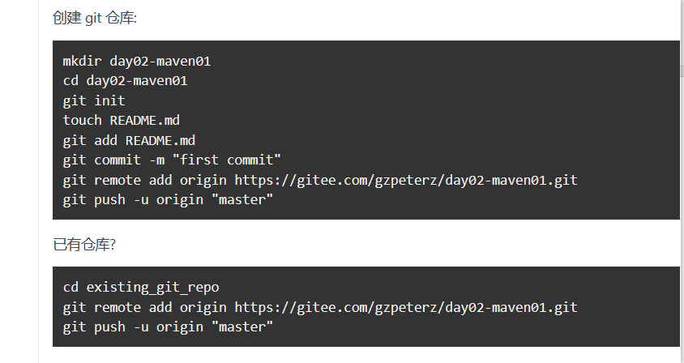
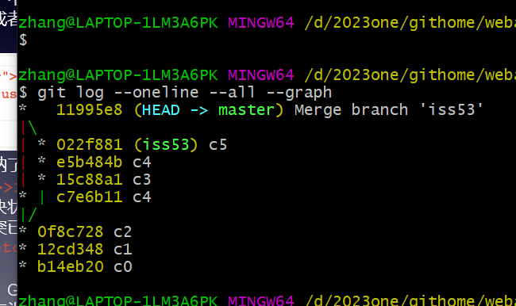
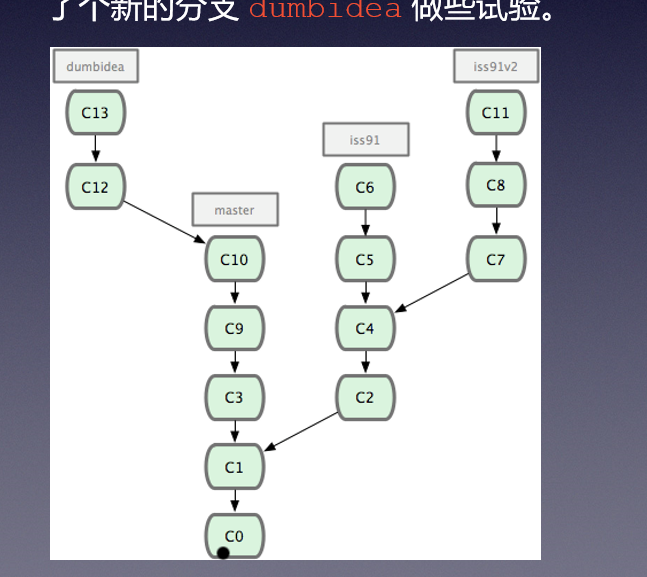

# git


## 复习

1. 什么是 git ？  git 可以干什么 ？
2. git 同 github， gitee的区别 ？ 
3. git 同 svn的区别 ？
4. 其他


```txt
 exit
  501  mkdir first
  502  cd first/
  503  git init
  504  ls -al
  505  ls -l
  506  cd ..
  507  ls -al
  508  git clone https://gitee.com/gzpeterz/day33src.git
  509  ls -al
  510  cd day33src
  511  ls -al
  512  git status
  513  cd ..
  514  git clone https://gitee.com/hdjxnwj/hello.git
  515  cd hello/
  516  ls -al
  517  cd ..
  518  ls -al
  519  cd first/
  520  ls -al
  521  vi a.txt
  522  ls -al
  523  git status
  524  git add a.txt
  525  git status
  526  ls -al
  527  cd .git/
  528  ls -al
  529  cat index
  530  cd ..
  531  ls -al
  532  vi a.txt
  533  ls -al
  534  git status
  535  git commit -m "add a.txt"
  536  ls -al
  537  cd .git/
  538  ls -al
  539  cd ..
  540  git status
  541  git add a.txt
  542  git commit -m "modify a.txt"
  543  git status --short
  544  git status -s
  545  ls -al
  546  touch b.txt
  547  git status -s
  548  touch c.txt
  549  git status -s
  550  git add b.txt
  551  git status -s
  552  touch d.txt
  553  git add c.txt
  554  git status -s
  555  git commit -m "add2"
  556  git status -s
  557  vi b.txt
  558  git status -s
  559  git status
  560  git log
  561  cd ..
  562  ls -al
  563  cd hello/
  564  git log
  565  cd ..
  566  ls -al
  567  cd day33src/
  568  git log
  569  cd ..
  570  git clone https://gitee.com/windandwine/YOLO_v3_tensorflow.git
  571  ls -al
  572  cd YOLO_v3_tensorflow/
  573  ls -al
  574  git log
  575  cd ..
  576  ls -al
  577  rm -Rf hello/
  578  git clone https://gitee.com/gzpeterz/hello.git
  579  cd hello/
  580  ls -al
  581  git log
  582  ls -al
  583  touch a.txt
  584  git add a.txt
  585  git status
  586  git reset HEAD a.txt
  587  git status
  588  git log
  589  ls -al
  590  md5sum a.txt
  591  sha256sum.exe  a.txt
  592  ls -al
  593  git log
  594  git reset --hard f96e8e8304bae602fd34955a160ffb7e84e62a77
  595  ls -al
  596  cat a.txt
  597  git log
  598  git status
  599  history

```

```txt
  rm -Rf hello/
  605  git clone https://gitee.com/gzpeterz/hello.git
  606  cd hello/
  607  git status
  608  git log
  609  ls -al
  610  touch teacher.txt
  611  vi teacher.txt
  612  git add teacher.txt
  613  git commit -m "for push test"
  614  git push
  615  git push
  616  ls -al
  617  vi teacher.txt
  618  git commit -a -m "no key"
  619  git push
  620  git pull
  621  ls -al
  622  vim lol.txt
  623  vi 这不是一个文件.txt
  624  git pull
  625  ls -al
  626  git history
  627  history

```





```txt
  exit
  501  git init
  502  ls -al
  503  git status
  504  git status
  505  git status
  506  git add *
  507  git status
  508  git add .git*
  509  git status
  510  git commit -m "first init"
  511  git remote -v
  512  git remote
  513  git remote add origin https://gitee.com/gzpeterz/day02-maven01.git
  514  git push -u origin master
  515  ls -al
  516  vi pom.xml
  517  git commit -a -m "add aaa comments"
  518  git push
  519  git --help
  520  git --help push

```


```txt
  history
  522  git log --oneline
  523  ls -al
  524  git branch
  525  git branch -a
  526  git branch test
  527  git checkout test
  528  ls -al
  529  echo "this is test file" > text.txt
  530  git add text.txt
  531  git commit -m "add test file"
  532  ls -al
  533  git checkout master
  534  ls -al
  535  touch b.txt
  536  git add b.txt
  537  git commit -m "add b.txt"
  538  ls -al
  539  git checkout test
  540  ls -al
  541  git log --oneline
  542  git log --oneline --all --graph
  543  git push origin test
  544  git branch -a
  545  history

```





```txt
 git branch
  513  cd ..
  514  mkdir weba
  515  cd weba/
  516  git init
  517  touch a.txt b.txt c.txt
  518  git add *.txt
  519  git commit -m "c0"
  520  vi a.txt
  521  git commit -a -m "c1"
  522  vi a.txt
  523  git commit -a -m "c2"
  524  git log --oneline --all --graph
  525  git checkout -b iss53
  526  git log --oneline --all --graph
  527  vi b.txt
  528  git commit -a -m "c3"
  529  git log --oneline --all --graph
  530  git checkout master
  531  ls -al
  532  git checkout -b hotfix
  533  vi c.txt
  534  git commit -a -m "c4"
  535  git log --oneline --all --graph
  536  git checkout master
  537  ls -al
  538  cat a.txt
  539  git merge hotfix
  540  ls -al
  541  cat c.txt
  542  git log --oneline --all --graph
  543  git branch
  544  git branch -d hotfix
  545  git branch
  546  git log --oneline --all --graph
  547  git checkout iss53
  548  ls -al
  549  cat a.txt
  550  cat b.txt
  551  vi b.txt
  552  git commit -a -m "c4"
  553  vi b.txt
  554  git commit -a -m "c5"
  555  git log --oneline --all --graph
  556  git checkout master
  557  git merge iss53
  558  ls -al
  559  cat a.txt
  560  cat c.txt
  561  cat b.txt
  562  git log --oneline --all --graph
  563  history

```


合作开发的步骤：

1. 成为该项目一个合作开发者
2. 在idea 克隆项目
3. 创建自己开发的分支， 从 master 分支里面
4. 完成自己的开发， 建议使用一个个人的文件 或者 包 。
5. 提交到自己的分支 。
6. 进行一个 pull 操作， 将服务器上面的最新 master 代码取下来
7. 切换分支到 master， 然后进行 代码的合并（合作开发的分支）
8. 进行一些测试的工作，看看代码情况
9. push master 分支进行 服务器 。


## 作业




