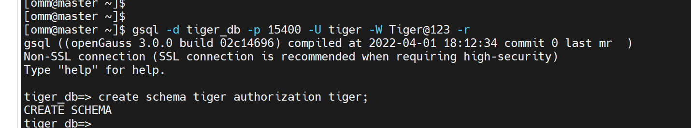
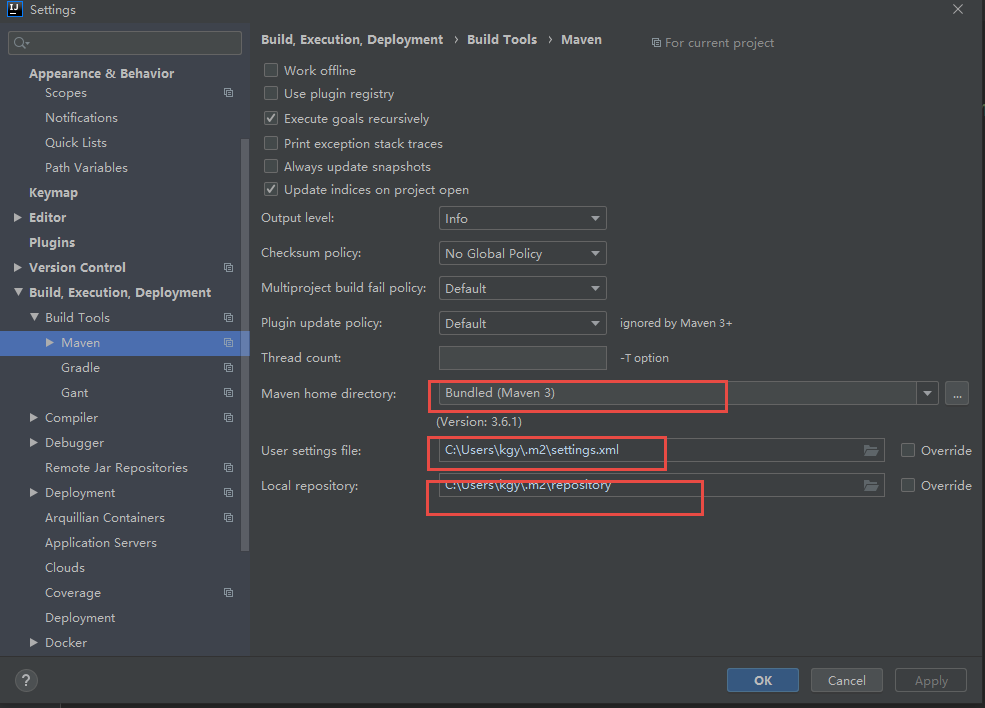
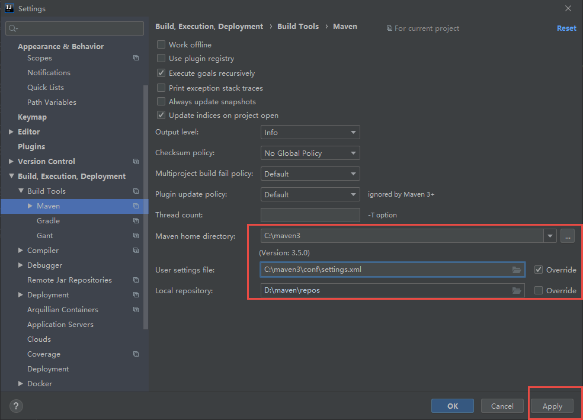

# open高斯数据库的jdbc


[TOC]

## 创建数据库和表

### 创建数据库用户

操作系统 linux

```txt
su - omm
gs_om -t start
```


gsql系统

```txt
gsql -d postgres -p 15400 -r

openGauss=#
openGauss=#
openGauss=#
openGauss=#
openGauss=# create user tiger with password "Tiger@123";
CREATE ROLE
openGauss=# create database tiger_db owner tiger;
CREATE DATABASE
openGauss=#
openGauss=# alter user tiger with sysadmin;
ALTER ROLE
\q


```

使用新用户登录：



```txt
[omm@master ~]$
[omm@master ~]$
[omm@master ~]$ gsql -d tiger_db -p 15400 -U tiger -W Tiger@123 -r
gsql ((openGauss 3.0.0 build 02c14696) compiled at 2022-04-01 18:12:34 commit 0 last mr  )
Non-SSL connection (SSL connection is recommended when requiring high-security)
Type "help" for help.

tiger_db=> create schema tiger authorization tiger;
CREATE SCHEMA
tiger_db=>

```


高斯数据库的数据类型

https://docs.opengauss.org/zh/docs/3.0.0/docs/BriefTutorial/%E6%95%B0%E6%8D%AE%E7%B1%BB%E5%9E%8B.html


### 创建表

```txt
-- Table structure for account
-- ----------------------------
DROP TABLE IF EXISTS  account ;
CREATE TABLE  account  (
   id  int NOT NULL,
   name  varchar(64) DEFAULT NULL,
   money  int DEFAULT NULL,
  PRIMARY KEY ( id )
)  
```


### 插入数据

```txt
-- ----------------------------
-- Records of account
-- ----------------------------
INSERT INTO  account  VALUES ('1', 'tiger', '1000');
INSERT INTO  account  VALUES ('2', 'pig', '10000');
INSERT INTO  account  VALUES ('3', '老王', '10000');
INSERT INTO  account  VALUES ('4', null, null);
```


## 创建maven项目

错误的：







```txt
 <dependencies>
        <dependency>
            <groupId>junit</groupId>
            <artifactId>junit</artifactId>
            <version>4.13.2</version>
            <scope>test</scope>
        </dependency>
        <!-- https://mvnrepository.com/artifact/org.opengauss/opengauss-jdbc -->
        <dependency>
            <groupId>org.opengauss</groupId>
            <artifactId>opengauss-jdbc</artifactId>
            <version>3.0.0</version>
<!--            <scope>provided</scope>-->
        </dependency>
```


## 进行jdbc编码（query)

```txt
 public static void main(String[] args) throws ClassNotFoundException, SQLException {
//        - 创建工程，导入驱动jar包
//                - 注册驱动
        Class<?> driver = Class.forName("org.opengauss.Driver");
//        - 获取连接
        Connection conn = DriverManager.getConnection("jdbc:opengauss://192.168.8.67:15400/mybatis", "peter", "peter@123");

        System.out.println(conn);
//        Java代码需要发送SQL给MySQL服务端，就需要先建立连接
//                - 定义SQL语句
        String sql = "select * from account";
//        - 获取执行SQL对象
//        执行SQL语句需要SQL执行对象，而这个执行对象就是Statement对象
        Statement stmt = conn.createStatement();
//        - 执行SQL
        ResultSet rs = stmt.executeQuery(sql);

        while (rs.next()) {
            System.out.println(rs.getString(1) + ", " +
                    rs.getString("name") + ", " + rs.getInt("money"));
        }
//        - 处理返回结果
//        System.out.println(result);
//                - 释放资源
        stmt.close();
        conn.close();
    }
```


## 进行 (insert , delete)