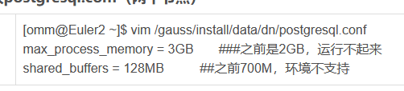

---

---


可能会用到的相关gauss数据库安装软件包：


# 一、 前期准备

1. 有一些后面需要用到的安装包，需要先部署

> yum -y install gcc net-tools wget openssl-devel bzip2-devel expat-devel gdbm-devel readline-devel sqlite-devel libaio-devel flex bison ncurses-devel glibc-devel patch redhat-lsb-core libnsl vim lrzsz bzip2

2. gauss数据库依赖python3.6的环境，这里安装一个

下载3.6.5的版本

> wget https://www.python.org/ftp/python/3.6.5/Python-3.6.5.tgz

解压配置和安装python版本

> tar -zxvf Python-3.6.5.tgz
cd Python-3.6.5
mkdir /usr/local/python3
./configure --prefix=/usr/local/python3 --enable-shared --with-ssl
make && make install
cp /usr/local/python3/lib/libpython3.6m.so.1.0 /usr/lib64/

建立python3的系统软链接

> ln -s /usr/local/python3/bin/python3 /usr/bin/python3
ln -s /usr/local/python3/bin/pip3 /usr/bin/pip3

输入python3可以进行验证


3. linux的sem值修改

先修改系统的semni数值，默认的值是128，华为的高斯数据库需要的最大信号量数值更高，这里我改成了2048,。

> vim /etc/sysctl.conf


```txt

kernel.sem = 250 512000 100 2048

```


通过 sysctl -p 来查看修改之后的值


4. openssl版本修改

华为高斯数据库的openssl要求版本是1.1以上，我的centos默认是1.0.2的版本，这个也需要升级。

先在官网上下载一个1.1版本的压缩包

> wget https://www.openssl.org/source/openssl-1.1.1g.tar.gz --no-check-certificate

解压压缩包并且对它进行配置、编译和安装

ssl:    secure  socket  layer, 

> tar -xvf openssl-1.1.1g.tar.gz
cd openssl-1.1.1g
./config shared --openssldir=/usr/local/openssl --prefix=/usr/local/openssl
make && make install

更新系统中原有的版本，替换系统openssl的软链接

> mv /usr/bin/openssl /usr/bin/openssl.old
ln -s /usr/local/openssl/bin/openssl /usr/bin/openssl
ln -s /usr/local/openssl/include/openssl /usr/include/openssl
echo "/usr/local/openssl/lib" >> /etc/ld.so.conf
ldconfig -v

最后可以验证是否成功

> openssl version


```txt
[root@localhost bin]# history
    1  ip addr
    2  ping www.baidu.com
    3  yum -y install gcc net-tools wget openssl-devel bzip2-devel expat-devel gdbm-devel readline-devel sqlite-devel libaio-devel flex bison ncurses-devel glibc-devel patch redhat-lsb-core libnsl vim lrzsz bzip2
    4  cd /home/tmp
    5  ls -al
    6  unzip guass.zip
    7  yum install unzip -y
    8  unzip guass.zip
    9  cd guass
   10  ls -al
   11  tar xvfz Python-3.6.5.tgz
   12  cd Python-3.6.5
   13  mkdir /usr/local/python3
   14  ./configure --prefix=/usr/local/python3 --enable-shared --with-ssl
   15  make && make install
   16  cp /usr/local/python3/lib/libpython3.6m.so.1.0 /usr/lib64/
   17  cd /usr/bin
   18  ls -al py*
   19  ln -s /usr/local/python3/bin/python3 /usr/bin/python3
   20  ls -al py*
   21  ln -s /usr/local/python3/bin/pip3 /usr/bin/pip3
   22  python3
   23  history
[root@localhost bin]#

```


```txt
  24  cd /etc
   25  vim sysctl.conf
   26  sysctl -p
   27  cd /home/tmp
   28  cd guass
   29  ls -al
   30  tar xvfz openssl-1.1.1g.tar.gz
   31  cd openssl-1.1.1g
   32  cd ..
   33  cd openssl-1.1.1g
   34  ./config shared --openssldir=/usr/local/openssl --prefix=/usr/local/openssl
   35  make && make install
   36  mv /usr/bin/openssl /usr/bin/openssl.old
   37  ln -s /usr/local/openssl/bin/openssl /usr/bin/openssl
   38  ln -s /usr/local/openssl/include/openssl /usr/include/openssl
   39  echo "/usr/local/openssl/lib" >> /etc/ld.so.conf
   40  ldconfig -v
   41  openssl version

```


# 二、进行华为GAUSS数据库企业版的安装（单节点服务器）

1. 创建/opt/software/openGauss文件夹

> mkdir -p /opt/software/openGauss

2. 将企业版的安装包上传到该目录，并且进行解压

因为我一开始是把安装包上传到了/home目录，所以我先做了一次mv的剪切操作：

> mv /home/openGauss-3.0.0-CentOS-64bit-all.tar.gz /opt/software/openGauss/
cd /opt/software/openGauss/
tar -zxvf openGauss-3.0.0-CentOS-64bit-all.tar.gz
tar -zxvf openGauss-3.0.0-CentOS-64bit-om.tar.gz

3. 修改服务器的主机名

> hostnamectl set-hostname master

```txt
  cd /opt
   44  ls -al
   45  mkdir -p /opt/software/openGuass
   46  mkdir -p /opt/software/openGauss
   47  cd software/
   48  ls -al
   49  rmdir openGuass/
   50  ls -al
   51  cd /home/tmp/guass
   52  ls -al
   53  mv ./openGauss-3.0.0-CentOS-64bit-all.tar.gz  /opt/software/openGauss/
   54  cd /opt/software/openGauss/
   55  ls -al
   56  tar xvfz openGauss-3.0.0-CentOS-64bit-all.tar.gz
   57  tar xvfz openGauss-3.0.0-CentOS-64bit-om.tar.gz
   58  hostnamectl set-hostname master
   59  ip addr
   60  cd /etc
   61  vi hosts
   62  cat hosts
   63  ping master
   64  history

```


4. 关闭和删除服务器的防火墙设置

> service firewalld stop
chkconfig firewalld off

​	

​	 

```txt
#现在关闭防火墙
systemctl stop firewalld

# 永久关闭防火墙
systemctl disable firewalld
```


5. 修改/etc/selinux/config文件，修改SELINUX的值，将值改成disabled

> SELINUX=disabled

修改完成后重启服务器。

> reboot

6. 修改服务器的时区信息

> cp /usr/share/zoneinfo/Asia/Shanghai /etc/localtime

7. 关闭服务器的交换内存

> swapoff -a

8. 设置网卡的mtu值为1500

> ifconfig ens33 mtu 1500

9. 设置root用户远程登录

修改ssd_config文件：将里面的PermitRootLogin选项改成 yes，找到这一行，去掉PermitRootLogin前面的 # 注释就行了

> vim /etc/ssh/sshd_config


> service sshd restart

10. 以root用户重新登录

```txt
ssh master
```


> ssh 192.168.2.203
>
> 

11. 复制服务器的xml配置文件

> cp /opt/software/openGauss/script/gspylib/etc/conf/cluster_config_template.xml /opt/software/openGauss/cluster_config.xml

12. 修改 /opt/software/openGauss/cluster_config.xml 文件

将文件内容全部删除掉，将以下的内容粘贴到自己的 cluster_config.xml文件中，并且对主机名和ip地址进行替换，然后保存文件

```txt
<?xml version="1.0" encoding="utf-8"?>
<ROOT>
<!-- openGauss整体信息 -->
<CLUSTER>
<!-- 数据库名称 -->
<PARAM name="clusterName" value="dbCluster" />
<!-- 数据库节点名称(hostname) -->
<PARAM name="nodeNames" value="master" />
<!-- 数据库安装目录-->
<PARAM name="gaussdbAppPath" value="/opt/huawei/install/app" />
<!-- 日志目录-->
<PARAM name="gaussdbLogPath" value="/var/log/omm" />
<!-- 临时文件目录-->
<PARAM name="tmpMppdbPath" value="/opt/huawei/tmp" />
<!-- 数据库工具目录-->
<PARAM name="gaussdbToolPath" value="/opt/huawei/install/om" />
<!-- 数据库core文件目录-->
<PARAM name="corePath" value="/opt/huawei/corefile" />
<!-- 节点IP，与数据库节点名称列表一一对应 -->
<PARAM name="backIp1s" value="192.168.8.67"/>
</CLUSTER>
<!-- 每台服务器上的节点部署信息 -->
<DEVICELIST>
<!-- 节点1上的部署信息 -->
<DEVICE sn="node1_hostname">
<!-- 节点1的主机名称 -->
<PARAM name="name" value="master"/>
<!-- 节点1所在的AZ及AZ优先级 -->
<PARAM name="azName" value="AZ1"/>
<PARAM name="azPriority" value="1"/>
<!-- 节点1的IP，如果服务器只有一个网卡可用，将backIP1和sshIP1配置成同一个IP -->
<PARAM name="backIp1" value="192.168.8.67"/>
<PARAM name="sshIp1" value="192.168.8.67"/>
<!--dbnode-->
<PARAM name="dataNum" value="1"/>
<PARAM name="dataPortBase" value="15400"/>
<PARAM name="dataNode1" value="/opt/huawei/install/data/dn"/>
<PARAM name="dataNode1_syncNum" value="0"/>
</DEVICE>
</DEVICELIST>
</ROOT>

```


```xml
<?xml version="1.0" encoding="UTF-8"?>
<ROOT>
<!-- openGauss整体信息 -->
<CLUSTER>
<!-- 数据库名称 -->
<PARAM name="clusterName" value="dbCluster" />
<!-- 数据库节点名称(hostname) -->
<PARAM name="nodeNames" value="master" />
<!-- 数据库安装目录-->
<PARAM name="gaussdbAppPath" value="/opt/huawei/install/app" />
<!-- 日志目录-->
<PARAM name="gaussdbLogPath" value="/var/log/omm" />
<!-- 临时文件目录-->
<PARAM name="tmpMppdbPath" value="/opt/huawei/tmp" />
<!-- 数据库工具目录-->
<PARAM name="gaussdbToolPath" value="/opt/huawei/install/om" />
<!-- 数据库core文件目录-->
<PARAM name="corePath" value="/opt/huawei/corefile" />
<!-- 节点IP，与数据库节点名称列表一一对应 -->
<PARAM name="backIp1s" value="192.168.222.134"/>
</CLUSTER>
<!-- 每台服务器上的节点部署信息 -->
<DEVICELIST>
<!-- 节点1上的部署信息 -->
<DEVICE sn="node1_hostname">
<!-- 节点1的主机名称 -->
<PARAM name="name" value="master"/>
<!-- 节点1所在的AZ及AZ优先级 -->
<PARAM name="azName" value="AZ1"/>
<PARAM name="azPriority" value="1"/>
<!-- 节点1的IP，如果服务器只有一个网卡可用，将backIP1和sshIP1配置成同一个IP -->
<PARAM name="backIp1" value="192.168.222.134"/>
<PARAM name="sshIp1" value="192.168.222.134"/>
<!--dbnode-->
<PARAM name="dataNum" value="1"/>
<PARAM name="dataPortBase" value="15400"/>
<PARAM name="dataNode1" value="/opt/huawei/install/data/dn"/>
<PARAM name="dataNode1_syncNum" value="0"/>
</DEVICE>
</DEVICELIST>
</ROOT>

```

13. 使用 gs_preinstall 进行交互模式执行安装环境

```txt
#
userdel omm
rm -Rf /home/omm
```


> /opt/software/openGauss/script/gs_preinstall -U omm -G dbgrp -X /opt/software/openGauss/cluster_config.xml

这里的omm是准备数据库使用的系统用户，dbgrp是这个用户所在的用户组。


```txt
 history
   65  iptables -n -L
   66  systemctl stop firewalld
   67  iptables -n -L
   68  systemctl disable firewalld
   69  cat selinux/config
   70  reboot
   71  ip addr
   72  ping www.baidu.com
   73  ip addr
   74  cp /opt/software/openGauss/script/gspylib/etc/conf/cluster_config_template.xml /opt/s       oftware/openGauss/cluster_config.xml
   75  cd /opt/software/openGauss/
   76  ls -al
   77  cat cluster_config.xml
   78  /opt/software/openGauss/script/gs_preinstall -U omm -G dbgrp -X /opt/software/openGau       ss/cluster_config.xml
   79  ping www.baidu.com
   80  ipconfig
   81  ifconfig
   82  history

```


14. 给 omm 用户赋予 opt 文件夹的权限

> chmod -R 775 /opt

15. 创建脚本互信文件，在hostfile文件中写入自己的ip地址

> cd /opt/software/openGauss/
vim hostfile

16. 切换到 omm 用户，开始安装 gauss 数据库

> su - omm

17. 安装 gauss 数据库

> gs_install -X /opt/software/openGauss/cluster_config.xml

在安装过程中需要输入数据库密码，密码要由符号、大小写英文组成，至少长度达到8位，例如

Root@123


Root@123





```txt
root 用户下

cd /
find / -name postgresql.conf
 vim /opt/huawei/install/data/dn/postgresql.conf

reboot

su - omm
gs_install -X /opt/software/openGauss/cluster_config.xml

```


18. 进行数据库安装之后的校验

> gs_om -t status --detail


19. 数据库的启动

> gs_om -t start

20. 使用命令登录和进入数据库

> gsql -d postgres -p 15400 -r


```txt
[root@master ~]#
[root@master ~]#
[root@master ~]# su - omm
Last login: Mon Sep 18 16:35:25 CST 2023 on pts/0
[omm@master ~]$
[omm@master ~]$
[omm@master ~]$
[omm@master ~]$ gsql -d postgres -p 15400  -r
gsql ((openGauss 3.0.0 build 02c14696) compiled at 2022-04-01 18:12:34 commit 0 last mr  )
Non-SSL connection (SSL connection is recommended when requiring high-security)
Type "help" for help.

openGauss=# \l
                          List of databases
   Name    | Owner | Encoding  | Collate | Ctype | Access privileges
-----------+-------+-----------+---------+-------+-------------------
 postgres  | omm   | SQL_ASCII | C       | C     |
 template0 | omm   | SQL_ASCII | C       | C     | =c/omm           +
           |       |           |         |       | omm=CTc/omm
 template1 | omm   | SQL_ASCII | C       | C     | =c/omm           +
           |       |           |         |       | omm=CTc/omm
(3 rows)

openGauss=#

```


21. 创建一个自己的数据库

> create database 数据库名称 with encoding '编码格式' template=template0;


22. 创建一个自己账号的用户

> create user 用户名 password '密码';


23. 给用户授权，将默认的管理员权限赋予新用户

> grant 管理员名称 to 用户名;


使用alter语句来给自己的用户授予权限：

> alter user jack sysadmin;

**这一步结束，你的GAUSS数据库就可以使用了。**
