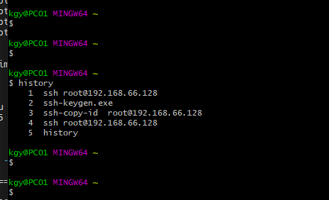

# opengauss 操作命令


## 工具的使用


查看install/app 目录下的文件

```txt
  gs_om -t start
   21  ps -ef
   22  cd /opt/huawei/install/app
   23  ls -al
   24  cd jre/
   25  ls -al
   26  cd bin
   27  ls -al
   28  ./java  -version
   29  cd ..
   30  ls -al
   31  cd etc
   32  ls -al
   33  history


# 查看 opengauss 数据库的监听端口   15400
 ps -ef
   35  cd /opt/huawei/install/data/dn
   36  pwd
   37  ls -al
   38  cat postgresql.conf | grep port

```


##### 操作系统的参数的检查， 必须使用 root 用户

```txt
  120  gs_checkos  -i A
  121  top
  122  gs_checkos  -i A
  123  swapoff -a
  124  top
  125  gs_checkos  -i A
  126  history

```


检查数据库连接的操作

```txt

一、主机需要免密码连接

# 产生当前用户的公钥和私钥
ssh-keygen
enter 
回车

#让用户免密登录，  将本机的公钥 复制到 master 主机并且保存
ssh-copy-id  master
输入 omm用户的密码

测试免密登录
ssh  master


# 检查数据库的连接
gs_check -i CheckDBConnection
```





```txt
-- Table structure for account
-- ----------------------------
DROP TABLE IF EXISTS  account ;
CREATE TABLE  account  (
   id  int NOT NULL,
   name  varchar(64) DEFAULT NULL,
   money  int DEFAULT NULL,
  PRIMARY KEY ( id )
)  

-- ----------------------------
-- Records of account
-- ----------------------------
INSERT INTO  account  VALUES ('1', 'tiger', '1000');
INSERT INTO  account  VALUES ('2', 'pig', '10000');
INSERT INTO  account  VALUES ('3', '老王', '10000');
INSERT INTO  account  VALUES ('4', null, null);
```


