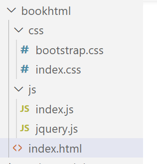

# day02


## 图书案例

### 写服务器

1. 创建一个数据库

   ```txt
   创建databse   ajax 利用图像界面， 字符集 utf-8
   
   创建表  books
    { "id": 1, "bookname": "西游记", "author": "吴承恩", "publisher": "北京图书出版社"  },
       { "id": 2, "bookname": "红楼梦", "author": "曹雪芹", "publisher": "上海图书出版社" },
       
       mysql> 
   mysql> desc books
       -> ;
   +-----------+--------------+------+-----+---------+----------------+
   | Field     | Type         | Null | Key | Default | Extra          |
   +-----------+--------------+------+-----+---------+----------------+
   | id        | int          | NO   | PRI | NULL    | auto_increment |
   | bookname  | varchar(255) | NO   |     | NULL    |                |
   | author    | varchar(125) | NO   |     | NULL    |                |
   | publisher | varchar(255) | NO   |     | NULL    |                |
   +-----------+--------------+------+-----+---------+----------------+
   4 rows in set
   
   mysql> 
   ```

   

2. 在数据库里面插入数据

   ```txt
   ysql> 
   mysql> 
   mysql> select * from books;
   +----+----------+--------+----------------+
   | id | bookname | author | publisher      |
   +----+----------+--------+----------------+
   |  1 | 西游记   | 吴承恩 | 北京图书出版社 |
   |  2 | 红楼梦   | 曹学芹 | 上海图书出版社 |
   |  3 | 三国演义 | 罗贯中 | 广州图书出版社 |
   +----+----------+--------+----------------+
   3 rows in set
   
   mysql> 
   ```

   

3. 利用express写后台服务的框架 （项目的初始化）

   ```txt
   mkdir server
   cd server
   npm init -y
   npm install express cors mysql
   ```

   

4. 主流程

   app.js

5. 写路由文件

   router.js

6. 写路由的处理过程 handler

   router-handler.js

7. 进行一个后台接口的测试

### 写前台页面

1. 初始化项目结构

   

2. 书写webserver的启动js

     ```txt
     const express = require('express')
     
     const app = express()
     
     // 托管 bookhtml 里面的 html文件
     app.use(express.static('bookhtml'))
     
     
     app.listen(80, () => {
         console.log('web server 在 80 端口 已经启动了 ！');
     })
     ```

   

3. 书写panel

   ```txt
   #vscode 里面的提示代码
   bs3-panel-primary 
   
   bs3-input-addon-text
   
   bs3-buttom-primary
   ```

   

4. 书写table

   

5. 进行列表的数据渲染

6. 完成书的删除功能

7. 完成书的添加


