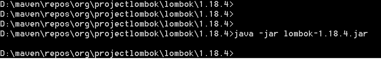
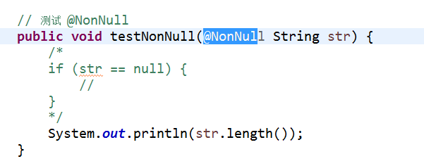
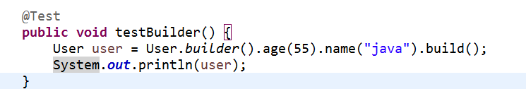
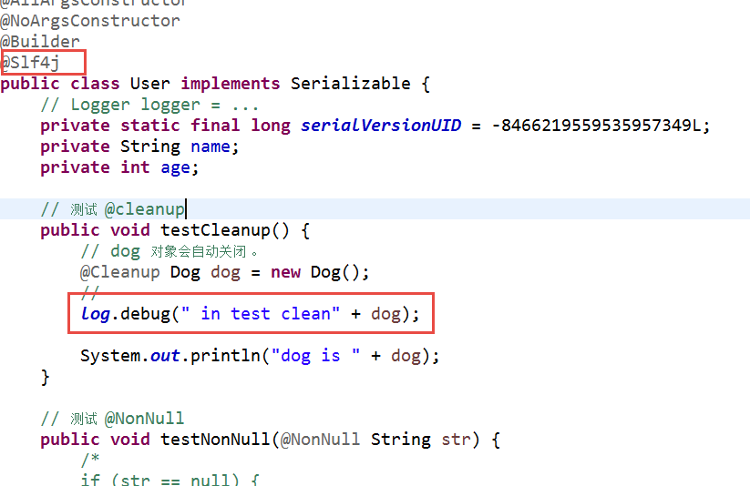
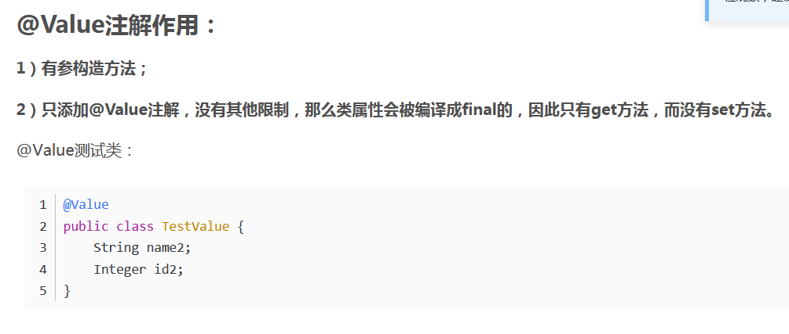

# lombok

## 复习

1.  maven    ?
2. maven模型  ？ 三个部分 。
3.  pom  ？ project object model  pom.xml   <html></html>
4. 依赖管理模型  ？
5. maven 插件   ？ 
6. 坐标  ？
7. scope （   compile、test、provided、 runtime）
8.  mvn  clean  test    ？   assertEquals  ？
9. mvn  package  、  mvn  install 
10. 继承  （pom）
11. 聚合，  （package pom）
12. 其他 ？


## lombok jar包

JavaBean   pojo 对象 ？

### 什么是 lombok

·1.减少大量的模板代码,get和set方法,从代码封装维度看,将大量的模板代码进行封装,不需要其他人员来不断编写,哪怕是IDE可以生成的代码,这也是重复代码,减少重复的出现;
2.从代码可读性角度来看,可以专注于查看类的属性,尤其编写代码的风格不一致,比如为了防止代码冲突,新增加的代码都在最后下面编写,之前总会看到类似的问题,新增加的属性和set和get方法写道后面,让其他人无法专注查看类本身的关键内容;
3.第三减少代码冲突的可能,尤其增加新属性的时候,哪怕处理冲突也非常简单的,大量的bean,model,vo中减少非常多的代码维护;
4.lombok处理的toString方法,hash,equal方法等内容,当增加新属性的时候,以上方法都不需要重新编写,而是lombok直接帮助处理的,不会出现遗漏的问题和情况.就好比修改增加或修改某个属性,那么你就要处理该属性对其相关内容的变化,现在你修改后,其他内容不需要你去善后,而是直接有人给你善后一样,这一点尤其在新增加属性的时候非常容易忘记处理.

使用lombok的不足:
1.要求IDE增加对lombok的支持,比如IDEA中需要安装lombok的插件;如果你对外提供的服务使用lombok,那么可能引用jar的其他项目需要增加对lombok的支持,但是并不麻烦.

2.如果你想确认某个set或get方法是否在程序中被调用,你无法找到哪里使用的,但是我更认为这样的操作是违背了bean使用的初衷,bean尤其数据库和java类的映射bean,java对bean的定义和使用就是无参数的构造方法和set和get方法,而不应该在bean中处理任何和业务有任何关系的逻辑.

### lombok的安装

1. 创建 spring starter 工程， 引入 lombok的jar包 。

2. 关闭 eclipse 

3. 进行 lombok的安装

   

4. 启动eclipse

5. 进行一个测试

   ```java
   @Data
   public class User implements Serializable {
   	private static final long serialVersionUID = -8466219559535957349L;
   	private String name;
   	private int age;
   }
   
   @RunWith(SpringRunner.class)
   @SpringBootTest
   public class LombokApplicationTests {
   
   	@Test
   	public void testUser() {
   		User user = new User();
   		user.setAge(88);
   		user.setName("tiger");
   		System.out.println(user);
   	}
   }
   
   ```

   

6. 其他

### lombok的其他注解


@AllArgsConstructor  : 产生 全参数的 构造方法

@NoArgsConstructor：  产生 无参数构造方法


@CleanUp ，  调用这个局部变量的 close()  方法。


@NonNull :  检验传入参数是否为空 。




@Builder  : 建造 对象



@Log    @slf4j






