# SVN课堂笔记

[TOC]

## svn简介

SVN(Subversion)是非常强大的配置管理工具；(GIT)

•可以及时了解不同版本之间的差异，可以随时恢复到特定的版本；

•可以了解项目团队成员的进度；

•资源共享，不用远程再发送文件；

•协同工作，大大提高了工作效率；

## svn安装

1. 安装client端

   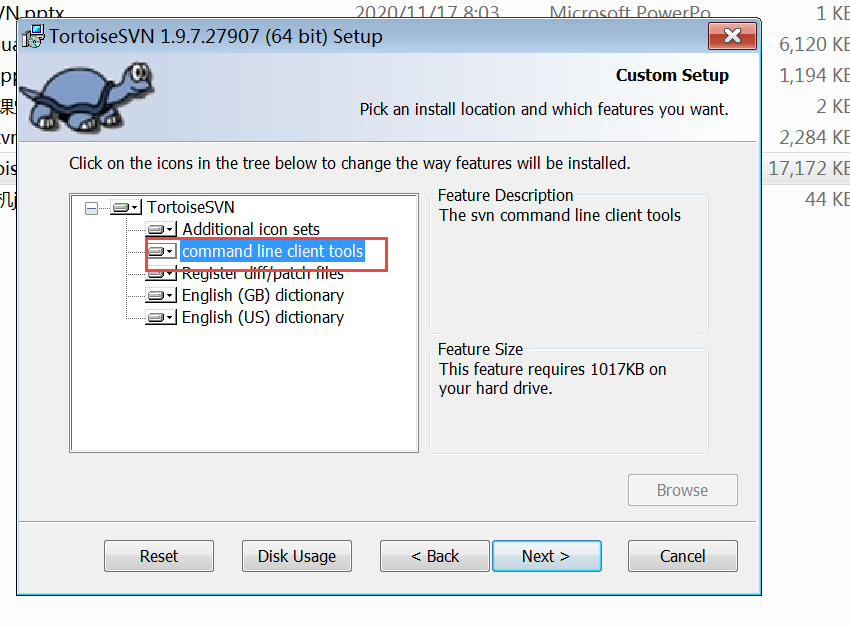

2. 安装语言包

3. 选择语言

## svn第一次初体验

svn://svn.gzpeter.com/java

svn://192.168.100.192/java

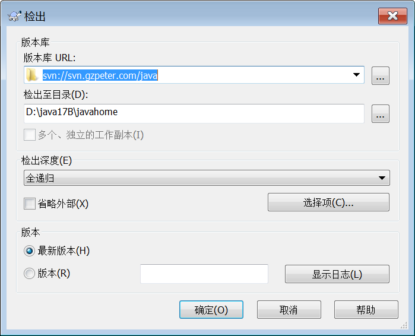

s8/p8

svn://newsvn.gzpeter.com/2022two

8

s8/p8


hello from teach  !


svn://newsvn.gzpeter.com/2023three

http://www.baidu.com


## ideal 使用 svn

### 配置 Ideal

file->settings->version control->subversion:


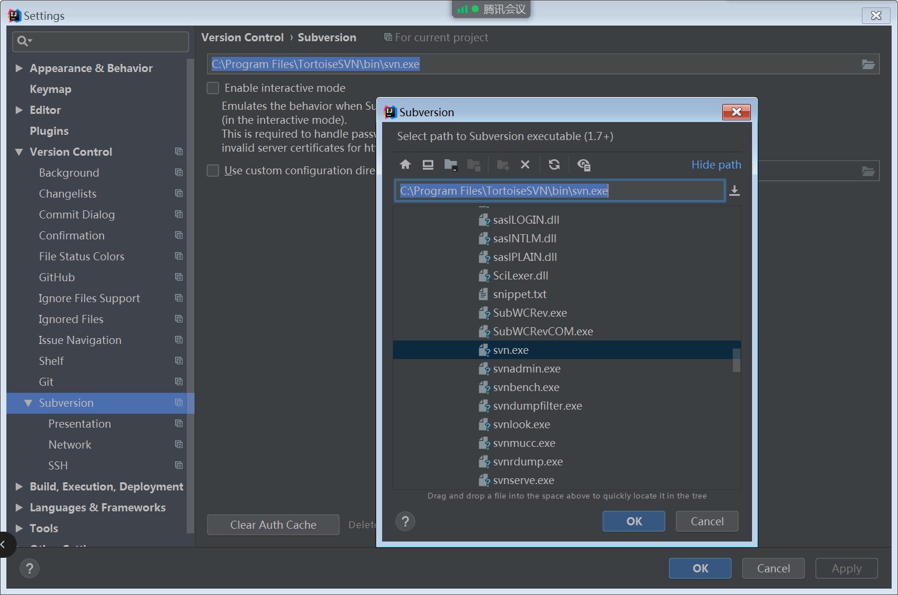

### 导入项目进入svn

vcs-> enable version control  Integration

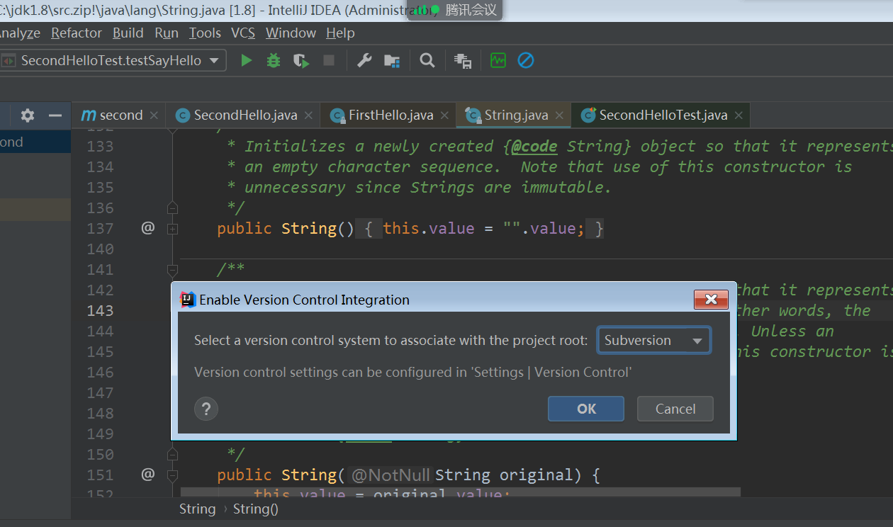
项目目录->subversion->share

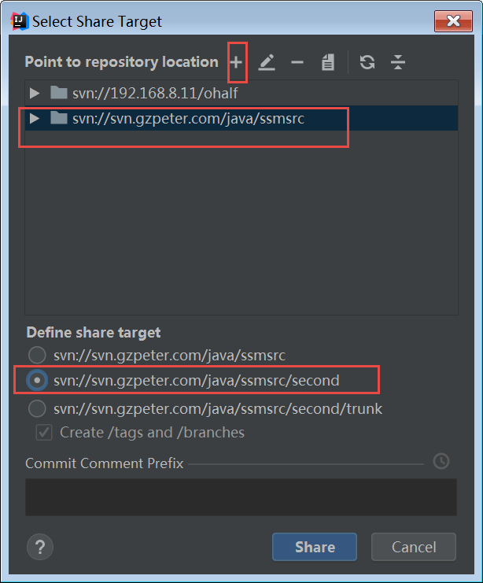


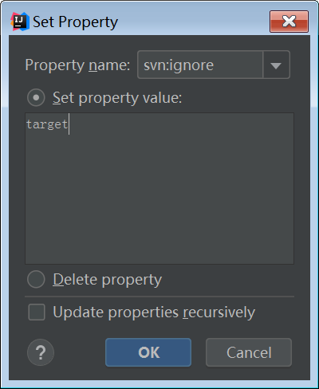

### 导出项目进行ideal

```txt


svn://192.168.100.192/java/src

```


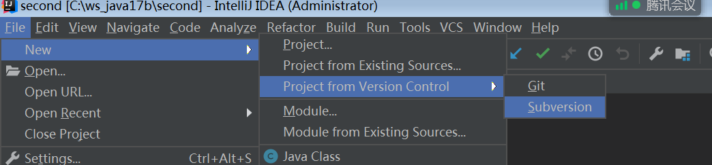

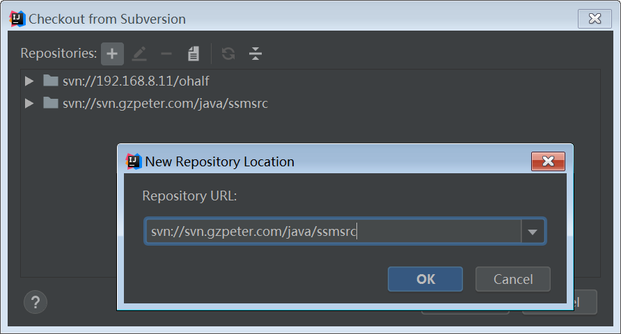

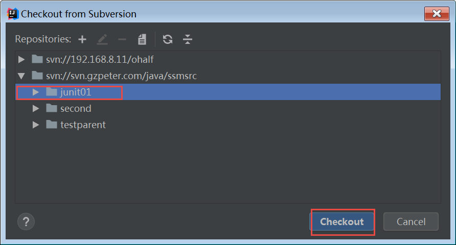


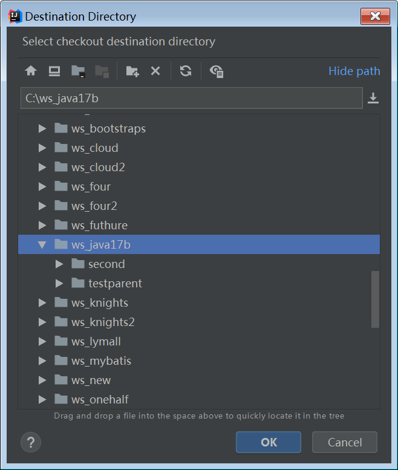

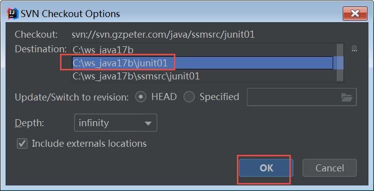

## svn使用流程

1. 开始新功能
2. update
3. 编码 、测试、debug。。。运行 
4. update， 代码合并
5. 提交

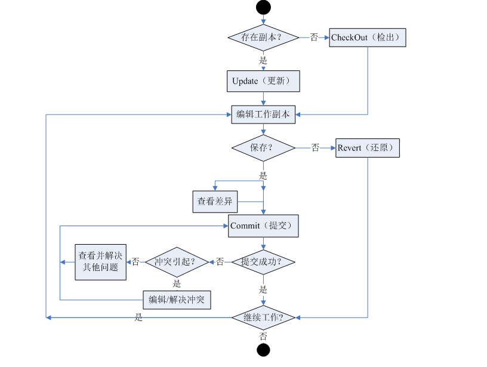

## commit的写法

提交：

```txt
好的日志信息和糟糕的日志信息
		日志信息主要记录的是每次的修改内容。建议把一些重要数据、关键操作写到日志信息中。
		注：修改人和提交时间由软件自动记录，无需人工写入日志信息

```


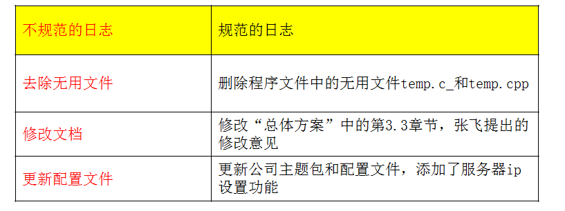

## 真心话大冒险项目

```txt


//add in test by Wang
public class TestGame {

	// aaa
	public static void main(String[] args) {
		
		// 真心话 大冒险
		// 产生 随机对象
		// test for conflict by teacher
		//test try by Wang
		Random random = new Random();
		// add by teacher
		Scanner scanner = new Scanner(System.in);
		List<Student> list = new ArrayList<Student>();
		Student zzh = new Zzh();
		Student zc = new One();
		list.add(zzh);
		list.add(zc);
		Student xiaoqingqing = new MyWords();
		list.add(xiaoqingqing);
		// add list comment by teacher
		
		Student xiaowang = new Wa();
		list.add(xiaowang);
		Student xiaoyang = new XiaoYang();
		list.add(xiaoyang);
		list.add(new Lword());
		list.add(new lyh());
		//add list by Wang
		//add list bb
		// add at teacher*
		while(true) {
			int index = random.nextInt(list.size());
			Student s = list.get(index);
			String name = s.getName();
			String statement = s.getWords();
			System.out.println("=======================================================" );
			System.out.println(name + "的真心话是 " );
			System.out.println("heelo");
			scanner.nextLine();
			System.out.println( statement);
		}
	}

}

```


## 冲突

```txt
冲突： 是两个人修改同一个文件的同一地方， 然后先后提交 。出现冲突
update： 对应的目录进行 更新
解决冲突：
   1. 修改冲突的文件 为 正常
   2. 标记该文件的冲突已经解决
   3. commit 该文件 
```


---

1. 修改 pom.xml  spring相关的jar 包加入

   ```txt
    <dependency>
               <groupId>org.springframework</groupId>
               <artifactId>spring-context</artifactId>
               <version>5.2.12.RELEASE</version>
           </dependency>
           <dependency>
               <groupId>org.springframework</groupId>
               <artifactId>spring-test</artifactId>
               <version>5.2.12.RELEASE</version>
           </dependency>
           <dependency>
               <groupId>org.springframework</groupId>
               <artifactId>spring-tx</artifactId>
               <version>5.2.12.RELEASE</version>
           </dependency>
   ```

   

2. 添加 applicationContext.xml 文件

   ```txt
   <beans xmlns="http://www.springframework.org/schema/beans"
          xmlns:xsi="http://www.w3.org/2001/XMLSchema-instance"
          xmlns:context="http://www.springframework.org/schema/context"
          xmlns:aop="http://www.springframework.org/schema/aop" xmlns:tx="http://www.springframework.org/schema/tx"
          xsi:schemaLocation="http://www.springframework.org/schema/beans
   	http://www.springframework.org/schema/beans/spring-beans.xsd
   	http://www.springframework.org/schema/context
   	http://www.springframework.org/schema/context/spring-context.xsd
   	http://www.springframework.org/schema/aop
   	http://www.springframework.org/schema/aop/spring-aop.xsd http://www.springframework.org/schema/tx http://www.springframework.org/schema/tx/spring-tx.xsd">
   
      
   
   </beans>
   ```

   

3. 修改 main方法， 可以通过 ac 对象来取代 IOC里面的对象

   ```txt
   ac = new XmlClassPathApplicationContext("app...xmlA");
   ac.getBean()
   ```

   

4. 在 applicationContext.xml 文件里面 添加对象

   ```txt
   <bean>
   ```

   

5. 运行