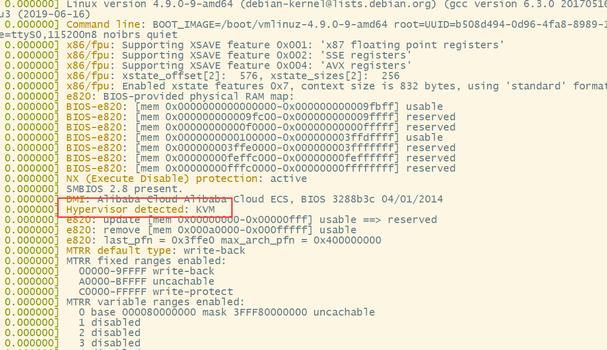
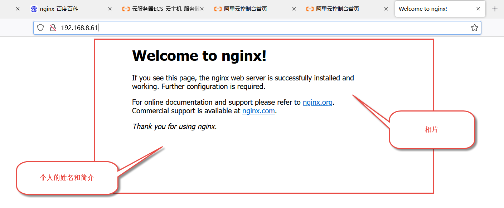
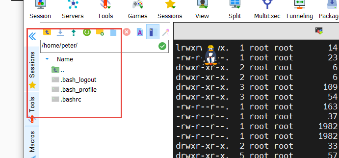

# day01

[TOC]

## 云计算 

 ？  是 什么  ?

linux:

redhat   centos   ubantu  debian 

centos -->

debian --> 

## centos 安装

1. 安装位置，  一点要 安装到 E 盘， e盘会被保留

## 作业

1. 在 centos 下面的虚拟机 安装  nginx

2. 开发一个 个人的简单博客，放到 nginx的首页， 要求有 个人的相片和个人简介和姓名

   

3. 要求 提交 上面的页面， 而且 你项目的 目录结构 也要截图

   

4. 其他