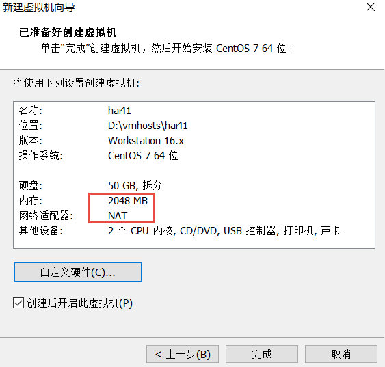
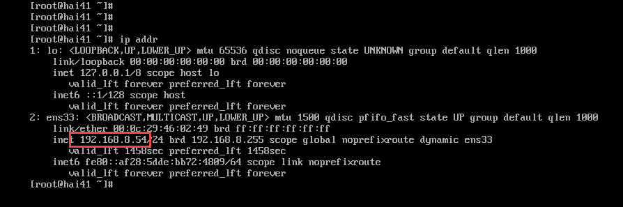
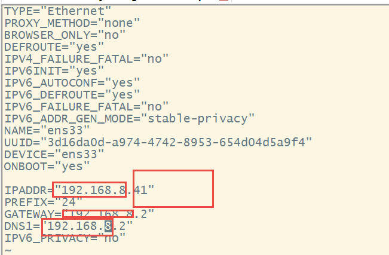
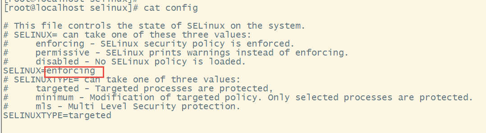
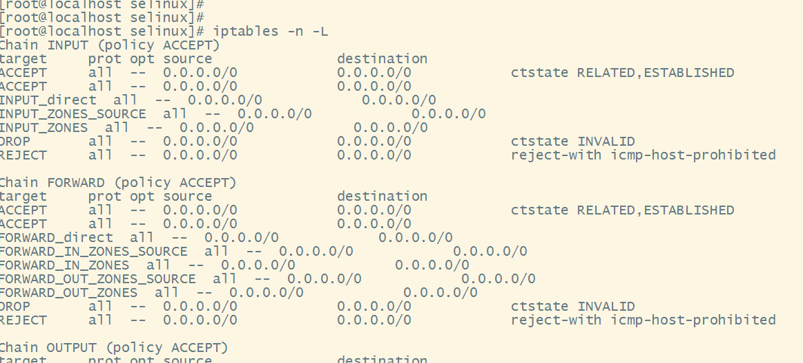
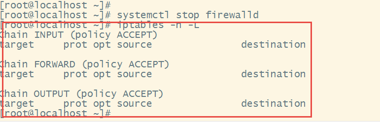
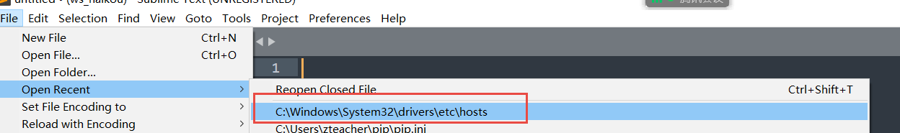

# Linux 准备

[TOC]

# 1.准备虚拟机


```txt
gitbash

hang/hang123    192.168.10.60


cd /d/tmp
scp hang@192.168.10.60:/home/hang/*.iso   .
hang123
```


```txt
名称        ip
hai41      192.168.8.41
hai42      192.168.8.42
hai43      192.168.8.43


```







1**92.168.8.54:    ip 地址的修改 只能修改 最后一个， 54， 其他 不能修改**

192.168.8.41

Xshell  mobotermial   secureCrt

centos7 环境准备。

### 1.1 修改IP地址

```txt
  cd /etc/sysconfig/network-scripts/
   25  ls -al
   26  vi ifcfg-ens33 
   
   #修改完成后进行机器的 reboot
   reboot
```
文件内容修改如下：
```txt
TYPE="Ethernet"
PROXY_METHOD="none"
BROWSER_ONLY="no"
DEFROUTE="yes"
IPV4_FAILURE_FATAL="no"
IPV6INIT="yes"
IPV6_AUTOCONF="yes"
IPV6_DEFROUTE="yes"
IPV6_FAILURE_FATAL="no"
IPV6_ADDR_GEN_MODE="stable-privacy"
NAME="ens33"
UUID="3d16da0d-a974-4742-8953-654d04d5a9f4"
DEVICE="ens33"
ONBOOT="yes"

IPADDR="192.168.66.128"
PREFIX="24"
GATEWAY="192.168.66.2"
# domainname  server  202.96.128.68
DNS1="192.168.66.2"
IPV6_PRIVACY="no"
```

```txt

192.168.83.129

192.168.83.83  192.168.83.88  192.168.83.8  
```



```txt
/etc/init.d/network restart

ip addr

ping www.baidu.com
ctrl + c


yum install net-tools -y

ifconfig

```


## 2. 准备环境


```txt

```


### 2.1 关闭 selinux 而且重新启动

selinux是什么 ？ 为什么关闭 。

如何关闭


```bash
[root@localhost ~]# cd /etc/selinux/
[root@localhost selinux]# ls
config  final  semanage.conf  targeted  tmp
[root@localhost selinux]# 
[root@localhost selinux]# 
[root@localhost selinux]# cat config 

# This file controls the state of SELinux on the system.
# SELINUX= can take one of these three values:
#     enforcing - SELinux security policy is enforced.
#     permissive - SELinux prints warnings instead of enforcing.
#     disabled - No SELinux policy is loaded.
SELINUX=enforcing
# SELINUXTYPE= can take one of three values:
#     targeted - Targeted processes are protected,
#     minimum - Modification of targeted policy. Only selected processes are protected. 
#     mls - Multi Level Security protection.
SELINUXTYPE=targeted 
```




将红色框部分的内容 修改为 disabled, 使用 reboot 命令进行重新启动。

```bash
cd /etc/selinux
vi config
# 修改 enforcing 为 disabled ， :wq!
reboot
```


### 2.2 关闭linux的防火墙

在非生产环境或内网环境的 防火墙对我们的开发配置和使用非常不方便， 这里我们首先关闭 linux的防火墙。

1. 查看linux防火墙的状态

   ```bash
   #使用命令 iptables -n -L 查看防火墙
   [root@localhost selinux]# 
   [root@localhost selinux]# iptables -n -L
   Chain INPUT (policy ACCEPT)
   target     prot opt source               destination         
   ACCEPT     all  --  0.0.0.0/0            0.0.0.0/0            ctstate       
   
   ```

   

2. 关闭防火墙

   ```bash
   systemctl stop firewalld
   ```

   再查看防火墙的状态

   

   现在的内容就是防火墙全部打开了

3. 关闭开机时自动启动防火墙

   ```bash
   [root@localhost ~]# systemctl disable firewalld
   Removed symlink /etc/systemd/system/multi-user.target.wants/firewalld.service.
   Removed symlink /etc/systemd/system/dbus-org.fedoraproject.FirewallD1.service.
   
   ```

    如果不做这一步， 下次机器重新启动，防火墙还在 ，就是 防火墙关闭白做了。

### 2.3 修改主机名称（可以不做）

```txt
  hostnamectl set-hostname  centos
  
```


```txt
cd /etc
vim hosts

127.0.0.1   localhost localhost.localdomain localhost4 localhost4.localdomain4
::1         localhost localhost.localdomain localhost6 localhost6.localdomain6
192.168.83.8  centos

```

reboot

```txt

```

### 修改pc机的hosts文件

必须以管理员身份启动 sublime（notepad） 软件




hosts 文件如果没有就创建一个

```txt
192.168.8.41 hai41
192.168.8.42 hai42
192.168.8.43 hai43
```


### 2.4 JDK安装（）

#### 准备

```bash
# 复制 /root 目录下的 .bashrc 和 .bash_profile 文件

[root@futher10 ~]# scp .bashrc esnode40:`pwd`
.bashrc                              100%  473   443.3KB/s   00:00    

[root@futher10 ~]# 
```

文件内容：

```bash
# .bashrc

# User specific aliases and functions

alias rm='rm -i'
alias cp='cp -i'


alias mv='mv -i'

# Source global definitions
if [ -f /etc/bashrc ]; then
        . /etc/bashrc
fi

export JAVA_HOME=/home/jdk1.8
export JRE_HOME=${JAVA_HOME}/jre
export CLASSPATH=.:${JAVA_HOME}/lib:${JRE_HOME}/lib
export  PATH=${JAVA_HOME}/bin:/usr/local/redis/bin:/home/zookeeper/bin:/home/maven3/bin:$PATH

VERSION=v12.13.0
DISTRO=linux-x64
export  PATH=/usr/local/nodejs/bin:$PATH

set -o vi
```


#### 安装 jdk

```bash
cd /home

[root@futher10 home]# scp -r jdk1.8 esnode40:`pwd`
```

```txt
 22  cd /home
   23  ls -al
   24  mkdir tmp
   25  mv jdk1.8-linux.tar.gz  tmp
   26  ls -al
   27  tar xvfz tmp/jdk1.8-linux.tar.gz 
   28  ls -al
   29  mv jdk1.8.0_151/ jdk1.8
   30  ls -al
```


```txt
[root@hai41 home]# cd
[root@hai41 ~]# 
[root@hai41 ~]# 
[root@hai41 ~]# 
[root@hai41 ~]# 
[root@hai41 ~]# vi .bashrc
[root@hai41 ~]# 
[root@hai41 ~]# 
[root@hai41 ~]# .   .bashrc
[root@hai41 ~]# 
[root@hai41 ~]# 
[root@hai41 ~]# 
[root@hai41 ~]# 
[root@hai41 ~]# java -version
java version "1.8.0_151"
Java(TM) SE Runtime Environment (build 1.8.0_151-b12)
Java HotSpot(TM) 64-Bit Server VM (build 25.151-b12, mixed mode)
[root@hai41 ~]# javac -version
javac 1.8.0_151
[root@hai41 ~]# 
```

