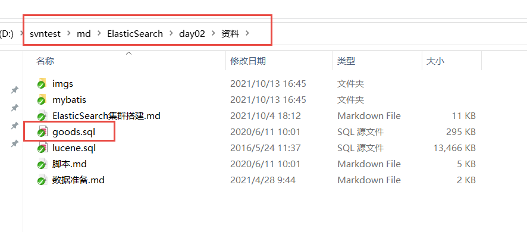
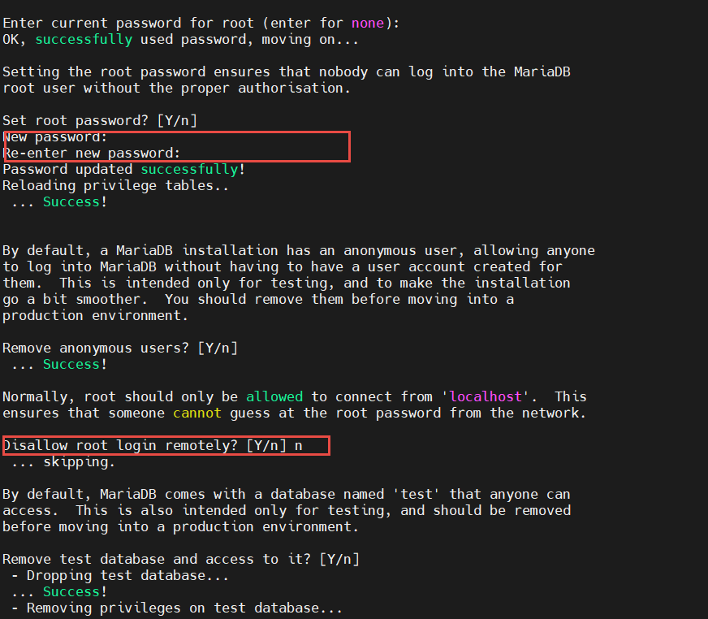
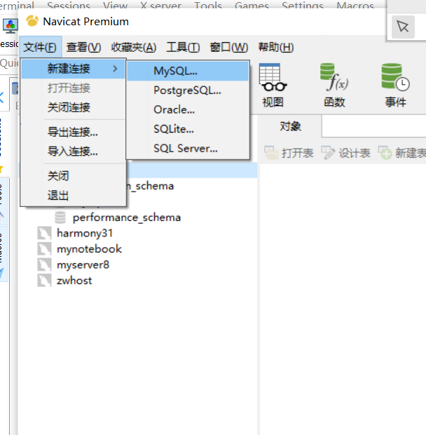
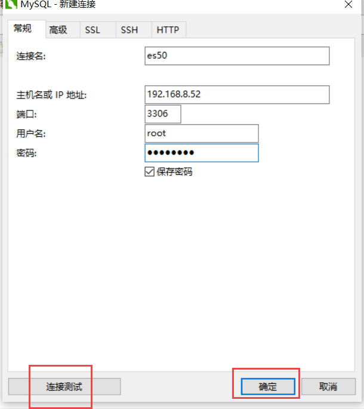
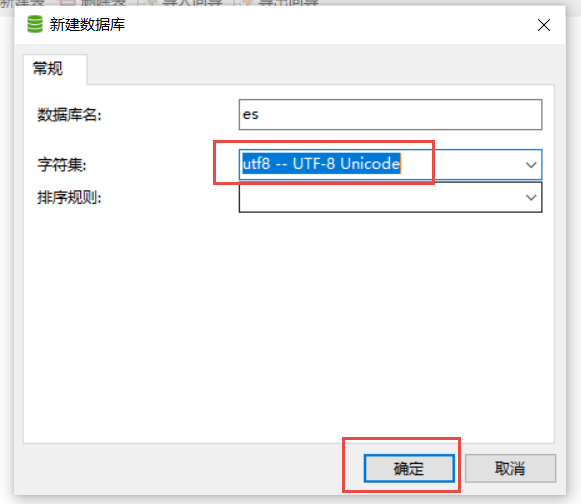
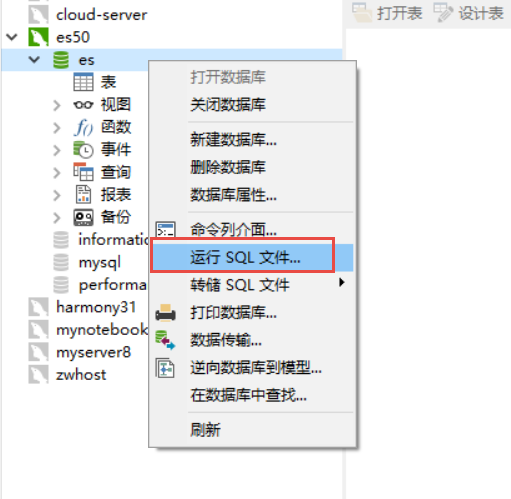
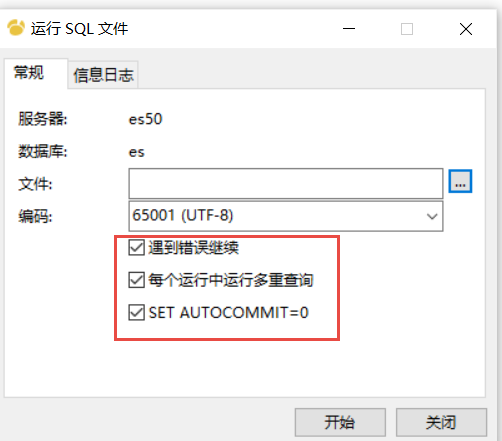

# mysql On Centos7

[TOC]

## 1.需求：导入数据



## 2.安装mysql

1. 安装mariadb 就是 mysql的 升级版 。

   ```txt
   yum install mariadb-server  -y
   ```

   

2. 配置mariadb

   ```txt
   [root@mini ~]# systemctl start mariadb  # 开启服务
   [root@mini ~]# systemctl enable mariadb  # 设置为开机自启动服务
   
   
   #设置 数据库 root 的密码
   mysql_secure_installation
   
   设置root密码，
   ```

   

3. 远程连接 mariadb

```txt
[root@mini ~]# mysql -u root -p  # 先通过本地链接进入数据库

MariaDB [(none)]> use mysql;

MariaDB [mysql]> select host, user from user;
+-----------+------+
| host      | user |
+-----------+------+
| 127.0.0.1 | root |
| ::1       | root |
| mini      | root |
+-----------+------+
3 rows in set (0.00 sec)

update user set host="%" where host="es50";
Query OK, 1 row affected (0.00 sec)
Rows matched: 1  Changed: 1  Warnings: 0


flush privileges;

#设置 root的远程密码 方法 2

grant all privileges on *.* to 'root'@'%' identified by 'root1234';
flush privileges;
```

4. 使用远程工具连接mariadb

   

   

   

5. 其他

## 3.导入sql数据

1. 创建database， es

   

2. 执行 sql语句

   

   

3. 查看数据和数据结构

```txt
mysql> select count(*) from goods;
+----------+
| count(*) |
+----------+
|      939 |
+----------+
1 row in set

mysql> 
mysql> desc goods;
+--------------+---------------+------+-----+---------+-------+
| Field        | Type          | Null | Key | Default | Extra |
+--------------+---------------+------+-----+---------+-------+
| id           | double        | YES  |     | NULL    |       |
| title        | varchar(300)  | YES  |     | NULL    |       |
| price        | decimal(22,0) | YES  |     | NULL    |       |
| stock        | double        | YES  |     | NULL    |       |
| saleNum      | double        | YES  |     | NULL    |       |
| createTime   | datetime      | YES  |     | NULL    |       |
| categoryName | varchar(600)  | YES  |     | NULL    |       |
| brandName    | varchar(300)  | YES  |     | NULL    |       |
| spec         | varchar(600)  | YES  |     | NULL    |       |
+--------------+---------------+------+-----+---------+-------+
9 rows in set

mysql> 

mysql> select * from goods limit 10;
+--------+---------------------------------------------------+--------+-------+---------+---------------------+--------------+-----------+------------------------------------+
| id     | title                                             | price  | stock | saleNum | createTime          | categoryName | brandName | spec                               |
+--------+---------------------------------------------------+--------+-------+---------+---------------------+--------------+-----------+------------------------------------+
| 536563 | new2 - 阿尔卡特 (OT-927) 炭黑 联通3G手机 双卡双待 | 299000 | NULL  |   99999 | 2015-03-08 21:33:18 | 手机         | 阿尔卡特  | {"机身内存":"16G","网络":"联通3G"} |
| 562379 | new8- 三星 W999 黑色 电信3G手机 双卡双待双通      | 11     | NULL  |   99999 | 2015-03-08 21:27:54 | 手机         | 三星      | {"机身内存":"16G","网络":"联通3G"} |
| 605616 | 阿尔卡特 (OT-979) 冰川白 联通3G手机               | 309    | NULL  |   99999 | 2015-03-08 21:33:18 | 手机         | 阿尔卡特  | {"机身内存":"16G","网络":"联通3G"} |
| 635906 | 阿尔卡特 (OT-927) 单电版 炭黑 联通3G手机 双卡双待 | 249    | NULL  |   99999 | 2015-03-08 21:33:18 | 手机         | 阿尔卡特  | {"机身内存":"16G","网络":"联通3G"} |
| 679532 | 阿尔卡特 (OT-986+) 玫红 AK47 加强版 联通3G手机    | 499    | NULL  |   99999 | 2015-03-08 21:32:31 | 手机         | 阿尔卡特  | {"机身内存":"16G","网络":"联通3G"} |
| 679533 | 阿尔卡特 (OT-986+) 曜石黑 AK47 加强版 联通3G手机  | 499    | NULL  |   99999 | 2015-03-08 21:31:36 | 手机         | 阿尔卡特  | {"机身内存":"16G","网络":"联通3G"} |
| 691300 | 三星 B9120 钛灰色 联通3G手机 双卡双待双通         | 4399   | NULL  |   99999 | 2015-03-08 21:29:27 | 手机         | 三星      | {"机身内存":"16G","网络":"联通3G"} |
| 738388 | 三星 Note II (N7100) 云石白 联通3G手机            | 1699   | NULL  |   99999 | 2015-03-08 21:28:16 | 手机         | 三星      | {"机身内存":"16G","网络":"联通3G"} |
| 741524 | 三星 Note II (N7100) 钛金灰 联通3G手机            | 1699   | NULL  |   99999 | 2015-03-08 21:28:30 | 手机         | 三星      | {"机身内存":"16G","网络":"联通3G"} |
| 816448 | 三星 Note II (N7100) 钻石粉 联通3G手机            | 1699   | NULL  |   99999 | 2015-03-08 21:28:44 | 手机         | 三星      | {"机身内存":"16G","网络":"联通3G"} |
+--------+---------------------------------------------------+--------+-------+---------+---------------------+--------------+-----------+------------------------------------+
10 rows in set

```


