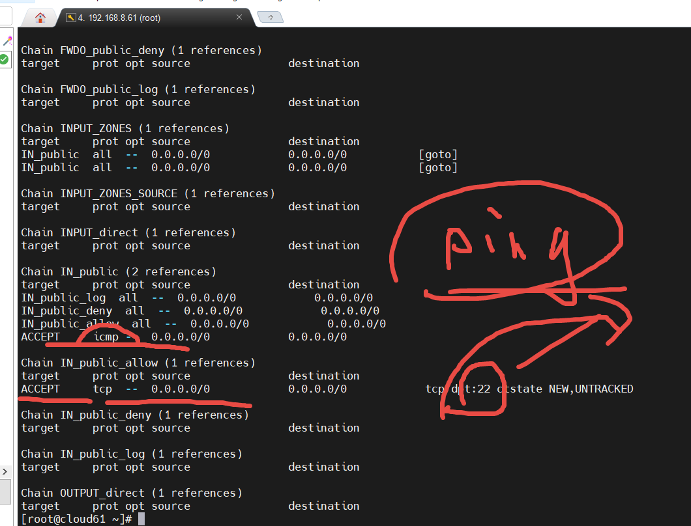

# 前端代码部署修改


## 安装 nginx

```txt
  1  iptables -n -L
    2  rpm -ivh http://nginx.org/packages/centos/7/noarch/RPMS/nginx-release-centos-7-0.el7.ngx.noarch.rpm
    3  yum install nginx -y

    5  systemctl start nginx
  
   11  systemctl stop firewalld
   12  iptables -n -L
   
   
   ps -ef | grep nginx
```





## 部署代码

```txt
#windows
zhang@LAPTOP-1LM3A6PK MINGW64 /d/2022three/src/nodejs/day15project
$ ls -al
total 8
drwxr-xr-x 1 zhang 197121 0 Sep 19 08:54 ./
drwxr-xr-x 1 zhang 197121 0 Sep 19 08:52 ../
drwxr-xr-x 1 zhang 197121 0 Sep 20 10:08 api_server/
drwxr-xr-x 1 zhang 197121 0 Sep 20 10:34 newsback/

zhang@LAPTOP-1LM3A6PK MINGW64 /d/2022three/src/nodejs/day15project

$ scp -r newsback/   root@hang51:/home
The authenticity of host 'hang51 (192.168.8.51)' can't be established.
ED25519 key fingerprint is SHA256:5aDzkN62l8PAiThPsjDPKtHocsxBhnUVAkAGyBpeDKA.
This host key is known by the following other names/addresses:

```


```txt
#linux

 cd /
 # 查找 html 文件 或目录
  109  find / -name html
  
  # nginx 服务的根目录
  110  cd /usr/share/nginx/html/
  111  ls -al
  112  pwd
  
  # 删除 nginx的  index.html
  113  rm -Rf *.html
  114  ls -al
  
  # 将 前端项目文件 复制到 nginx的根目录  -r 目录和子目录都复制
  115  cp -r /home/newsback/*  .
  116  ls -al

```


## 安装nodejs

```txt
cd /home
# 创建目录 放 安装包
mkdir tmp
  103  cd tmp
  104  ls -al
  # 解压缩
  105  xz -d node-v14.18.0-linux-x64.tar.xz 
  106  ls -al
  107  cd ..
  
  #  将打包的文件 转换为目录
  108  tar xvf  ./tmp/node-v14.18.0-linux-x64.tar 
  
  # 修改目录名称
  109  mv node-v14.18.0-linux-x64/ nodejs
  110  cd nodejs/
  111  ls -al
 
/root/.bashrc
#修改文件 .bashrc
export PATH=/home/nodejs/bin:${PATH}

# 让当前环境变量的设置 马上生效
.   ./.bashrc

# 验证 安装是否成功
node -v

npm 
```


## 运行node server 代码

```txt


cd /home/api-server

# 命令会在后台执行， 而且 同终端 没有关系
nohup  node ./app.js   &

```


## 修改代码